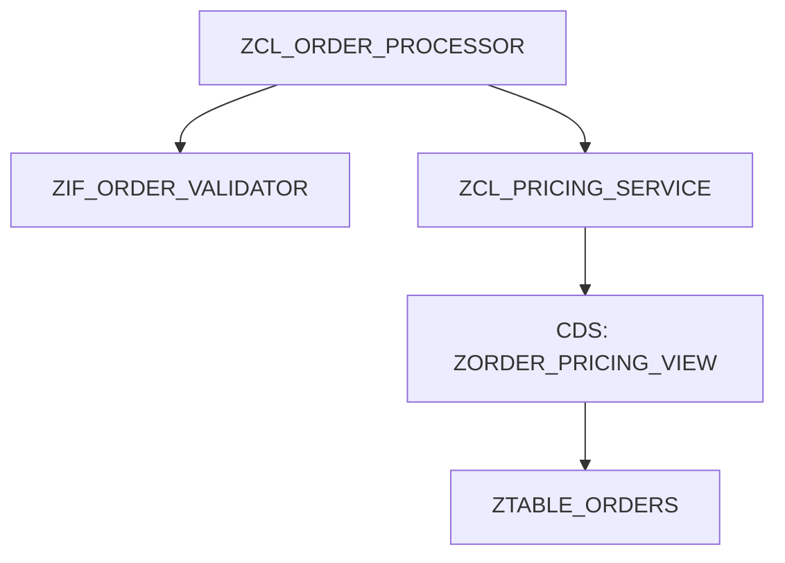
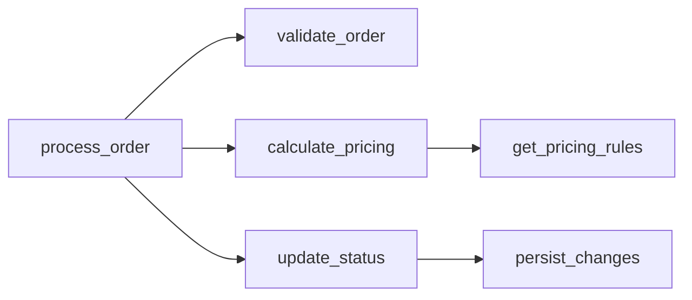
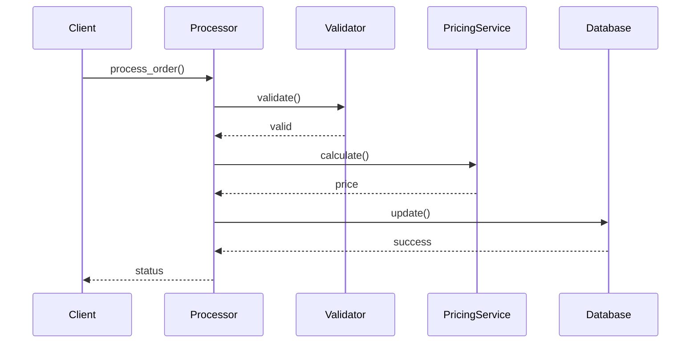
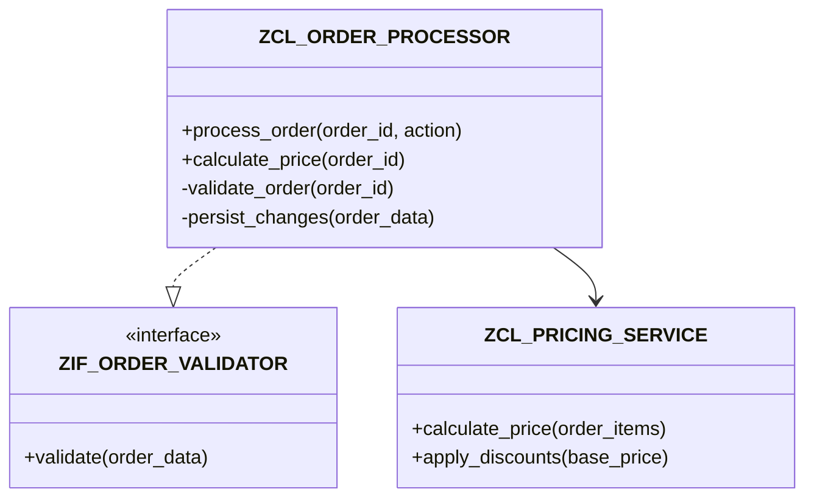
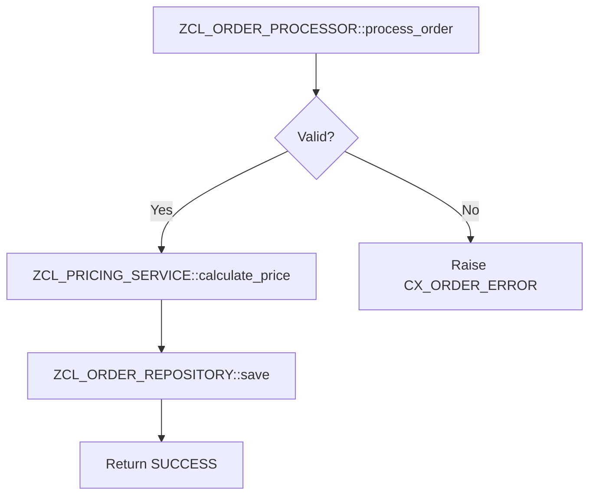
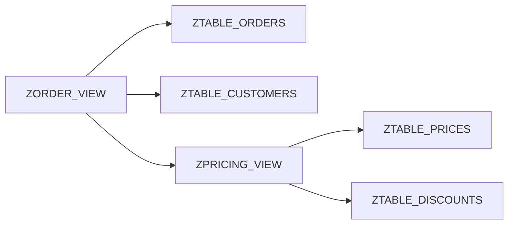

# Documentation Generator

Generate comprehensive technical documentation for ABAP packages, classes, APIs, and architectures. Creates README files, API references, UML diagrams, and architecture documentation in Markdown format.

## 1. Identify Documentation Scope

Ask the user what to document:

- **Scope type**:
  - Package (all objects in package)
  - Single class or interface (API documentation)
  - API surface (public interfaces across packages)
  - Architecture (call graphs, dependencies)
  - CDS views and data model

- **Target**: e.g., $ZAPI package, ZCL_ORDER_PROCESSOR class
- **Documentation type**:
  - README (overview, getting started, examples)
  - API Reference (complete method documentation)
  - Architecture Guide (diagrams, design decisions)
  - Developer Guide (how to extend, contribute)
  - Data Model (tables, CDS views, relationships)

- **Output format**: Markdown (default), HTML, or both
- **Include**: Code examples, UML diagrams, call graphs

## 2. Initialize Progress Tracking

Use TodoWrite to track documentation generation:

- Discover objects in scope
- Extract metadata and structure
- Generate package overview
- Document public APIs
- Create architecture diagrams
- Generate code examples
- Create UML class diagrams
- Generate CDS dependency graphs
- Write documentation files
- Create index/navigation

Mark first task as in_progress.

## 3. Discover Objects in Scope

Use SearchObject to find all objects to document:

```
For packages:
- query: "<package_pattern>" (e.g., "$ZAPI*")
- maxResults: 500

For specific objects:
- query: "ZCL_ORDER_*" (pattern matching)
```

Organize discovered objects by type:
- Classes (CLAS) - Core API
- Interfaces (INTF) - Contracts
- Programs (PROG) - Reports and tools
- CDS Views (DDLS) - Data model
- Tables (TABL) - Persistence
- Function Groups (FUGR) - Legacy APIs

## 4. Extract Metadata and Structure

For each major object, gather comprehensive information:

### For Classes and Interfaces

Use GetClassInfo to get structured metadata:

```
Parameters:
- class_name: <name>
```

Returns:
- Methods (public, protected, private)
- Attributes
- Interfaces implemented
- Superclass
- Abstract/final status

Use GetSource to read source code:
- Extract header comments
- Parse method documentation
- Identify design patterns

### For Packages

Use GetPackage to get package information:

```
Parameters:
- package_name: <name>
```

Returns:
- Package description
- Transport layer
- Software component
- Sub-packages

### For CDS Views

Use GetCDSDependencies to understand data model:

```
Parameters:
- ddls_name: <cds_view_name>
- dependency_level: "hierarchy" (recursive)
- with_associations: true
```

Returns:
- Base tables and views
- Associations
- Dependency tree

### For Tables

Use GetTable to get structure:

```
Parameters:
- table_name: <name>
```

Returns:
- Field definitions
- Key fields
- Delivery class
- Technical settings

## 5. Generate Package README

Create comprehensive package overview:

```markdown
# <Package Name>

> <Package description from metadata>

## Overview

<High-level description of what this package provides>

### Purpose

<Why this package exists, what problems it solves>

### Key Components

- **Classes**: X classes providing [functionality]
- **Interfaces**: Y interfaces defining [contracts]
- **CDS Views**: Z views for [data access]
- **Reports**: N programs for [operations]

## Getting Started

### Prerequisites

- SAP NetWeaver version: <version>
- Required dependencies: <list packages/components>
- Authorizations needed: <auth objects>

### Installation

1. Import package via transport request
2. Activate all objects
3. Run unit tests to verify: `/test-gen`
4. Configure <settings if needed>

### Quick Example

```abap
" Create instance
DATA(lo_processor) = NEW zcl_order_processor( ).

" Process order
TRY.
    lo_processor->process_order(
      iv_order_id = '123456'
      iv_action   = 'APPROVE' ).
  CATCH cx_order_error INTO DATA(lx_error).
    " Handle error
ENDTRY.
```

## Architecture

### Component Diagram



### Design Patterns Used

- **Factory Pattern**: ZCL_ORDER_FACTORY for order creation
- **Strategy Pattern**: ZIF_PRICING_STRATEGY for flexible pricing
- **Repository Pattern**: ZCL_ORDER_REPOSITORY for data access

### Dependencies

<List of external dependencies with purpose>

## API Reference

See [API.md](API.md) for complete API documentation.

### Core Classes

- [ZCL_ORDER_PROCESSOR](docs/ZCL_ORDER_PROCESSOR.md) - Main order processing logic
- [ZCL_PRICING_SERVICE](docs/ZCL_PRICING_SERVICE.md) - Pricing calculations
- [ZCL_ORDER_REPOSITORY](docs/ZCL_ORDER_REPOSITORY.md) - Data access layer

### Interfaces

- [ZIF_ORDER_VALIDATOR](docs/ZIF_ORDER_VALIDATOR.md) - Order validation contract
- [ZIF_PRICING_STRATEGY](docs/ZIF_PRICING_STRATEGY.md) - Pricing strategy contract

## Data Model

### Tables

| Table | Purpose | Key Fields |
|-------|---------|------------|
| ZTABLE_ORDERS | Order master data | MANDT, ORDER_ID |
| ZTABLE_ORDER_ITEMS | Order line items | MANDT, ORDER_ID, ITEM_NO |

### CDS Views

| View | Purpose | Base Objects |
|------|---------|--------------|
| ZORDER_PRICING_VIEW | Pricing calculation | ZTABLE_ORDERS, ZTABLE_PRICES |
| ZORDER_STATUS_VIEW | Order status tracking | ZTABLE_ORDERS, ZTABLE_STATUS |

## Usage Examples

### Example 1: Process Order

```abap
METHOD process_customer_order.
  DATA(lo_processor) = NEW zcl_order_processor( ).

  TRY.
      lo_processor->process_order(
        EXPORTING
          iv_order_id = '123456'
          iv_action   = 'APPROVE'
        IMPORTING
          ev_status   = DATA(lv_status) ).

      IF lv_status = 'SUCCESS'.
        " Continue processing
      ENDIF.
    CATCH cx_order_error INTO DATA(lx_error).
      " Log error
      WRITE: / lx_error->get_text( ).
  ENDTRY.
ENDMETHOD.
```

### Example 2: Custom Pricing Strategy

```abap
" Implement custom pricing strategy
CLASS lcl_premium_pricing DEFINITION.
  PUBLIC SECTION.
    INTERFACES zif_pricing_strategy.
ENDCLASS.

CLASS lcl_premium_pricing IMPLEMENTATION.
  METHOD zif_pricing_strategy~calculate_price.
    " Custom pricing logic
    rv_price = iv_base_price * CONV #( 1.2 ). " 20% premium
  ENDMETHOD.
ENDCLASS.

" Use custom strategy
DATA(lo_service) = NEW zcl_pricing_service(
  io_strategy = NEW lcl_premium_pricing( ) ).
```

## Testing

### Running Unit Tests

```bash
# Run all tests
/test-gen $ZAPI

# Or via vsp CLI
vsp -s <system> source test ZCL_ORDER_PROCESSOR
```

### Test Coverage

Current test coverage: 85%
- ZCL_ORDER_PROCESSOR: 92%
- ZCL_PRICING_SERVICE: 78%
- ZCL_ORDER_REPOSITORY: 90%

## Configuration

### Customizing Tables

| Table | Purpose |
|-------|---------|
| ZCUST_ORDER_CONFIG | Order processing configuration |
| ZCUST_PRICING_RULES | Custom pricing rules |

### Authorization Objects

| Object | Activity | Purpose |
|--------|----------|---------|
| Z_ORDER | 01, 02, 03 | Create, change, display orders |
| Z_PRICING | 01, 03 | Maintain, display pricing |

## Troubleshooting

### Common Issues

**Issue**: Order processing fails with CX_ORDER_LOCKED
**Solution**: Order is locked by another user, retry after a few seconds

**Issue**: Pricing calculation returns zero
**Solution**: Check ZCUST_PRICING_RULES table for missing configuration

**Issue**: Authorization check fails
**Solution**: Verify user has Z_ORDER object with activity 03

### Debug Mode

Enable debug logging:
```abap
zcl_order_processor=>set_debug_mode( abap_true ).
```

## Contributing

### Development Guidelines

1. Follow naming conventions (Z prefix for custom objects)
2. Add unit tests for all public methods (80% coverage minimum)
3. Run code quality checks before commit: `/code-quality`
4. Update this documentation for API changes

### Code Style

- Use modern ABAP syntax (inline declarations, method chaining)
- Prefer exceptions over return codes
- Add method documentation with `"!` comments
- Keep methods under 50 lines

## Transport Management

### Creating Transport

```bash
# Create transport for package
/transport-deploy $ZAPI
```

### Deployment Checklist

- [ ] All objects activated
- [ ] Unit tests passing (85%+ coverage)
- [ ] ATC checks passing (no critical issues)
- [ ] Documentation updated
- [ ] Change log updated
- [ ] Deployment guide reviewed

## Support

- **Package Owner**: <owner_name>
- **Team**: <team_name>
- **Contact**: <email or ticket system>

## License

Proprietary - Internal use only

## Changelog

See [CHANGELOG.md](CHANGELOG.md) for version history.

---

Generated by Claude Code Documentation Generator on <timestamp>
```

## 6. Generate API Reference Documentation

For each class and interface, create detailed API documentation:

```markdown
# ZCL_ORDER_PROCESSOR

> Main order processing logic with validation, pricing, and status management

## Class Information

- **Type**: Class (not abstract, final)
- **Package**: $ZAPI
- **Interfaces**: ZIF_ORDER_PROCESSOR
- **Superclass**: None

## Overview

The `ZCL_ORDER_PROCESSOR` class provides centralized order processing functionality including:
- Order validation
- Pricing calculation
- Status updates
- Persistence

## Public Methods

### PROCESS_ORDER

Process an order with specified action.

**Signature**:
```abap
METHODS process_order
  IMPORTING
    iv_order_id TYPE zorder_id
    iv_action   TYPE zorder_action
  EXPORTING
    ev_status   TYPE zorder_status
  RAISING
    cx_order_error
    cx_order_locked.
```

**Parameters**:

| Parameter | Type | Direction | Description |
|-----------|------|-----------|-------------|
| `iv_order_id` | ZORDER_ID | IN | Unique order identifier |
| `iv_action` | ZORDER_ACTION | IN | Action: 'APPROVE', 'REJECT', 'CANCEL' |
| `ev_status` | ZORDER_STATUS | OUT | Result status: 'SUCCESS', 'FAILED', 'PENDING' |

**Exceptions**:

| Exception | When Raised |
|-----------|-------------|
| `CX_ORDER_ERROR` | Invalid order ID, data inconsistency |
| `CX_ORDER_LOCKED` | Order locked by another user |

**Usage Example**:
```abap
TRY.
    lo_processor->process_order(
      EXPORTING
        iv_order_id = '123456'
        iv_action   = 'APPROVE'
      IMPORTING
        ev_status   = DATA(lv_status) ).
  CATCH cx_order_error cx_order_locked INTO DATA(lx_error).
    " Handle error
ENDTRY.
```

**Implementation Notes**:
- Validates order before processing
- Calculates pricing if action is 'APPROVE'
- Updates order status atomically
- Commits changes only on success

---

### CALCULATE_PRICE

Calculate total price for an order.

[... similar detailed documentation for each method ...]

## Usage Examples

[... comprehensive examples showing typical usage patterns ...]

## Internal Architecture

### Call Graph



### Sequence Diagram



## Related Classes

- [ZCL_ORDER_VALIDATOR](ZCL_ORDER_VALIDATOR.md) - Order validation logic
- [ZCL_PRICING_SERVICE](ZCL_PRICING_SERVICE.md) - Pricing calculations
- [ZCL_ORDER_REPOSITORY](ZCL_ORDER_REPOSITORY.md) - Data persistence

## Testing

Test class: `LTC_ORDER_PROCESSOR` (in testclasses include)

### Test Coverage

- Lines covered: 145 / 158 (92%)
- Methods tested: 8 / 8 (100%)
- Edge cases: 12 test methods

### Running Tests

```abap
/test-gen ZCL_ORDER_PROCESSOR
```

---

Last updated: <timestamp>
```

## 7. Generate Architecture Diagrams

Create visual representations using Mermaid syntax:

### Class Diagram

Use GetClassInfo for multiple classes and generate UML:



### Call Graph Diagram

Use GetCallGraph to build execution flow diagrams:



### CDS Dependency Graph

Use GetCDSDependencies to visualize data model:



## 8. Generate Code Examples

Create practical, runnable examples for common scenarios:

### Example Template

```markdown
## Example: <Scenario Name>

**Scenario**: <Description of what this example demonstrates>

**Prerequisites**:
- <Required setup>
- <Test data needed>

**Code**:
```abap
<Complete, executable ABAP code>
```

**Expected Output**:
```
<What the user should see>
```

**Explanation**:
<Line-by-line explanation of key concepts>
```

## 9. Write Documentation Files

Use the Write tool to create documentation files:

```
Directory structure:
docs/
├── README.md            (package overview)
├── API.md              (API reference index)
├── ARCHITECTURE.md     (architecture guide)
├── EXAMPLES.md         (code examples)
├── DATA_MODEL.md       (tables, CDS views)
├── classes/
│   ├── ZCL_ORDER_PROCESSOR.md
│   ├── ZCL_PRICING_SERVICE.md
│   └── ...
└── interfaces/
    ├── ZIF_ORDER_VALIDATOR.md
    └── ...
```

For each file:

Use Write tool:
```
Parameters:
- file_path: ./docs/<filename>.md
- content: <generated markdown content>
```

## 10. Create Navigation Index

Generate a master index for easy navigation:

```markdown
# Documentation Index

## Core Documentation

- [Package README](README.md) - Start here
- [API Reference](API.md) - Complete API documentation
- [Architecture Guide](ARCHITECTURE.md) - System design and patterns
- [Examples](EXAMPLES.md) - Practical code examples
- [Data Model](DATA_MODEL.md) - Tables and CDS views

## API Documentation

### Classes (8)

- [ZCL_ORDER_PROCESSOR](classes/ZCL_ORDER_PROCESSOR.md) - Order processing
- [ZCL_PRICING_SERVICE](classes/ZCL_PRICING_SERVICE.md) - Pricing logic
- [ZCL_ORDER_REPOSITORY](classes/ZCL_ORDER_REPOSITORY.md) - Data access
- [...](classes/) - See all classes

### Interfaces (3)

- [ZIF_ORDER_VALIDATOR](interfaces/ZIF_ORDER_VALIDATOR.md) - Validation contract
- [ZIF_PRICING_STRATEGY](interfaces/ZIF_PRICING_STRATEGY.md) - Pricing strategy
- [...](interfaces/) - See all interfaces

## Data Model

### Tables (5)

- [ZTABLE_ORDERS](tables/ZTABLE_ORDERS.md)
- [ZTABLE_ORDER_ITEMS](tables/ZTABLE_ORDER_ITEMS.md)
- [...](tables/) - See all tables

### CDS Views (7)

- [ZORDER_PRICING_VIEW](cds/ZORDER_PRICING_VIEW.md)
- [ZORDER_STATUS_VIEW](cds/ZORDER_STATUS_VIEW.md)
- [...](cds/) - See all CDS views

## Guides

- [Getting Started](guides/GETTING_STARTED.md)
- [Developer Guide](guides/DEVELOPER_GUIDE.md)
- [Testing Guide](guides/TESTING.md)
- [Deployment Guide](guides/DEPLOYMENT.md)
- [Troubleshooting](guides/TROUBLESHOOTING.md)
```

## 11. Generate Summary Report

```markdown
═══════════════════════════════════════════════════════
📚 DOCUMENTATION GENERATION COMPLETE
═══════════════════════════════════════════════════════

Package: $ZAPI
Generated: <timestamp>
Duration: <X minutes>

## Files Created

Total files:        25
- README files:      3
- API docs:         12
- Diagrams:          5
- Examples:          5

## Coverage

Objects documented: 18 / 18 (100%)
- Classes:           8
- Interfaces:        3
- CDS Views:         5
- Tables:            2

Public methods:     42
Private methods:    18 (not documented)

## Documentation Quality

✓ All public APIs documented
✓ UML diagrams generated
✓ Code examples provided
✓ Architecture documented
✓ Navigation index created

## Output Location

./docs/
├── README.md              (5.2 KB)
├── API.md                 (12.1 KB)
├── ARCHITECTURE.md        (8.3 KB)
├── classes/ (8 files)
└── interfaces/ (3 files)

## Next Steps

1. [ ] Review generated documentation
2. [ ] Add custom examples if needed
3. [ ] Commit documentation to version control
4. [ ] Share with team
5. [ ] Set up auto-generation in CI/CD

═══════════════════════════════════════════════════════
```

Mark all todos as completed.

## Best Practices Applied

This agent automatically:
- ✓ Generates complete, structured documentation
- ✓ Creates visual diagrams (UML, call graphs, CDS dependencies)
- ✓ Provides practical, runnable code examples
- ✓ Follows Markdown best practices
- ✓ Creates navigable documentation structure
- ✓ Documents only public APIs (respects encapsulation)
- ✓ Generates up-to-date documentation from source

## Usage Examples

**Example 1: Package documentation**
```
User: "Generate documentation for $ZAPI package"

Agent will:
- Create complete package documentation
- Document all classes, interfaces, CDS views
- Generate architecture diagrams
- Create README, API reference, examples
- Report: 25 files generated in ./docs/
```

**Example 2: Single class documentation**
```
User: "Document ZCL_ORDER_PROCESSOR API"

Agent will:
- Extract all public methods
- Document parameters, exceptions
- Generate usage examples
- Create UML class diagram
- Report: ZCL_ORDER_PROCESSOR.md created
```

**Example 3: Architecture documentation**
```
User: "Generate architecture guide for $ZRAY"

Agent will:
- Build call graphs
- Create component diagrams
- Document design patterns
- Map dependencies
- Report: ARCHITECTURE.md with 5 Mermaid diagrams
```
