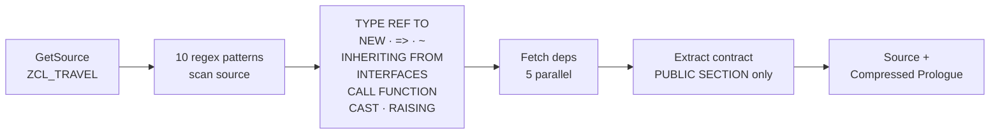
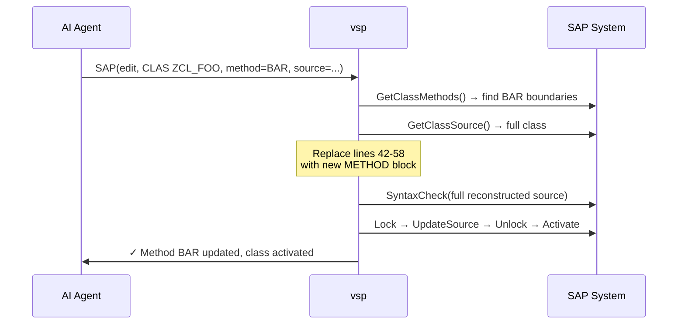
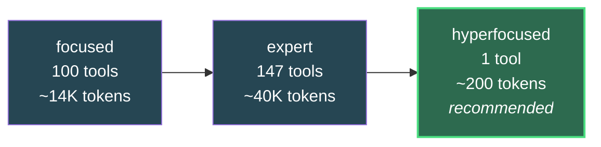

# Vibing Steampunk (vsp)

**AI-Agentic Development Unlocked for ABAP** — any system with ADT enabled, 7.50 upwards.
The available surface varies by release, and `vsp compat` reports it per system: RAP needs
S/4, AMDP needs HANA, and some ADT resources present on S/4 are absent on ERP.

> **ADT ↔ MCP Bridge**: Gives Claude (and other AI assistants) full access to SAP ADT APIs.
> Read code, write code, debug, deploy, run tests — all through natural language (or DSL for automation).
>
> **New:** the whole ABAP debugger — breakpoints, attach, stepping, call stack **and variables** —
> runs through SAP's own ADT resources over either a classic-RFC tunnel or a plain HTTPS
> session, with **nothing installed on the server** and no SAP SDK. The MCP debugger tools
> are enabled by default again, because the server now holds the session they always needed.
>
> See also: [OData ↔ MCP Bridge](https://github.com/oisee/odata_mcp_go) for SAP data access.
>
> **Want to review or test?** Start here: **[Reviewer Guide](docs/reviewer-guide.md)** — 11 hands-on tasks, 6 of them fully offline.


## Hot Right Now

### The ABAP Debugger over RFC — Nothing Installed on the Server

The debugger needs one thing above all: a **stable ABAP session**.
`attach_debuggee( )` returns an object reference, and step, stack, and variables
all hang off it — which is why a debug loop spread over independent HTTP calls
kept losing its debuggee. A pinned classic-RFC conversation *is* that session,
natively, with no ICF, no CSRF, and no WebSocket upgrade.

```bash
vsp rfc debug                                    # one pinned session, held for the whole loop
dbg> ebp ZADT_DEBUG_LOOP 9                       # breakpoint, by object name — ADT resolves the URI
dbg> eclipse 120                                 # listen, attach, stack — through SAP's own ADT resources
dbg> elocals                                     # the stopped frame's variables, with values
dbg> estep over
dbg> estack
```

The same six commands work in `vsp adt debug`, over HTTPS, against a system with
no gateway port. An integration test runs that script over both transports and
fails if they disagree about where the debuggee stopped or what it could see
(`go test -tags=integration -run Conformance ./pkg/saprfc/`).

From an MCP client the same loop is `SetBreakpoint` → `DebuggerListen` →
`DebuggerGetVariables` → `DebuggerStep` → `DebuggerDetach`. `DebuggerListen`
attaches for you: a debuggee is only attachable while it waits, so a caller that
has to copy an id between two tool calls loses the race.

**Nothing is installed on the server for this.** `eclipse` drives the very
resources Eclipse uses — `/sap/bc/adt/debugger/listeners`, `/sap/bc/adt/debugger`,
`/sap/bc/adt/debugger/stack` — tunnelled through `SADT_REST_RFC_ENDPOINT`. The
only reason a normal tool cannot use them is that ADT keeps the debug session in
an ABAP roll area, reachable again only through a `sap-contextid` cookie; over a
pinned RFC conversation the roll area *is* the session, so there is nothing to
correlate. You get ADT's own answers back: source URIs per stack frame, DYNP
screen frames, the authorization flags, the action catalogue — and SAP labels
the session `RFC session: <instance>` itself.

**No RFC channel at all?** Then use `vsp adt debug`: the identical loop over one
stateful HTTPS session. The debugger was never an RFC feature — listen, attach,
stack and step are ADT resources, and RFC was one way to carry them. What they
need is a *session*, and over HTTPS that is the stateful ICF session
`sap-contextid` selects. Verified against A4H over plain HTTPS, with a cookie or
a password and no gateway port in sight — which is the shape of every system
where you can sign on to ADT but nobody will give you an RFC user
([`docs/design/http-only-systems.md`](docs/design/http-only-systems.md)).

**Breakpoints need no ABAP either.** `POST /sap/bc/adt/debugger/breakpoints`
answers 200 on both transports and writes the same `ABDBG_EXTDBPS` row a Z
facade would. One asymmetry is real: SAP answers the *GET* with 200 and an empty
body, because in ADT the breakpoint set is the IDE's state — Eclipse posts it
whole rather than asking. So a client keeps its own record, and adding one
breakpoint is a read-modify-write.

There is also a typed, smaller-payload path over a little ABAP facade
([`abap/src/zadt_debug`](abap/src/zadt_debug/)) for systems where the ADT
debugger resources are absent or blocked — and for the one thing ADT will not
answer, reading the server's own breakpoint table:

```bash
dbg> bp SAPLZADT_DEBUG/LZADT_DEBUGU01 9          # external breakpoint (name the include!)
dbg> catch 150                                   # wait for a hit, attach, show the stack
dbg> step over
dbg> stack
dbg> detach
```

Both paths are proven live on A4H: the breakpoint was hit by a function module
called over a **second** RFC connection, the stack showed the real entry chain
`%_RFC_START` → `REMOTE_FUNCTION_CALL` → the module, stepping walked it line by
line, and afterwards the debuggee ran on and committed its work.

**Variables are read *and* written.** `elocals` walks the debugger's variable
tree to the stopped frame's own data; `eset LV_AMOUNT 900` puts a value back, and
the next statement computes with it — measured on A4H, a value that arrived from
the database as 46 became 901 downstream instead of 47. That turns the debugger
into a scenario harness: reaching a state by arranging for the system to produce
it is usually the hard part, and this skips it. It changes real execution,
database writes included, so it is not something to do in somebody else's session
without asking. `eframe` moves the cursor to another stack entry, so the caller's
half of a call boundary is readable too.

**Customer code by default.** A breakpoint set in a SAP standard program is
accepted, given an id, and then never fires: without system debugging there is
nowhere to stop. That is SAP's behaviour, not a filter of ours — `esys` turns it
on for the cases that need it. Staying out costs less than it sounds, because a
breakpoint on the line that *calls* a standard module captures what went in, and
one on the line after captures what came back.

**It catches web requests.** An external breakpoint fires for an ICF session just
as it does for RFC: a function module triggered through `/sap/bc/soap/rfc` over
plain HTTP was caught by a listener on an HTTPS debug session, with the whole web
stack visible — `%_HTTP_START` → `HTTP_DISPATCH_REQUEST` →
`CL_HTTP_SERVER->EXECUTE_REQUEST` → the SOAP handler → the module. An OData
request is that same path with the Gateway handler, so debugging one needs
nothing new.

The read half needs no ABAP either: `vsp rfc debuggees`, `vsp rfc breakpoints`
and `vsp rfc watch` read `ABDBG_ACTIVATION` and `ABDBG_EXTDBPS` directly — who is
parked in the debugger and where, short dumps included.

**It is tested without a system.** `vsp adt debug --record` captures a live
session to a cassette — every request and every answer — and the tests replay
it, so `go test ./...` drives the real debugger with no SAP, no RFC channel and
no Z code. The committed cassettes are real 7.58 sessions: catching a stopped
program, reading its stack, reading locals with their values, stepping into a
subroutine and back out, writing a variable, expanding a structure and a table,
and a statement-level trace. A recording is an oracle rather than a mock —
nobody writes the answers, so nobody can write them to match the code, which is
how four defects surfaced the first time it ran.

Because a cassette is taken from a live system, the recorder drops every header
that carries a session and blanks the eight places a debug session names the
application server, and a test re-checks the committed files on every run.

**7.50 works too, and did not before.** That release has no
`/sap/bc/adt/debugger/stack`: the listener caught a debuggee, the attach
succeeded, and the first stack read returned 404 — and since catching a debuggee
ends with a stack read, every catch was thrown away. It serves the same document
from the dispatcher instead. The shape is discovered once per session and
remembered.

### AMDP debugging over plain ADT — the breakpoint fires

An AMDP method runs inside HANA, not inside ABAP, so debugging one means
bridging two debuggers. ADT does that itself, and nothing has to be installed:

```bash
vsp adt debug -s a4h -c "astart; abp ZCL_MY_AMDP 41; aresume 12; astop"
# and, while it waits, run the method from anywhere
```

SAP answers `ON_BREAK` with the position inside the SQLScript. This project
spent months concluding the opposite, through a Z service and a WebSocket
protocol built to reach what the system was already offering.

**With values.** `alocals` lists everything in scope — scope, type, and for a
table its handle and row count — and costs no request at all, because the stop
event already carries it. `avar LV_I` reads what a variable holds:

```
output   ET_RESULT   table[0] handle 3000001
input    IV_COUNT    INTEGER
local    LV_I        INTEGER
→ LV_I    INTEGER    1
```

Reading a variable is asynchronous and does not advertise it: the resource
answers 200 with an empty body and puts a request id in `Location`, which reads
exactly like a variable that is out of scope. The value arrives through the same
queue as everything else. Table *contents* are the one thing still missing — the
address is right and HANA refuses to build its data provider from it; see
`AMDPTableRows` for where it stands.

The trap is that answers arrive as a **queue** with acknowledgements at its
head. Resume once, see `SYNC_BREAKPOINTS`, and you conclude the breakpoint never
fired — while the debuggee is, at that moment, blocked on it. `aresume` waits
past them, and reports SAP's verdict on the way (`state="VALID"`), because a
refused breakpoint and a method that never ran look identical otherwise.

The whole choreography stays on one held session: the ADT resource keeps its
handles in ABAP session memory, so a second connection finds nothing.

Reachable from an agent too: `SAP(action="debug", target="AMDP_ADT_START")`.

### Post-mortem: from a dump to what was logged around it

A debugger helps when you can reproduce the failure. Usually nobody can:
there is a dump from Tuesday, a user who has moved on, and no way to make it
happen again.

```bash
vsp -s a4h dumps --group                          # what keeps failing, not what failed once
vsp -s a4h dumps --similar latest                 # what else looks like this one, and how closely
vsp -s a4h dumps --explain latest --tolerance 10m # one dump, its stack, and the log around it
vsp -s a4h applog --program ZCL_ORDER_POST        # who logged what, and from where
```

`--group` collapses dumps by runtime error and terminated program, which is
structural. Grouping by "the same afternoon" would make a busy hour look like
one incident.

`--similar` answers "is this new, and how often does it happen" on a ladder,
and says which rung each match is on:

| rung | claim |
|---|---|
| 1 | same error, same program, same line — the same bug |
| 2 | same error, same program — the same bug or its siblings |
| 3 | same error, same application component — a neighbourhood |
| 4 | same error — a class of failure |

Rungs 2 and 4 come free with the listing. Rungs 1 and 3 need the failing line
and the application component, which are in the dump detail and nowhere else,
so they cost one fetch per candidate — bounded by `--deep`, and skipped
entirely on a release that has the feed but not the detail resource. A rung is
an argument, not a verdict: rung 4 is the same class of failure and is not the
same bug, and the output says so on every row rather than in a footnote.

Two things the ladder refuses to do. Three different function groups on a live
system all terminate at `SAPMSSY1` line 36, because that is where the RFC entry
point is — so the line alone is never rung 1 without the program. And custom
code is usually assigned to no application component, which is reported as no
neighbourhood rather than as one shared neighbourhood of everything unassigned.

`--explain` is the interesting one. Correlating a dump with the application log
is a time join, and a time join is where a tool starts lying — two things in the
same second is not causation. What rescues it is that a log entry records *the
program that wrote it*. So time is the filter and the program is the reason:

| rank | why |
|---|---|
| strongest | written by the program that dumped |
| | written by a program on the dump's call stack — on the path by construction |
| | written by something a stack frame calls — where a bad value gets prepared (see below) |
| | same user, shortly before |
| weakest | same user after the dump — error handling, not cause |

Every row states its own argument, because the argument is what lets a person
overrule the ranking. A match is a candidate; "the cause" is not ours to say.

One rung does not fire yet, and the tool says so rather than leaving a gap that
looks like an answer: asking what a program calls needs
`/sap/bc/adt/cai/callgraph`, which is advertised on none of 7.50, 7.57 or 7.58
and answers 404. The ranking is right and only the source of callees is
missing; where-used over CROSS would supply it.

All of it over plain ADT — no RFC, no gateway, no Z code. SAP's own way into the
application log is the `BAL_*` function group, which cannot be called remotely
by any transport; the log's tables are ordinary tables, so free SQL reads them
instead — the headers from BALHDR, and with `--messages` the messages from
BALDAT, which is a cluster table and needs one more step:

```bash
vsp -s a4h applog --object ZDEMO_LOG --since 2026-09-01 --messages
```

```
2026-09-04 12:00:01  ZDEMO_LOG/POST  log 22274  TESTUSER  ZCL_DEMO_POST=================CP
    000001 E ZDEMO_MSG 017       20260904100001.5909840  Order 4711 has no delivery block
           context ZDEMO_ORDER_KEY: 0000004711
```

### Jobs and spool — SM37 and SP01 as tables

A night job failed. `vsp jobs list --since` shows it with its status, its
steps — program, variant, user — and the spool number each step wrote;
`vsp spool read` prints that spool, and `vsp spool export` writes every
matching request to a directory with an index of who wrote what, when, from
which job. All of it from TBTCO, TBTCP, TSP01 and TST03 over free SQL: the
spool content is the TemSe object decoded here — records, print controls,
the list format's escapes — checked line for line against what XBP returns.

Two things are not tables. The job log is a TemSe object most systems keep
in files, and so is spool on a system configured that way; both come over
RFC through XBP, which `vsp jobs log` and `--via rfc` do. On the MCP side:
`job_list`, `job_log`, `spool_list`, `spool_read`.

```bash
vsp -s a4h jobs list --program ZDEMO_NIGHTLY_RUN     # every job with a step running it
vsp -s a4h spool list --job ZDEMO_NIGHTLY --top 20
vsp -s a4h spool export --user TESTUSER --since 2026-09-01 --out ./spool
```

### Cluster tables, decoded — BALDAT, INDX, STXL over plain ADT

BALDAT is one of a family: INDX, STXL, and every table an `EXPORT ... TO
DATABASE` writes to. The rows are ordinary — a key, a sequence number, a byte
count and a RAW column — and ADT's data preview returns all of them. What
nothing on the SAP side does for a remote caller is turn the RAW column back
into data: it is an SAP-compressed data cluster, and only `IMPORT` reads it.

`vsp cluster` does it here. SAP's "LZH" turned out to be DEFLATE behind an
eight-byte header and a two-bit prefix, so the standard library inflates it;
"LZC" is compress(1) and is ~100 lines. The cluster itself carries a type
descriptor for every exported object — kind, length and decimals of every
field, nested for structures, a line type for a table inside a structure —
so the values come back typed: packed numbers as decimals, time stamps with
their microseconds, strings from their out-of-line segments, a table-typed
component as its rows. What it does not carry is field names. `--layout`
supplies them: a DDIC structure is read from DD03L, includes resolved, and
laid over the descriptor field by field — type family, byte length and
decimals checked at every leaf, so a structure that does not fit is refused
with the field named rather than guessed at. Two layouts are built in:
`applog` for BALDAT, and `stxl` for SAPscript text, which STXL gets by
default.

```bash
vsp -s a4h cluster read INDX --where "relid = 'ZV'" --schema   # every object, every field typed
vsp -s a4h cluster read INDX --where "relid = 'ZD'" --layout ZDEMO_S_HEADER
vsp -s a4h cluster read INDX --where "relid = 'ZD'" --layout "HDR=ZDEMO_S_HEADER,ITEMS=ZDEMO_S_ITEM"
vsp -s a4h cluster read STXL --where "tdname = 'ZDEMO_TEXT'"   # the text, lines and formats
vsp -s a4h cluster read BALDAT --where "relid = 'AL' AND log_handle = '...'" --layout applog
vsp cluster decode baldat.txt --layout applog                  # from an SE16H download, no system
```

The offline form is the one for a system where SE16H is all you have: export
BALHDR to find the log handles, export the matching BALDAT rows, decode them
on your machine. On the MCP side it is `analyze type=cluster_read`, and
`application_log` takes `messages: true`.

Verified against clusters written by a 7.58 kernel: every elementary type,
compressed and not; DDIC-typed structures and tables; tables inside
structures, tables inside table rows, sorted and hashed tables, tables of
strings, bare strings — and against BALDAT from a 7.5x system. Version 5
clusters — what a pre-Unicode kernel wrote, and what old rows still are
after a Unicode conversion — are read too, from EUFUNC and AQLDB. The same
reader opens VARI (report variants, one object per parameter), LTDX (ALV
layouts), MONI (workload statistics), SOC3 (SAPoffice documents), EUDB and
STXL on sight, and EUFUNC gives the Function Builder's saved test data:
every parameter by name, the result, the runtime, the return code.

`vsp cluster decompress` is the compression alone, for streams that are
not clusters — REPOSRC's source column, dumped to a file by a few lines of
ABAP, decompresses with `--skip 1 --text`.

Checked on 7.50, 7.57 and 7.58. 7.50 serves the dump feed but not the detail
resource, so there is no call stack to read there — the correlation drops that
rung and still ranks on the rest.

### What really ran: `vsp trace`

A static call graph is a hypothesis. ABAP resolves `CALL FUNCTION lv_name`,
`PERFORM (f)`, `CALL METHOD (m)` and every RFC destination at runtime, so only a
measurement knows what a program actually called.

```bash
vsp trace run ZADT_DEBUG_LOOP --call     # arm a SAT trace, fire it, print the tree
vsp trace list                           # traces this system holds
vsp trace tree <ID> --json               # one JSON object per statement
```

SAT does the measuring and vsp reads the result, so it costs almost nothing and
runs against real workloads. The tree it produced for a two-statement module
already contains an edge no extraction would find:
`PERFORM (ext) %_BEFORE_COMMIT → SAPMSSY0`.

And the expensive half, for when the tree is not enough and you want the values:

```bash
vsp trace unit ZADT_DEBUG_LOOP --line 9 --call --values
```

anchors a breakpoint, waits for somebody to run the unit, then steps *over* its
statements — never descending into what it calls — and writes one JSON object per
stop. Against A4H that is the unit's whole data flow in seven records: line 9
with `LV_LOW` empty, line 14 with `LV_LOW=44` once the SELECT had landed, line 15
with `LV_COUNTER=45`, then an exit marker. Values are redacted to `«type:length»`
unless `--values` is given, because a capture at a code boundary is business data
by construction.

It is a deliberate mode, and the numbers say why. A stop needs the step, the
stack and the variables — four round trips, since variables take two. Measured
on A4H over a LAN in August 2026 that is about 45ms a stop, some 1300 a minute.
`/sap/bc/adt/debugger/batch` takes them as one multipart document and works
through the tunnel: **14ms, some 4300 stops a minute** on the same system. The
harness is `pkg/saprfc/step_cost_test.go`, behind the `integration` tag; the
numbers are one machine on one network, not a specification. Two other
measured limits shape it — SAP allows **30 external breakpoints per user**, and
stepping past the end of a unit whose caller is standard code ends the debuggee
rather than stopping, which is why a recording ends with an explicit `exit`
record instead of an error.

The write-up, with everything that had to be learned on the way:
[`reports/debugger-over-rfc.md`](https://github.com/oisee/open-rfc-go/blob/main/reports/debugger-over-rfc.md).

### Classic RFC — Call Any Function Module, No SAP SDK

vsp now speaks **classic RFC** next to ADT, through the pure-Go, SDK-free
[open-rfc-go](https://github.com/oisee/open-rfc-go) client — no NW RFC SDK, no native
library, no cgo. Same system, second protocol: ADT reads and writes code, RFC calls
the business logic.

```bash
vsp rfc info                                     # RFC_SYSTEM_INFO (sysid, release, host)
vsp rfc search 'BAPI_USER_*'                     # find RFC-enabled function modules
vsp rfc describe STFC_STRUCTURE                  # FM interface as an MCP-tool JSON Schema
vsp rfc call Z_DOUBLE '{"N":21}'                 # call any FM with JSON parameters
vsp rfc read-table T000 --fields MANDT,MTEXT     # RFC_READ_TABLE
```

The destination is derived from the system you already configured: host from the ADT
URL, system number from its port, gateway port `3300 + sysnr`. Override per system in
`.vsp.json` (`rfc_host`, `rfc_sysnr`, `rfc_port`) or per command (`--rfc-host`,
`--sysnr`, `--port`). RFC logon uses `rfc_user`/`rfc_password`, else `SAP_USER`/
`SAP_PASSWORD`, else the system's own credentials.

In MCP it is one more action on the single `SAP` tool — the tool space stays as small
as it was:

```
SAP(action="rfc", params={"op":"info"})
SAP(action="rfc", target="Z_DOUBLE", params={"op":"call","args":{"N":21}})
SAP(action="rfc", target="STFC_CONNECTION")      # describe (default with a target)
SAP(action="rfc", target="T000", params={"op":"read_table","fields":["MANDT"],"top":5})
```

Types are handled end to end — scalars (incl. STRING/XSTRING, DATE/TIME, packed
DEC/TIMESTAMP, FLOAT), flat **and deep** structures and tables (xRFC) — and both the
classic and fast serializations on the wire.

And RFC does things ADT cannot:

```bash
vsp rfc probe                                    # what is this system, and what may this user do here
vsp rfc export ZPACKAGE -o pkg.zip               # abapGit ZIP in one call
vsp rfc run RSPARAM --wait 60 --spool            # run a report as a background job, read its spool
vsp rfc adt GET /sap/bc/adt/discovery            # ADT REST tunnelled through RFC, for when ICF is closed
vsp rfc debuggees                                # who is parked in the debugger, and where
```

### And the debugger is only the hard case — potentially all of ADT rides RFC

`SADT_REST_RFC_ENDPOINT` takes a whole HTTP request, so **any** ADT resource is
reachable over the gateway port: source read and write, activation, ATC, unit
tests, transports, search, refactoring — the surface vsp already speaks, on a
system where ICF is closed, HTTPS terminates somewhere inconvenient, or CSRF and
cookies are a fight:

```bash
vsp rfc adt GET /sap/bc/adt/discovery                 # 200, 299 KB atomsvc
vsp rfc adt GET /sap/bc/adt/programs/programs/RSUSR000/source/main
vsp rfc adt POST /sap/bc/adt/atc/runs Content-Type=application/xml --body run.xml
```

Read paths are proven (discovery, program source with `ETag`/`Last-Modified`, a
missing object answering ADT's own 404 document). The write sequence has been
**demonstrated by hand** on A4H and is not yet covered by a test, so it is shown
here as a worked example rather than as a guarantee:

```
POST …/oo/classes/zcl_x?_action=LOCK&accessMode=MODIFY   → 200, a lock handle
PUT  …/oo/classes/zcl_x/source/main?lockHandle=…         → 200   ← a separate request
POST …/oo/classes/zcl_x?_action=UNLOCK&lockHandle=…      → 200
POST /sap/bc/adt/activation?method=activate              → activated
```

An ADT lock is bound to an ABAP session — precisely what a short-lived HTTP
client cannot hold, which is why `LOCK` in one call and `UPDATE_SOURCE` in the
next fails with `InvalidLockHandle`, and why `EditSource` has to do everything
inside a single call. A pinned RFC conversation holds exactly that session, so
the handle is still valid on the next request.

And the class used for the test is one the HTTP client **could not even lock**:
it answers `MODIFICATION_SUPPORT=NoModification`, which is SAP saying "no
modification assistant needed here", not "read-only". So editing over RFC is not
merely equivalent to editing over HTTP — on that system it is strictly more
capable. (Order matters: activate *after* unlock, or the object's own ENQUEUE
answers `403 … is currently editing …`.)

### Package Analysis Suite

Five analysis commands that answer real questions about your ABAP packages:

```bash
vsp health --package '$ZDEV'                    # tests + ATC + boundaries + staleness
vsp health --package '$ZDEV' --report html      # full HTML report with details
vsp slim '$ZDEV' --level methods                # dead code detection (method-level)
vsp api-surface '$ZDEV' --include-subpackages   # Clean Core: which standard APIs do you use?
vsp boundaries '$ZDEV'                          # directional boundary crossing analysis
vsp boundaries '$ZDEV' --format mermaid         # visual graph with package subgraphs
```

### Transport & Change History

```bash
vsp changelog '$ZDEV' --since 20260101          # what changed in this package?
vsp changes '$ZDEV' --attribute SAPTEST         # group transports by CR attribute (E070A)
```

### Directional Boundary Crossings

Not just "crossed" or "not crossed" — **which direction** the dependency flows:

| Direction | Meaning | Verdict |
|-----------|---------|---------|
| UPWARD | child → parent | OK |
| COMMON | anything → _00 package | OK |
| SIBLING | module → module | BAD — extract to common |
| DOWNWARD | parent → child | BAD — inverts hierarchy |
| EXTERNAL | cross-hierarchy | WARN — isolation violation |
| CIRCULAR | A→B + B→A siblings | BAD — coupled modules |

Export to 7 formats: `text`, `json`, `md`, `mermaid`, `html`, `dot` (Graphviz), `plantuml`, `graphml` (Gephi/yEd).

### Side Effect & LUW Analysis

```bash
vsp -s dev effects ZCL_DEMO_ORDER      # from SAP
vsp effects --file ./local.abap        # no system needed
```

```
  LUW          unsafe
               both commits and registers deferred work — part of what it queues
               is committed by each
  reads        ZDEMO_ORDERS
  writes       ZDEMO_ORDERS
  effects      COMMIT WORK, IN UPDATE TASK
```

Also `SAP(action="analyze", params={"type": "effects", ...})`.

The interesting effects in ABAP are not database writes but **LUW effects**: a
unit calling `IN UPDATE TASK` has not written anything yet, and whoever calls
`COMMIT WORK` higher up triggers everything it queued. That is invisible
coupling, and nothing in SAP's toolchain reports it.

The analysis is **local** — it reads the unit's own source and nothing it calls
— and every answer says so.

The parser detects transactional patterns in ABAP source:

| What | Detected |
|------|----------|
| DB read/write | SELECT, INSERT, UPDATE, DELETE, MODIFY |
| LUW ownership | COMMIT WORK, ROLLBACK WORK |
| Deferred execution | IN UPDATE TASK, IN BACKGROUND TASK |
| Async | STARTING NEW TASK (aRFC), SUBMIT VIA JOB |
| External calls | RFC DESTINATION, HTTP client, APC/WebSocket |
| Transactions | CALL TRANSACTION, LEAVE TO TRANSACTION |
| Transformations | CALL TRANSFORMATION |

LUW classification: **safe** / **participant** / **owner** / **unsafe**.

### Health Reports

Full health reports with test details, ATC findings, and boundary crossings:

```bash
vsp health --package '$ZDEV' --details          # text with all details
vsp health --package '$ZDEV' --report md        # → _ZDEV.md
vsp health --package '$ZDEV' --report html      # → _ZDEV.html
vsp health --package '$ZDEV' --report my.html   # → my.html
```

Tests discover embedded local test classes across the full package hierarchy — the same as Eclipse Ctrl+Shift+F10.

### More

- `vsp graph co-change CLAS ZCL_FOO` for transport-based co-change analysis
- `vsp graph where-used-config ZKEKEKE` for heuristic TVARVC usage discovery
- `.vsp.json` `transport_attribute` for per-system CR correlation config
- **[Analysis & Refactoring Guide](docs/analysis-refactoring-guide.md)** for what these commands do
- **[Graph Guide](docs/graph-guide.md)** for examples, data sources, and current limits

## 0x101 Stars!

Read the latest article: **[VSP IS ONLY 5% EXPLORED](articles/2026-04-07-vsp-only-5-percent-explored.md)** — 257 stars, the tool surface, compilers, graph analysis, and why 95% of the surface is still unexplored.

Previous: **[Agentic ABAP at 100 Stars](articles/2026-02-18-100-stars-celebration.md)**

## What's New — Analysis & Intelligence Sprint

> **Sprint goal:** move from CRUD tool to ABAP intelligence platform. Package-level analysis, directional boundary crossings, side effect detection, transport correlation.

The full version history is in [CHANGELOG.md](CHANGELOG.md).

### Hyperfocused Mode — 1 Tool to Rule Them All (Recommended)

**Recommended for most setups.** Single `SAP(action, target, params)` tool covers most of what the 147 individual tools do — gCTS, revision history and i18n still need `--mode expert`. The same tool is now registered in focused and expert too, so an agent in either can reach the `analyze` surface. Minimal token overhead, maximum capability.

```
SAP(action="read",   target="CLAS ZCL_TRAVEL")
SAP(action="edit",   target="CLAS ZCL_TRAVEL", params={"source": "..."})
SAP(action="create", target="DEVC", params={"name": "$ZOZIK", "description": "New pkg"})
SAP(action="help",   target="debug")
```

| Metric | Focused (100 tools) | Expert (147 tools) | Hyperfocused (1 tool) |
|--------|-------------------:|-------------------:|----------------------:|
| MCP schema tokens | ~14,000 | ~40,000 | **~200** |
| Reduction | — | — | **99.5%** |

All safety controls (`--read-only`, `--allowed-ops`, `--allowed-packages`) work identically — the universal tool routes through the same handler → ADT client → `checkSafety()` chain.

> *Thanks to [Filipp Gnilyak](https://github.com/nickel-f) for the hyperfocused mode concept.*

### Context Compression — Built-in ABAP Understanding

`GetSource` auto-appends a **compressed dependency prologue** — public API signatures of every referenced class, interface, and FM. One MCP call = source + full surrounding context.

**How it works:**



**Compression by object type:**

Ratios below are observed on real objects, not computed by a test — treat them
as orders of magnitude. The 1x for interfaces is structural: an interface is
already its own contract, so nothing is stripped.

| What | Keeps | Strips | Observed ratio |
|------|-------|--------|:--------------:|
| **Class** | `CLASS DEFINITION` + `PUBLIC SECTION` | Protected, Private, Implementation | **7–30x** |
| **Interface** | Full `INTERFACE...ENDINTERFACE` | — | 1x (already compact) |
| **Function Module** | `FUNCTION` line + `*"` signature block | Body | **5–15x** |

**Real-world example** — `ZCL_ABAPGIT_ADT_LINK` (abapGit codebase):
- 8 dependencies detected → 8 resolved, 0 failed
- Dependencies include: `ZIF_ABAPGIT_DEFINITIONS` (massive interface), `ZCX_ABAPGIT_EXCEPTION`, `CL_WB_OBJECT` (14 methods), `IF_ADT_URI_MAPPER` (8 methods), etc.
- All compressed to **public signatures only** — no implementation bodies, no private sections

### Method-Level Surgery — Read and Edit Individual Methods

Why pull an entire 1000-line class when you only need one 30-line method?

```
# Read just the FACTORIAL method — not the whole class
SAP(action="read", target="CLAS ZCL_CALCULATOR", params={"method": "FACTORIAL"})

# Edit just that method — vsp handles the rest
SAP(action="edit", target="CLAS ZCL_CALCULATOR", params={
  "method": "FACTORIAL",
  "source": "  METHOD factorial.\n    ...\n  ENDMETHOD."
})
```

**What happens under the hood on edit:**



The AI only sends/receives the method block (~30 lines). vsp fetches the full class internally, splices in the new method at the right line range, validates, and pushes back. **95% token reduction** vs full-class round-trips.

**Context compression scopes to the method too** — when reading a single method, dependency analysis runs on _that method's code only_, so the prologue contains exactly the types and interfaces relevant to the method you're working on, not the entire class's dependency tree.

| Operation | Tokens (full class) | Tokens (method-level) | Savings |
|-----------|:-------------------:|:---------------------:|:-------:|
| Read source | ~1,000 | ~50 | **20x** |
| Read + context | ~1,600 | ~250 | **6x** |
| Edit round-trip | ~2,000 | ~100 | **20x** |

> *Built-in ABAP parser based on [abaplint](https://github.com/abaplint/abaplint) by [Lars Hvam](https://github.com/larshp) — the same parser that powers abaplint's 392 ABAP statement types.*

### Native Go ABAP Lexer — abaplint in Go

The [abaplint](https://github.com/abaplint/abaplint) lexer has been mechanically ported from TypeScript to native Go (`pkg/abaplint`). This is the same lexer that powers abaplint — 48 token types, all 6 lexer modes (normal, string, backtick, template, comment, pragma), with full whitespace-context encoding.

**Verified via oracle-based differential testing** against the real TypeScript abaplint:

```
=== DIFFERENTIAL KPI ===
Files:   29/29 passed (100.0%)
Tokens:  22,612 total
  Full match:  22,612 (100.0%)  — str + type + row + col
  Str match:   22,612 (100.0%)
  Type match:  22,612 (100.0%)
  Pos match:   22,612 (100.0%)
```

Zero dependencies, zero FFI. Pure Go, ~3.5M tokens/sec, ready for lint rules in Phase 2.

### ABAP LSP — Real-Time Diagnostics

`vsp lsp --stdio` gives Claude Code (and other editors) **automatic** error detection and navigation for ABAP files. No explicit tool calls — the LSP pushes diagnostics **as you type**, debounced, and compressed dependency context on file open.

See [LSP setup](#abap-lsp-for-claude-code) for configuration.

### WASM-to-ABAP Compiler (Research)

Compile WebAssembly binaries to native ABAP — advanced prototype, verified on selected corpora. Three paths:

```
.wasm binary → pkg/wasmcomp (Go)  → ABAP source files     ← AOT compiler
.ts source   → pkg/ts2abap (Go)   → clean OO ABAP classes  ← direct transpiler
.wasm binary → zcl_wasm_compiler  → ABAP (on SAP itself!)  ← self-hosting, 785 lines
```

**Demonstrated on SAP A4H:** QuickJS (1,410 functions) compiled to 101K lines ABAP. abaplint parser (26.5MB) compiled to 396K lines. Self-hosting compiler parses WASM, generates ABAP, and executes via `GENERATE SUBROUTINE POOL` — all within SAP. This is research/prototype work, not a production-ready toolchain.

| What | Size | Status |
|------|:----:|:------:|
| QuickJS → ABAP | 101K lines | Compiled |
| abaplint → ABAP | 396K lines | Compiled |
| abaplint lexer (TS→ABAP) | 495 lines | Running on SAP |
| Self-hosting compiler | 785 lines | Running on SAP |
| Batch deploy | `vsp deploy *.clas.abap` | 40 classes, 0 failures |

> *On main: `pkg/wasmcomp/` and `embedded/abap/wasm_compiler/`. The original
> branch `feat/wasm-abap` is kept for history. See
> [reports/2026-03-20-001](reports/2026-03-20-001-wasm-abap-achievement.md).*

### Full CLI Toolchain — SAP from the Terminal

35+ commands. No SAP GUI, no Eclipse, no IDE. Most work with standard ADT; `lint`/`parse`/`compile` work fully offline.

```bash
# Package analysis
vsp health --package '$ZDEV'                     # tests + ATC + boundaries + staleness
vsp health --package '$ZDEV' --report html       # full HTML report
vsp slim '$ZDEV' --level methods                 # dead code detection
vsp api-surface '$ZDEV' --include-subpackages    # Clean Core API inventory
vsp boundaries '$ZDEV' --format mermaid          # boundary crossings (visual)
vsp boundaries '$ZDEV' --report dot              # Graphviz export
vsp changelog '$ZDEV' --since 20260101           # transport history
vsp changes '$ZDEV' --attribute SAPTEST          # CR-level grouping

# Graph & dependencies
vsp graph CLAS ZCL_FOO --direction callers       # who uses this class?
vsp graph co-change CLAS ZCL_FOO                 # transport-based co-change
vsp graph where-used-config ZKEKEKE              # TVARVC readers (heuristic)

# Source & editing
vsp source CLAS ZCL_MY_CLASS                     # read source
vsp source CLAS ZCL_MY_CLASS --method GET_DATA   # read single method
vsp context CLAS ZCL_FOO --depth 2               # source + dependency contracts
vsp analyze ZCL_MY_CLASS                         # 13 lint rules (offline)

# Getting connected — before there is any config
vsp detect sap.example.com                       # which port serves ADT, and the config to use
vsp detect A4H --all                             # exhaustive sweep, by system id from SAP Logon
vsp landscape list --probe                       # every system SAP Logon knows, and which answer
vsp landscape import A4H --client 100 --write    # turn one into a .vsp.json entry
vsp -s dev compat                                # what this system supports, and how to route it
vsp -s dev compat --against prod                 # what two releases disagree about

# Classic RFC (no SAP SDK)
vsp rfc info                                     # RFC system info
vsp rfc call Z_DOUBLE '{"N":21}'                 # call any function module
vsp rfc describe BAPI_USER_GET_DETAIL            # FM interface as JSON Schema

# Debugging and tracing (nothing installed on the server)
vsp rfc debug                                    # debug REPL on a pinned RFC session
vsp adt debug                                    # the same REPL over stateful HTTPS
vsp trace run ZFOO --call                        # SAT trace: the measured call tree
vsp trace unit ZFOO --line 12 --values           # record a unit, statement by statement

# Tables & search
vsp query T000 --top 5                           # query any table
vsp search "ZCL_*" --type CLAS --max 50          # object search
vsp grep "SELECT.*mara" --package '$TMP'         # source code search

# Testing & quality
vsp test --package '$ZDEV'                       # run unit tests
vsp atc CLAS ZCL_MY_CLASS                        # ATC code check

# Deployment & tooling
vsp deploy zcl_test.clas.abap '$TMP'             # deploy file to SAP
vsp export '$ZORK' '$ZLLM' -o packages.zip       # export abapGit ZIP
vsp install abapgit                              # install abapGit on SAP
vsp install zadt-vsp                             # install ZADT_VSP handler

# Offline tools
vsp lint --file myclass.clas.abap                # offline ABAP linter
vsp parse --stdin --format json < source.abap    # ABAP parser
vsp compile wasm program.wasm --class ZCL_DEMO   # WASM→ABAP compiler
```

See **[CLI Guide](docs/cli-guide.md)** for the complete reference with feature requirements matrix.

### Other Highlights
- **Lua Scripting Engine**: `vsp lua` — interactive REPL + scripts with 50+ SAP bindings. Query tables, lint code, parse ABAP, debug with breakpoints, record execution, replay state. See [example scripts](examples/scripts/).
- **YAML Workflows**: `vsp workflow run pipeline.yaml` — CI/CD automation with variable substitution, step chaining, and error handling. See [example workflows](examples/workflows/).
- **Bootstrap from CLI**: `vsp install abapgit` + `vsp install zadt-vsp` — deploy dependencies to SAP systems directly from the command line. No SAP GUI needed.

## Key Features

- **Classic RFC without the SAP SDK** — `vsp rfc` and the `rfc` action of the `SAP` MCP
  tool call any RFC-enabled function module over the gateway, in pure Go.

| Feature | Description |
|---------|-------------|
| **Package Health** | `vsp health` — tests, ATC, boundary crossings, staleness in one report (text/md/html) |
| **Dead Code Detection** | `vsp slim` — method-level dead/internal/live classification via WBCROSSGT reverse refs |
| **Boundary Analysis** | `vsp boundaries` — directional crossings (UPWARD/SIBLING/DOWNWARD/EXTERNAL/CIRCULAR) |
| **Side Effect Detection** | `vsp effects` — DB read/write, COMMIT/ROLLBACK, UPDATE TASK, RFC, async, and the LUW class with what it means for the caller |
| **Transport History** | `vsp changelog` + `vsp changes` — transport correlation and CR-level grouping |
| **API Surface** | `vsp api-surface` — Clean Core inventory: which standard APIs does your code use? |
| **Graph Export** | 7 formats: mermaid, HTML, DOT (Graphviz), PlantUML, GraphML (Gephi), JSON, MD |
| **Static Analysis** | `vsp analyze` — 13 lint rules in pure Go, no external dependencies |
| **Hyperfocused Mode** | 1 universal SAP tool, **~200 tokens** vs ~40K for 147 tools |
| **Context Compression** | Auto-compressed dependency contracts — 7–30x compression, built-in ABAP parser |
| **Method-Level Surgery** | Read/edit individual methods — 95% token reduction vs full-class round-trips |
| **ABAP LSP** | Built-in Language Server — real-time diagnostics, go-to-definition, context push |
| **AI Debugger** | Breakpoints, listener, attach, step, stack, variables — over RFC or plain HTTPS, nothing installed on the server |
| **RAP OData E2E** | Create CDS views, Service Definitions, Bindings → Publish OData services |
| **AI-Powered RCA** | Root cause analysis with dumps, traces, profiler + code intelligence |
| **DSL & Workflows** | Fluent Go API + YAML automation for CI/CD pipelines |
| **File Deployment** | Bypass token limits — deploy large files directly from filesystem |
| **Surgical Edits** | `EditSource` tool matches Claude's Edit pattern for precise changes |

## Quick Start

```bash
#Download binary from releases
curl -LO https://github.com/oisee/vibing-steampunk/releases/latest/download/vsp-linux-amd64
chmod +x vsp-linux-amd64

#Or build from source
git clone https://github.com/oisee/vibing-steampunk.git && cd vibing-steampunk
make build
```
### Windows 11 with VS Code + Claude Code extension:
#### 1. Get the latest vsp release:
https://github.com/oisee/vibing-steampunk/releases.

If you have trouble downloading executable files in your browser, use `curl -o url` or `wget` to download the file. Name the file `vsp.exe`.

Put the file in a local folder and open the folder in VS Code.

Add the vsp folder to your `PATH` environment variable for your user. Either through command line or Windows Registry Editor `regedit`. Add the vsp folder to `KEY_CURRENT_USER\Environment\Path`.

Restart your VS Code to recognize the updated `PATH` before progressing to the next steps.

#### 2. Initialize the config files:
Open a terminal in VS Code, then run `./vsp config init` to create config template files:
-	`.env.example`
-	`.vsp.json.example`
-	`.mcp.json.example`

#### 3. Adjust your config files:
 Make sure you delete the comment lines. Refer to the example files in this `README`.

#### 4. Set up authentication

**For basic auth:** Set up a password for your user to allow for basic authentication. Go to `SU01 > Logon Data`, generate an initial password. Then log in again (without SNC/SSO in SAPGUI) and change the initial password. You are now set up for basic authentication via config file in vsp. Set your environment variables `SAP_USER` and `SAP_PASSWORD` accordingly.

You now need to obtain the SAP hostname for your `SAP_URL` environment variable: Log in to any web-based application (e.g. Fiori Launchpad) and obtain the URL from your browser. Attention: `SAP_URL` is not **not** your message/group server from SAP Logon!

**Alternatively use cookie authentication:**
If you cannot set a password for your user, you may still use cookie authentication to access your SAP system from vsp. 

Extract cookies manually and save them in `cookies.txt` in your vsp folder. Use cookies `SAP_SESSIONID_SYS_CLI` and `sap-usercontext` on your previously determined URL (caution: use `https://` prefix for secure connections). Refer to below guide on how to manually extract cookies from your browser.

**Template cookie file:**
```
# Netscape HTTP Cookie File
# https://curl.haxx.se/rfc/cookie_spec.html

https://your.domain.com	FALSE	/	TRUE	0	SAP_SESSIONID_SYS_CLI  YOUR_CONTENT
https://your.domain.com	FALSE	/	TRUE	0	sap-usercontext        YOUR_CONTENT
```
Replace the hostname, `SYS` with your system ID (e.g. DS1) and `CLI` with your client number (e.g. 100).

**For BTP/Cloud based systems**: Use cookies `__VCAP_ID__` and `JSESSIONID` on your domain `https://xyz.ondemand.com`. This also works for BTP trial accounts. Also refer to <a href="https://medium.com/@warren_eiserman/vibe-steam-punk-vsp-for-abap-cloud-mac-claude-2864d601978f">this article</a>.

**Obtaining cookies from your browser session:**

The easiest way to do so is to use Edge as it allows you to display cookie contents from its settings page. From there you can copy & paste them into the newly created `cookies.txt` file.

Open any transaction in WebDynpro or Fiori Launchpad. For older environments like ECC it should work with BRF+ transactions that open in a browser. Login with your credentials. Once logged in it’s a matter of extracting the created session cookies.

In Edge, go to `Settings > Privacy, search and services > Cookies > See all cookies and site data`. Search for your top-level domain. There should be two cookies for your system as described above (`SAP_SESSIONID` and `sap-usercontext` or `VCAP_ID` and `JSESSIONID` if your system is cloud-based). Copy the content values for each cookie to your local file and save.

The created cookies are session cookies. They will eventually expire after a timeout and the values in cookies.txt need to be updated. Usually Claude will tell you if this is the case.

#### 5. Test the connection: 
Use the terminal with this command: `./vsp -s dev search "zcl_*" --type CLAS --max 50`.

You will get prompted with a list of found objects if the connection could be established. 


## CLI Coding Agents

VSP works with **8 CLI coding agents** — not just Claude! Full setup guides with config templates:

| Agent | Model Access | Availability | Config |
|-------|--------------|--------------|--------|
| **Gemini CLI** | Gemini models | Free tier available; paid/API-backed usage also available | `.gemini/settings.json` |
| **Claude Code** | Claude models | Paid usage or subscription-backed access | `.mcp.json` |
| **GitHub Copilot** | Multi-model (plan-dependent) | Free tier available; paid plans unlock more limits/models | `.copilot/mcp-config.json` |
| **OpenAI Codex** | OpenAI coding models / ChatGPT-linked access | Limited or plan-dependent access; API usage also available | `codex.toml` |
| **Qwen Code** | Qwen models | Free tier available; BYOK/API-backed usage also available | `.qwen/settings.json` |
| **OpenCode** | Multi-provider BYOK | Depends on your provider/account | `opencode.json` |
| **Goose** | Multi-provider BYOK | Depends on your provider/account | `~/.config/goose/config.yaml` |
| **Mistral Vibe** | Mistral API or local models | Local/Ollama path can be free; API usage is provider-billed | `.vibe/config.toml` |

Availability, pricing, and model lineups change quickly. Check the linked agent guides and official product docs before copying limits or plan claims into downstream docs.

**[Full setup guide with config examples](docs/cli-agents/README.md)** | [Русский](docs/cli-agents/README_RU.md) | [Українська](docs/cli-agents/README_UA.md) | [Español](docs/cli-agents/README_ES.md)

For the new graph analysis capabilities, see **[Graph Guide](docs/graph-guide.md)**.

## CLI Mode

vsp works in two modes:
1. **MCP Server Mode** (default) - Exposes tools via Model Context Protocol for Claude
2. **CLI Mode** - Direct command-line operations without MCP

### CLI Commands

```bash
# Source operations
vsp -s a4h source CLAS ZCL_MY_CLASS              # read source
vsp -s a4h source read CLAS ZCL_MY_CLASS          # same, explicit
vsp -s a4h source write CLAS ZCL_FOO < file.abap  # write from stdin
vsp -s a4h source edit CLAS ZCL_FOO --old "X" --new "Y"  # surgical edit
vsp -s a4h source context CLAS ZCL_FOO            # source + dependency contracts
vsp -s a4h context CLAS ZCL_FOO                   # shortcut for above

# Search
vsp -s a4h search "ZCL_*"
vsp -s dev search "Z*ORDER*" --type CLAS --max 50

# Graph analysis
vsp -s a4h graph CLAS ZCL_FOO                      # call graph
vsp -s a4h graph co-change CLAS ZCL_FOO           # transport-based co-change
vsp -s a4h graph co-change PROG ZREPORT --format json
vsp -s a4h graph where-used-config ZKEKEKE        # TVARVC readers (heuristic)
vsp -s a4h graph where-used-config ZKEKEKE --format mermaid > config.mmd
vsp -s a4h loads ZCL_FOO                           # D010INC: what must be loaded for this to run
vsp -s a4h loads ZDEMO_GROUP --direction loaded-by # and what pulls this in
vsp -s a4h examples FUNC Z_CALCULATE_TAX           # real call sites, ranked, from caller source
vsp -s a4h examples CLAS ZCL_TRAVEL --method GET_DATA

# Runtime errors and the application log
vsp -s a4h dumps --since 2026-08-01                # newest first
vsp -s a4h dumps --group                           # what keeps failing
vsp -s a4h dumps --similar latest                  # the same bug, its siblings, its neighbourhood
vsp -s a4h dumps --explain latest --tolerance 10m  # stack + ranked log around it
vsp -s a4h applog --program ZCL_ORDER_POST --top 20
vsp -s a4h applog --user TESTUSER --since 2026-08-01
vsp -s a4h applog --object ZDEMO_LOG --messages    # the messages too, decoded from BALDAT
vsp -s a4h jobs list --since 2026-09-01 --status A  # what was cancelled, with steps and spools
vsp -s a4h jobs log ZDEMO_NIGHTLY 22554500          # the job log, over XBP
vsp -s a4h spool list --job ZDEMO_NIGHTLY           # what the job's steps printed
vsp -s a4h spool read 27302                         # the list, decoded from TemSe
vsp -s a4h spool export --since 2026-09-01 --out ./spool

# Cluster tables — what only IMPORT could read, decoded here
vsp -s a4h cluster read INDX --where "relid = 'ZV'" --schema
vsp -s a4h cluster read INDX --where "relid = 'ZD'" --layout ZDEMO_S_HEADER   # names from DD03L
vsp -s a4h cluster read STXL --where "tdname = 'ZDEMO_TEXT'"                 # SAPscript text
vsp cluster decode baldat.txt --layout applog     # an SE16H export, offline

# Testing & code quality
vsp -s a4h test CLAS ZCL_MY_CLASS                 # run unit tests
vsp -s a4h test --package '$TMP'                  # package-level tests
vsp -s a4h atc CLAS ZCL_MY_CLASS                  # ATC code check

# Deployment
vsp -s a4h deploy zcl_test.clas.abap '$TMP'       # deploy file to SAP
vsp -s a4h export '$ZORK' '$ZLLM' -o packages.zip # export abapGit ZIP

# Bootstrap SAP system (no SAP GUI needed)
vsp -s a4h install abapgit                        # install abapGit
vsp -s a4h install zadt-vsp                       # install ZADT_VSP handler
vsp -s a4h install abapgit --edition full         # full dev edition (576 objects)
vsp -s a4h install list                           # show installable components

# Transport management
vsp -s a4h transport list                         # list transports
vsp -s a4h transport get A4HK900094               # transport details

# System management
vsp systems                                       # list configured systems
vsp config init                                   # create example configs

# Self-check: which advertised capabilities actually answer
vsp sweep --reach-only                            # offline; is everything registered and routed
vsp -s a4h sweep --strict                         # read-only probes against a system, non-zero exit on findings

# Start ABAP LSP server (for Claude Code / editors)
vsp lsp --stdio
```

Graph-MVP highlights:

- `vsp graph co-change <type> <name>` for transport-based co-change analysis
- `vsp graph where-used-config <variable>` for heuristic TVARVC usage analysis
- `SAP(action="analyze", params={"type":"co_change", ...})` for MCP co-change
- `SAP(action="analyze", params={"type":"impact", ...})` for reverse dependency impact
- `SAP(action="analyze", params={"type":"where_used_config", ...})` for MCP TVARVC usage

### System Profiles (`.vsp.json`)

Configure multiple SAP systems in `.vsp.json`:

```json
{
  "default": "dev",
  "systems": {
    "dev": {
      "url": "http://dev.example.com:50000",
      "user": "DEVELOPER",
      "client": "001"
    },
    "a4h": {
      "url": "http://a4h.local:50000",
      "user": "ADMIN",
      "client": "001",
      "insecure": true
    },
    "prod": {
      "url": "https://prod.example.com:44300",
      "user": "READONLY",
      "client": "100",
      "read_only": true,
      "cookie_file": "/path/to/cookies.txt"
    }
  }
}
```

**Password Resolution:**
- Set via environment variable: `VSP_<SYSTEM>_PASSWORD` (e.g., `VSP_DEV_PASSWORD`)
- Or use cookie authentication: `cookie_file` or `cookie_string`
- Or let the browser do it: `"auth": "sso"` — see [Browser SSO](#browser-sso-entra-saml-kerberos)

**Config Locations** (searched in order):
1. `.vsp.json` (current directory)
2. `.vsp/systems.json`
3. `~/.vsp.json`
4. `~/.vsp/systems.json`

### Finding a System Before You Can Configure It

Nothing on a workstation knows which port a system serves ADT on. SAP Logon's
landscape file describes SAP GUI connectivity and carries no HTTP at all; Eclipse
ADT asks the person setting up the project. The convention — HTTPS at 443nn,
HTTP at 80nn — is a starting guess and often wrong, because a system behind a web
dispatcher answers on 443 instead.

```bash
vsp detect sap.example.com          # scan, and print the config for what answered
vsp detect DEV --all                # by system id; --all sweeps every conventional port
```

It reports how far each port got, which separates questions that go to different
people: **adt** (the port is right, credentials are a separate matter), **SAP
without ADT** (the port is right and the ICF node is off — that is a conversation
with basis), **a certificate for another host** (the port is right and the name
is not — and the scan follows that name, since an application server behind a
dispatcher presents the dispatcher's certificate). TLS is preferred over plain
HTTP, and when only plain answers it says so.

`vsp landscape list` reads the systems SAP Logon already knows — including the
shared one on a company file server, from SAP Logon's own cache rather than over
the share — and `vsp landscape import` turns them into configuration.

### Knowing What a System Supports

Two SAP releases answer the same ADT request differently, in ways nothing
documents and no feature flag captures: a resource present on one is missing on
the other, and a content type accepted by one is refused by the other.

```bash
vsp -s dev compat                   # quick: what decides routing, in seconds
vsp -s dev compat --full            # the whole surface
vsp -s dev compat --against prod    # only what the two disagree about
```

It reports, per capability, which route the system supports and which to prefer —
because a table of 200s and 404s leaves the reader to work that out again.
Measured across an S/4-generation and an ERP-generation system, five of six
capabilities route the same way; RFC is the one that does not.

### Browser SSO (Entra, SAML, Kerberos)

Some systems have no password to give: sign-in goes through a browser, and what
comes back is a session that expires in hours. Set `"auth": "sso"` and vsp keeps
one for itself — capturing a session on demand, noticing when the server stops
accepting it, and capturing another. Nothing that expires is written into any
config file.

```json
{
  "systems": {
    "dev": { "url": "https://sap.example", "client": "100", "auth": "sso" }
  }
}
```

```bash
vsp -s dev sso login       # first sign-in, in a visible window
vsp -s dev sso status --check   # what is cached, and whether it still works
vsp -s dev search 'ZCL_*'  # from here on, authentication takes care of itself
```

The session is cached in `~/.vsp/sso/<system>.json`, owner-only. Optional tuning
lives in an `sso` block: `trigger_url` (the page whose loading starts the
redirect — the ADT root by default), `profile` (browser profile directory),
`helper` (path to `vsp-sso.exe`), and `on_expiry` — `"window"` opens a sign-in
window when a silent refresh needs a human, `"error"` reports what to run
instead, which is the better choice where nobody is watching a screen.

**Under WSL** the browser step runs as a Windows process. This is not a
convenience: on tenants with device-based Conditional Access the credential that
proves the device — an Entra Primary Refresh Token — is held by the Windows
account broker and cannot be reached from Linux, so a browser started on the
Linux side loops on the identity provider forever. vsp stages a small helper
(`vsp-sso.exe`, from `make sso-helper`) onto the Windows side, runs it through
interop, and reads the cookies back over its stdout. Only cookies cross.

`--sso` is authoritative: any `SAP_USER`/`SAP_PASSWORD` in the environment is
ignored, because basic auth would win in the transport and take the automatic
recovery down with it.

<details>
<summary><strong>MCP Server Configuration</strong></summary>

### CLI Flags
```bash
vsp --url https://host:44300 --user admin --password secret
vsp --url https://host:44300 --cookie-file cookies.txt
vsp --url https://host:44300 --sso --sso-system dev   # browser SSO, self-refreshing
vsp --mode expert          # Enable all 147 tools
vsp --mode hyperfocused    # Single SAP tool (~200 tokens instead of ~40K)
```

### Environment Variables
```bash
export SAP_URL=https://host:44300
export SAP_USER=developer
export SAP_PASSWORD=secret
export SAP_CLIENT=001
```

### .env File
```bash
# .env (auto-loaded from current directory)
SAP_URL=https://host:44300
SAP_USER=developer
SAP_PASSWORD=secret
```

| Flag | Env Variable | Description |
|------|--------------|-------------|
| `--url` | `SAP_URL` | SAP system URL |
| `--user` | `SAP_USER` | Username |
| `--password` | `SAP_PASSWORD` | Password |
| `--client` | `SAP_CLIENT` | Client (default: 001) |
| `--mode` | `SAP_MODE` | `hyperfocused` (recommended), `focused`, or `expert` |
| `--cookie-file` | `SAP_COOKIE_FILE` | Netscape cookie file |
| `--sso` | `SAP_SSO` | Browser SSO; re-captures the session when it expires |
| `--sso-system` | `SAP_SSO_SYSTEM` | Name for the cached session (default: URL host) |
| `--sso-on-expiry` | `SAP_SSO_ON_EXPIRY` | `window` (default) or `error` when a sign-in is due |
| `--insecure` | `SAP_INSECURE` | Skip TLS verification |
| `--terminal-id` | `SAP_TERMINAL_ID` | SAP GUI terminal ID for cross-tool debugging |
| `--allow-transportable-edits` | `SAP_ALLOW_TRANSPORTABLE_EDITS` | Enable editing transportable objects |
| `--allowed-transports` | `SAP_ALLOWED_TRANSPORTS` | Whitelist transports (wildcards: `A4HK*`) |
| `--allowed-packages` | `SAP_ALLOWED_PACKAGES` | Whitelist packages (wildcards: `Z*,$TMP`) |

</details>

## Usage with Claude

### Claude Desktop

Add to `~/.config/claude/claude_desktop_config.json`:

```json
{
  "mcpServers": {
    "abap-adt": {
      "command": "/path/to/vsp",
      "env": {
        "SAP_URL": "https://your-sap-host:44300",
        "SAP_USER": "your-username",
        "SAP_PASSWORD": "your-password"
      }
    }
  }
}
```

### Claude Code

Add `.mcp.json` to your project:

```json
{
  "mcpServers": {
    "abap-adt": {
      "command": "/path/to/vsp",
      "env": {
        "SAP_URL": "https://your-sap-host:44300",
        "SAP_USER": "your-username",
        "SAP_PASSWORD": "your-password"
      }
    }
  }
}
```

### ABAP LSP for Claude Code

vsp includes a built-in LSP server that gives Claude Code **automatic** error detection when editing ABAP files — no explicit tool calls needed.

**Add to Claude Code settings** (`.claude/settings.json` or global settings):

```json
{
  "lsp": {
    "abap": {
      "command": "vsp",
      "args": ["lsp", "--stdio"],
      "extensionToLanguage": {
        ".abap": "abap",
        ".asddls": "abap",
        ".asbdef": "abap"
      }
    }
  }
}
```

SAP credentials are resolved from environment variables or `.env` file — same as MCP mode.

**Supported LSP features:**

| Feature | Method | Source |
|---------|--------|--------|
| Real-time syntax errors | `textDocument/publishDiagnostics` | ADT SyntaxCheck |
| Go-to-definition | `textDocument/definition` | ADT FindDefinition |

**Supported file patterns** (abapGit naming convention):

| Extension | Object Type |
|-----------|-------------|
| `.clas.abap` | Class (main source) |
| `.clas.testclasses.abap` | Class test includes |
| `.clas.locals_def.abap` | Class local definitions |
| `.prog.abap` | Program / Report |
| `.intf.abap` | Interface |
| `.fugr.abap` | Function Group |
| `.ddls.asddls` | CDS View |

Namespace convention (`#dmo#cl_flight.clas.abap` → `/DMO/CL_FLIGHT`) is handled automatically.

### Transportable Packages Configuration

To work with transportable packages (non-`$` prefixed), you **must** explicitly enable transport support:

```json
{
  "mcpServers": {
    "abap-adt": {
      "command": "/path/to/vsp",
      "env": {
        "SAP_URL": "https://your-sap-host:44300",
        "SAP_USER": "your-username",
        "SAP_PASSWORD": "your-password",
        "SAP_CLIENT": "001",
        "SAP_ALLOW_TRANSPORTABLE_EDITS": "true",
        "SAP_ALLOWED_TRANSPORTS": "DEVK*,A4HK*",
        "SAP_ALLOWED_PACKAGES": "ZPROD,$TMP,$*,Z*"
      }
    }
  }
}
```

| Env Variable | Purpose |
|-------------|---------|
| `SAP_ALLOW_TRANSPORTABLE_EDITS` | Enable editing objects in transportable packages |
| `SAP_ENABLE_TRANSPORTS` | Enable full transport management (create, release) |
| `SAP_ALLOWED_TRANSPORTS` | Whitelist transport patterns (wildcards supported) |
| `SAP_ALLOWED_PACKAGES` | Whitelist package patterns (wildcards supported) |

**CreatePackage with software component:**
```
CreatePackage(
  name="ZPROD_005",
  description="Sub-package",
  parent="ZPROD",
  transport="DEVK900123",
  software_component="HOME"
)
```

Without these flags, operations on transportable packages will be blocked by the safety system.

## Tool Modes

One axis, three values — `--mode` or `SAP_MODE`:



| Aspect | Focused | Expert | Hyperfocused (recommended) |
|--------|:-:|:-:|:-:|
| **Tools** | 100 essential | 147 complete | 1 universal `SAP()` |
| **Schema tokens** | ~14K | ~40K | **~200** |
| **How AI calls it** | `GetSource(type, name)` | Same, + granular tools | `SAP(action, target, params)` |
| **Documentation** | In tool schemas | In tool schemas | `SAP(action="help")` |
| **Best for** | Legacy setups | Edge cases, debugging | **Most setups — any model, minimal overhead** |
| **Safety controls** | All apply | All apply | All apply (same code path) |

```bash
vsp --mode hyperfocused  # recommended — single SAP(action, target, params) tool
vsp --mode focused       # 100 curated tools (individual tool names)
vsp --mode expert        # all 147 tools individually
```

## DSL & Automation

### YAML Workflows

```yaml
# ci-pipeline.yaml
name: CI Pipeline
vars:
  package: "$TMP"
steps:
  - action: search
    query: "ZCL_*"
    types: [class]
    package: "{{ .package }}"
    save_as: classes

  - action: test
    objects: "{{ .classes }}"
    parallel: 4

  - action: fail_if
    condition: tests_failed
    message: "Unit tests failed"
```

```bash
vsp workflow run ci-pipeline.yaml --var package='$ZRAY'
```

### Go Library

```go
// Fluent search
objects, _ := dsl.Search(client).
    Query("ZCL_*").Classes().InPackage("$TMP").Execute(ctx)

// Test orchestration
summary, _ := dsl.Test(client).
    Objects(objects...).Parallel(4).Run(ctx)

// Batch import from directory (abapGit-compatible)
result, _ := dsl.Import(client).
    FromDirectory("./src/").
    ToPackage("$ZRAY").
    RAPOrder().  // DDLS → BDEF → Classes → SRVD
    Execute(ctx)

// Export classes with all includes
result, _ := dsl.Export(client).
    Classes("ZCL_TRAVEL", "ZCL_BOOKING").
    ToDirectory("./backup/").
    Execute(ctx)

// RAP deployment pipeline
pipeline := dsl.RAPPipeline(client, "./src/", "$ZRAY", "ZTRAVEL_SB")
```

See [docs/DSL.md](docs/DSL.md) for complete documentation.

## RAP OData Service Creation

VSP supports full RAP OData E2E development since v2.6.0. Create complete OData services via AI assistant:

### Step-by-Step Workflow

**1. Create CDS View (DDLS)**
```
WriteSource(
  object_type="DDLS",
  name="ZTRAVEL",
  package="$TMP",
  description="Travel Entity",
  source=`
@EndUserText.label: 'Travel'
@AccessControl.authorizationCheck: #NOT_REQUIRED
define root view entity ZTRAVEL as select from ztravel_tab {
  key travel_id as TravelId,
  description as Description,
  start_date as StartDate,
  end_date as EndDate,
  status as Status
}
`
)
```

**2. Create Behavior Definition (BDEF)**
```
WriteSource(
  object_type="BDEF",
  name="ZTRAVEL",
  package="$TMP",
  description="Travel Behavior",
  source=`
managed implementation in class ZBP_TRAVEL unique;
strict ( 2 );

define behavior for ZTRAVEL alias Travel
persistent table ztravel_tab
lock master
authorization master ( instance )
{
  field ( readonly ) TravelId;
  field ( mandatory ) Description;

  create;
  update;
  delete;

  mapping for ztravel_tab {
    TravelId = travel_id;
    Description = description;
    StartDate = start_date;
    EndDate = end_date;
    Status = status;
  }
}
`
)
```

**3. Create Service Definition (SRVD)**
```
WriteSource(
  object_type="SRVD",
  name="ZTRAVEL_SD",
  package="$TMP",
  description="Travel Service Definition",
  source=`
@EndUserText.label: 'Travel Service'
define service ZTRAVEL_SD {
  expose ZTRAVEL;
}
`
)
```

**4. Create Service Binding (SRVB)**
```
WriteSource(
  object_type="SRVB",
  name="ZTRAVEL_SB",
  package="$TMP",
  description="Travel OData V4 Binding",
  service_definition="ZTRAVEL_SD",
  binding_version="V4"
)
```

### Binding Options

| Parameter | Values | Description |
|-----------|--------|-------------|
| `binding_version` | `V2`, `V4` | OData protocol version |
| `binding_category` | `0`, `1` | `0`=Web API, `1`=UI |

### For Transportable Packages

Add `transport` parameter to all WriteSource calls:
```
WriteSource(
  object_type="DDLS",
  name="ZTRAVEL",
  package="ZPROD",
  transport="DEVK900123",
  ...
)
```

### Related
- [RAP OData Lessons Report](reports/2025-12-08-003-rap-odata-service-lessons.md)
- DSL Pipeline: `dsl.RAPPipeline(client, "./src/", "$PKG", "ZSRV_SB")`

## ExecuteABAP

Run arbitrary ABAP code via unit test wrapper:

```
ExecuteABAP:
  code: |
    DATA(lv_msg) = |Hello from SAP at { sy-datum }|.
    lv_result = lv_msg.
```

**Risk levels:** `harmless` (read-only), `dangerous` (write), `critical` (full access)

See [ExecuteABAP Report](reports/2025-12-05-004-execute-abap-implementation.md) for details.

## AI-Powered Root Cause Analysis

vsp enables AI assistants to investigate production issues autonomously:

```
User: "Investigate the ZERODIVIDE crash in production"

AI Workflow:
  1. GetDumps      → Find recent crashes by exception type
  2. GetDump       → Analyze stack trace and variable values
  3. GetSource     → Read code at crash location
  4. GetCallGraph  → Trace call hierarchy
  5. GrepPackages  → Find similar patterns
  6. Analysis      → Identify root cause
  7. Propose Fix   → Generate solution + test case
```

**Example Output:**
> "The crash occurs in `ZCL_PRICING=>CALCULATE_RATIO` when `LV_TOTAL=0`.
> This happens for archived orders with no line items. Here's the fix..."

See [AI-Powered RCA Workflows](reports/2025-12-05-013-ai-powered-rca-workflows.md) for the complete vision.

## Tools Reference

**Focused Mode Tools (100):**
- **Search:** SearchObject, GrepObjects, GrepPackages
- **Read:** GetSource, GetTable, GetTableContents, RunQuery, GetPackage, GetFunctionGroup, GetCDSDependencies
- **Debugger:** DebuggerListen, DebuggerAttach, DebuggerDetach, DebuggerStep, DebuggerGetStack, DebuggerGetVariables, SetBreakpoint, GetBreakpoints, DeleteBreakpoint
  - Enabled by default again since 2026-08-21. They run on a debug session the
    server holds for itself — one pinned RFC conversation, or one stateful ADT
    session where there is no gateway — and drive SAP's own ADT resources.
    No ZADT_VSP, no WebSocket, no ABAP on the server.
  - `DebuggerListen` attaches for you: a debuggee is only attachable while it
    waits, so a caller that copies an id between two tool calls loses the race.
- **Write:** WriteSource, EditSource, ImportFromFile, ExportToFile, MoveObject
- **Dev:** SyntaxCheck, RunUnitTests, RunATCCheck, LockObject, UnlockObject
- **Intelligence:** FindDefinition, FindReferences, GetContext
- **System:** GetSystemInfo, GetInstalledComponents, GetCallGraph, GetObjectStructure, GetFeatures
- **Diagnostics:** GetDumps, GetDump, ListTraces, GetTrace, GetSQLTraceState, ListSQLTraces
- **Git:** GitTypes, GitExport (requires abapGit on SAP)
- **Reports:** RunReport, GetVariants, GetTextElements, SetTextElements
- **Install:** InstallZADTVSP, InstallAbapGit, ListDependencies

See [README_TOOLS.md](README_TOOLS.md) for complete tool documentation.

<details>
<summary><strong>Capability Matrix</strong></summary>

| Capability | ADT (Eclipse) | abap-adt-api (TS) | **vsp** |
|------------|:-------------:|:-----------------:|:-------:|
| Programs, Classes, Interfaces | Y | Y | **Y** |
| Functions, Function Groups | Y | Y | **Y** |
| Tables, Structures | Y | Y | **Y** |
| CDS Views | Y | Y | **Y** |
| Syntax Check, Activation | Y | Y | **Y** |
| Unit Tests | Y | Y | **Y** |
| CRUD Operations | Y | Y | **Y** |
| Find Definition/References | Y | Y | **Y** |
| Code Completion | Y | Y | **Y** |
| ATC Checks | Y | Y | **Y** |
| Call Graph | Y | Y | **Y** |
| System Info | Y | Y | **Y** |
| Surgical Edit (Edit pattern) | - | - | **Y** |
| File-based Deploy | - | - | **Y** |
| ExecuteABAP | - | - | **Y** |
| RAP OData (DDLS/SRVD/SRVB) | Y | - | **Y** |
| OData Service Publish | Y | - | **Y** |
| abapGit Export | Y | - | **Y** (one RFC call) |
| Debugging | Y | Y | **Y** (RFC *or* HTTPS, nothing installed) |
| Breakpoints, variables, stepping | Y | Y | **Y** |
| Writing variables mid-execution | Y | - | **Y** |
| Runtime traces (SAT call tree) | Y | - | **Y** |

</details>

## Credits

| Project | Author | Contribution |
|---------|--------|--------------|
| [abap-adt-api](https://github.com/marcellourbani/abap-adt-api) | Marcello Urbani | TypeScript ADT library, definitive API reference |
| [mcp-abap-adt](https://github.com/mario-andreschak/mcp-abap-adt) | Mario Andreschak | First MCP server for ABAP ADT |

**vsp** is a Go rewrite with:
- Single binary, zero dependencies
- 147 tools (vs 13 original)
- ~50x faster startup

## Optional: WebSocket Handler (ZADT_VSP)

vsp can optionally deploy a WebSocket handler to SAP. It is no longer needed for
debugging or for calling function modules — the debugger runs on SAP's own ADT
resources and classic RFC is spoken natively — so this is now only of interest
for the few things still built on it.


```bash
# 1. Create package
vsp CreatePackage --name '$ZADT_VSP' --description 'VSP WebSocket Handler'

# 2. Deploy objects (embedded in binary)
vsp WriteSource --object_type INTF --name ZIF_VSP_SERVICE --package '$ZADT_VSP' \
    --source "$(cat embedded/abap/zif_vsp_service.intf.abap)"
vsp WriteSource --object_type CLAS --name ZCL_VSP_RFC_SERVICE --package '$ZADT_VSP' \
    --source "$(cat embedded/abap/zcl_vsp_rfc_service.clas.abap)"
vsp WriteSource --object_type CLAS --name ZCL_VSP_APC_HANDLER --package '$ZADT_VSP' \
    --source "$(cat embedded/abap/zcl_vsp_apc_handler.clas.abap)"

# 3. Manually create APC app in SAPC + activate in SICF
#    See embedded/abap/README.md for details
```

**After deployment**, connect via WebSocket to call RFCs:
```json
{"id":"1","domain":"rfc","action":"call","params":{"function":"BAPI_USER_GET_DETAIL","USERNAME":"TESTUSER"}}
```

See [WebSocket Handler Report](reports/2025-12-18-002-websocket-rfc-handler.md) for complete documentation.

## Documentation

| Document | Description |
|----------|-------------|
| [docs/architecture.md](docs/architecture.md) | Architecture diagrams (Mermaid) |
| [README_TOOLS.md](README_TOOLS.md) | Complete tool reference (94 tools) |
| [MCP_USAGE.md](MCP_USAGE.md) | AI agent usage guide |
| [docs/DSL.md](docs/DSL.md) | DSL & workflow documentation |
| [ARCHITECTURE.md](ARCHITECTURE.md) | Technical architecture (detailed) |
| [CLAUDE.md](CLAUDE.md) | AI development guidelines |
| [embedded/abap/README.md](embedded/abap/README.md) | WebSocket handler deployment |
| [docs/cli-agents/](docs/cli-agents/README.md) | CLI coding agents setup guide (8 agents, 4 languages) |
| [Roadmap: Quick/Mid/Far Wins](reports/2026-01-02-005-roadmap-quick-mid-far-wins.md) | Prioritized feature backlog |
| [Observations Since v2.12.5](reports/2025-12-22-observations-since-v2.12.5.md) | Recent changes & research summary |

<details>
<summary><strong>SQL Query Notes</strong></summary>

Uses **ABAP SQL syntax**, not standard SQL:

| Feature | Status |
|---------|--------|
| `ORDER BY col ASCENDING` | Works |
| `ORDER BY col DESCENDING` | Works |
| `ORDER BY col ASC/DESC` | **FAILS** - use ASCENDING/DESCENDING |
| `LIMIT n` | **FAILS** - use `max_rows` parameter |

</details>

## Development

```bash
# Build
make build          # Current platform
make build-all      # All 9 platforms

# Test
go test ./...                              # Unit tests (1203)
go test -tags=integration -v ./pkg/adt/    # Integration tests (34+)
```

<details>
<summary><strong>Architecture</strong></summary>

```
vibing-steampunk/
├── cmd/vsp/main.go           # CLI (cobra/viper)
├── pkg/adt/
│   ├── client.go             # ADT client + read ops
│   ├── crud.go               # CRUD operations
│   ├── devtools.go           # Syntax check, activate, tests
│   ├── codeintel.go          # Definition, refs, completion
│   ├── workflows.go          # High-level workflows
│   └── http.go               # HTTP transport (CSRF, auth)
├── internal/mcp/server.go    # MCP tool handlers
├── internal/lsp/             # ABAP LSP server (diagnostics, go-to-def)
└── pkg/dsl/                  # DSL & workflow engine
```

</details>

## Project Status

| Metric | Value |
|--------|-------|
| **Tools** | 147 expert, 100 focused, 1 universal |
| **Unit Tests** | 1203 (`go test ./... -list '.*'`; integration tests excluded by build tag) |
| **Platforms** | 9 (Linux, macOS, Windows × amd64/arm64/386) |

<details>
<summary><strong>Roadmap</strong></summary>

### Completed (v2.15.0)
- [x] DSL & Workflow Engine
- [x] CDS Dependency Analysis (`GetCDSDependencies`)
- [x] ATC Code Quality Checks (`RunATCCheck`)
- [x] ExecuteABAP (code injection via unit tests)
- [x] System Info & Components (`GetSystemInfo`, `GetInstalledComponents`)
- [x] Call Graph & Object Structure (`GetCallGraph`, `GetObjectStructure`)
- [x] Short Dumps / Runtime Errors - `GetDumps`, `GetDump` (RABAX)
- [x] ABAP Profiler / Traces - `ListTraces`, `GetTrace` (ATRA)
- [x] SQL Trace - `GetSQLTraceState`, `ListSQLTraces` (ST05)
- [x] **RAP OData E2E** - DDLS, SRVD, SRVB create + publish (v2.6.0)
- [x] **External Breakpoints** - Line, exception, statement, message (v2.7.0)
- [x] **Debug Session** - Listener, attach, detach, step, stack, variables (v2.8.0)
- [x] **Tool Group Disablement** - `--disabled-groups 5THD` (v2.10.0)
- [x] **UI5/BSP Read** - `UI5ListApps`, `UI5GetApp`, `UI5GetFileContent` (v2.10.1)
- [x] **Feature Detection** - `GetFeatures` tool + system capability probing (v2.12.4)
- [x] **WriteSource SRVB** - Create Service Bindings via unified API (v2.12.4)
- [x] **Call Graph & RCA** - GetCallersOf, GetCalleesOf, TraceExecution (v2.13.0)
- [x] **Lua Scripting** - REPL, 40+ bindings, debug session management (v2.14.0)
- [x] **WebSocket Debugging** - ZADT_VSP handler, TPDAPI integration (v2.15.0)
- [x] **Force Replay** - Variable history, state injection (v2.15.0)

### Parked (Needs Further Work)
- [ ] **AMDP Debugger** - Experimental: Session works, breakpoint triggering under investigation ([Report](reports/2025-12-22-001-amdp-debugging-investigation.md))
- [x] **UI5/BSP Write** - `UI5UploadFile`, `UI5DeleteFile`, `UI5CreateApp`, `UI5DeleteApp` (v2.10.0).
  Shipped in the same release as UI5/BSP Read and sat here as parked for nine months.
  The ADT filestore turned out to take PUT and DELETE; no `/UI5/CL_REPOSITORY_LOAD` plugin
  was needed. Caveat: with `--allowed-packages` set these are refused outright, because
  UI5 app→package resolution is unimplemented (`pkg/adt/mutation_gate.go:117`).
- [x] **abapGit Export** - WebSocket integration complete (v2.16.0) - GitTypes, GitExport tools ([Report](reports/2025-12-23-002-abapgit-websocket-integration-complete.md))
- [ ] **abapGit Import** - Requires `ZCL_ABAPGIT_OBJECTS=>deserialize` with virtual repository

### Completed (v2.36.0)
- [x] API Release State (ARS) - `GetAPIReleaseState` tool for Clean Core compliance checks
- [x] gCTS Integration - 10 tools for gCTS repository management
- [x] i18n Tools - 7 tools for translation management with per-request language override
- [x] Browser SSO - `--browser-auth` for Kerberos/SAML/Keycloak authentication
- [x] Self-refreshing SSO - `"auth": "sso"` keeps its own session, WSL included
- [x] HTTP Streamable Transport - `--transport http` for non-stdio deployments
- [x] mcp-go v0.47.0 - Latest MCP SDK

### Completed (2026-08-21)
- [x] **Debugger, finished and transport-neutral** — breakpoints, listener, attach, step, stack and variables through SAP's own ADT resources, over the RFC tunnel or plain stateful HTTPS, with nothing installed on the server. MCP tools re-enabled; the server holds the session itself, so no `vsp-debugd` was needed
- [x] **Writing variables** (`eset`) and frame navigation (`eframe`)
- [x] **Request batching** — `/sap/bc/adt/debugger/batch` cuts a recorded stop from 45ms to 14ms
- [x] **`vsp trace`** — SAT runtime traces: the measured call tree, and `vsp trace unit` for a statement-by-statement recording with values
- [x] **Transport conformance tests** — the same debug script and the same trace, run over both transports, required to agree

### Planned
- [ ] Watchpoints (`CL_TPDA_ADT_RES_WATCHPOINTS`)
- [ ] A held session for the Lua bindings, as the MCP server has
- [ ] Message Server Logs
- [ ] Background Job Management

### Future Considerations
- [ ] AMDP Session Persistence (enable full HANA debugging)
- [ ] **Graph Engine & Boundary Analysis** - initial implementation in `pkg/graph/` (boundary analysis, dynamic call detection, 11 tests); SQL/ADT adapters pending
- [ ] Test Intelligence (smart test execution based on changes)
- [ ] Standard API Surface Scraper

**Research Reports:**
- [AMDP Session Architecture](reports/2025-12-05-019-amdp-session-architecture.md) - Session binding analysis & solutions
- [Native ADT Features](reports/2025-12-05-005-native-adt-features-deep-dive.md) - Comprehensive ADT capability analysis
- [ADT Debugger API](reports/2025-12-05-012-adt-debugger-api-deep-dive.md) - External debugging REST API
- [AI-Powered RCA](reports/2025-12-05-013-ai-powered-rca-workflows.md) - Vision for AI-assisted debugging

</details>

## Lua Scripting (New in v2.14)

Automate debugging workflows with Lua scripts:

```bash
# Interactive REPL
vsp lua

# Run a script
vsp lua examples/scripts/debug-session.lua

# Execute inline
vsp lua -e 'print(json.encode(searchObject("ZCL_*", 10)))'
```

**Example: Set breakpoint and debug**
```lua
-- Set breakpoint
local bpId = setBreakpoint("ZTEST_PROGRAM", 42)
print("Breakpoint: " .. bpId)

-- Wait for debuggee
local event = listen(60)
if event then
    attach(event.id)
    print("Stack:")
    for i, frame in ipairs(getStack()) do
        print("  " .. frame.program .. ":" .. frame.line)
    end
    stepOver()
    detach()
end
```

**Available Functions:**
- **Search**: `searchObject`, `grepObjects`
- **Source**: `getSource`, `writeSource`, `editSource`
- **Debug**: `setBreakpoint`, `listen`, `attach`, `detach`, `stepOver`, `stepInto`, `stepReturn`, `continue_`, `getStack`, `getVariables`
- **Checkpoints**: `saveCheckpoint`, `getCheckpoint`, `listCheckpoints`, `injectCheckpoint`
- **Diagnostics**: `getDumps`, `getDump`, `runUnitTests`, `syntaxCheck`
- **Call Graph**: `getCallGraph`, `getCallersOf`, `getCalleesOf`
- **Utilities**: `print`, `sleep`, `json.encode`, `json.decode`

See `examples/scripts/` for more examples.

## RCA, Replay & Test Extraction

### The Vision: AI-Powered Debugging Pipeline

```
┌─────────────────────────────────────────────────────────────────────────────┐
│  1. SET BREAKPOINT    →  2. RUN PROGRAM    →  3. CAPTURE CONTEXT           │
│     setBreakpoint()       (trigger via         saveCheckpoint()             │
│     on FM/method          unit test/RFC)       for each hit                 │
├─────────────────────────────────────────────────────────────────────────────┤
│  4. EXTRACT TEST CASES  →  5. AI NORMALIZE  →  6. GENERATE UNIT TESTS      │
│     inputs + outputs       deduplicate,         ABAP Unit classes           │
│     from checkpoints       explain patterns     with mocks                  │
└─────────────────────────────────────────────────────────────────────────────┘
```

### Example: Capture FM Execution for Test Generation

```lua
-- Step 1: Set breakpoint on function module entry
local bpId = setBreakpoint("SAPL<FGROUP>", 10)  -- Entry point

-- Step 2: Prepare to capture multiple executions
local captures = {}

-- Step 3: Loop to capture test cases
for i = 1, 10 do
    local event = listen(120)  -- Wait for debuggee
    if not event then break end

    attach(event.id)

    -- Capture input parameters at entry
    local vars = getVariables()
    local testCase = {
        id = i,
        inputs = extractInputs(vars),  -- IV_*, IT_*, IS_*
        timestamp = os.time()
    }

    -- Step to end to capture outputs
    continue_()
    local event2 = listen(5)
    if event2 then
        attach(event2.id)
        testCase.outputs = extractOutputs(getVariables())  -- EV_*, ET_*, ES_*, RETURN
    end

    -- Save checkpoint for replay
    saveCheckpoint("testcase_" .. i, testCase)
    table.insert(captures, testCase)

    detach()
end

-- Step 4: Export for AI processing
print(json.encode(captures))
```

### AI Processing Pipeline

After capturing test cases, AI can:

1. **Normalize & Deduplicate** - Group similar inputs, identify unique scenarios
2. **Explain Patterns** - "TestCase 3 tests error path when IV_AMOUNT < 0"
3. **Generate Unit Tests** - Create ABAP Unit test class with proper mocks

```
User: "Analyze captured test cases and generate unit tests"

AI Workflow:
  1. Load checkpoints     → listCheckpoints("testcase_*")
  2. Analyze patterns     → Cluster by input signatures
  3. Identify edge cases  → Empty tables, zero values, error conditions
  4. Generate mock specs  → Which FMs/DB tables need mocking
  5. Create ABAP Unit     → ZCL_TEST_<FM> with test methods
  6. Deploy tests         → WriteSource to SAP system
```

### What works today

| Step | How | Status |
|------|-----|--------|
| Set a breakpoint | `vsp rfc debug` → `ebp <OBJECT> <LINE>`, or `SetBreakpoint` | Through SAP's ADT resources, no ABAP on the server |
| Catch and attach | `eclipse`, or `DebuggerListen` | One call: a debuggee is attachable only while it waits |
| Step | `estep over/into/out`, or `DebuggerStep` | `stepOver` keeps a recording inside its unit |
| Read variables | `elocals`, `evars`, `echildren`, or `DebuggerGetVariables` | Typed; the walk from `@ROOT` is done for you |
| **Write variables** | `eset <NAME> <VALUE>` | The next statement computes with the new value |
| Move between frames | `eframe <STACK-URI>` | Reads the caller's half of a boundary |
| Record a whole unit | `vsp trace unit <OBJECT> --line N` | JSONL, one object per stop, values redacted by default |
| Measure what ran | `vsp trace run <OBJECT>` | SAT call tree, no stepping, real workloads |
| Replay a captured call | `vsp rfc call <FM> '<captured json>'` | The RFC client is in the box; no ABAP test framework needed |

All of it works over a pinned classic-RFC conversation **and** over a stateful
HTTPS session. An integration test runs the same script through both and fails if
they disagree (`go test -tags=integration -run Conformance ./pkg/saprfc/`).

**A caveat about the Lua bindings.** `vsp lua` exposes debugger functions, but its
ADT client is the stateless one — and a debug session cannot survive a stateless
client, which is precisely why the MCP debugger tools were disabled for so long.
The working paths today are the two debug REPLs and the MCP tools; giving the Lua
engine a held session is the obvious next step and is not done yet.

### Not yet, and honestly labelled

| Feature | What is missing |
|---------|-----------------|
| Watchpoints | `CL_TPDA_ADT_RES_WATCHPOINTS` exists on the system; vsp does not drive it yet. Breaking when a *value changes* would cost one watchpoint where today it costs a breakpoint per assignment — and a watchpoint on a `SY-` field is a boundary detector on its own: `SY-REPID` changes whenever control moves to another program, `SY-DYNNR` on every screen, `SY-SUBRC` and `SY-MSGNO` on every failure path. One of those could replace the whole thirty-breakpoint budget |
| Test-case extraction | The recording format is there; grouping recorded calls into distinct scenarios is not |
| ABAP Unit generation | Follows extraction |
| SE37 test data | Stored in cluster table `EUFUNC`, so it cannot be written from outside — this one genuinely needs a small ABAP helper |
| Mock framework, isolated playground | Design only ([VISION.md](VISION.md)) |
| Time-travel (backwards) | Design only |

### Related Documentation

| Document | Description |
|----------|-------------|
| [VISION.md](VISION.md) | The dream: AI as a senior developer |
| [ROADMAP.md](ROADMAP.md) | Detailed implementation timeline |
| [TAS & Scripting](reports/2025-12-21-001-tas-scripting-time-travel-vision.md) | Technical design for TAS-style debugging |
| [Test Extraction](reports/2025-12-21-002-test-extraction-isolated-replay.md) | Playground and mock architecture |
| [Force Replay](reports/2025-12-21-003-force-replay-state-injection.md) | State injection design |
| [**Implications Analysis**](reports/2025-12-21-004-test-extraction-implications.md) | Paradigm shift: archaeology → observation |
| [AI-Powered RCA](reports/2025-12-05-013-ai-powered-rca-workflows.md) | Root cause analysis workflows |

---

## Vision & Roadmap

**Where we're going:** TAS-style debugging, time-travel, AI-powered RCA

| Phase | Target | Features |
|-------|--------|----------|
| 5 | Q1 2026 | Lua scripting ✅, variable history, checkpoints, Force Replay |
| 6 | Q2 2026 | Test case extraction, ABAP test generator, mock framework |
| 7 | Q3 2026 | Isolated playground with mocks, patch & re-run |
| 8 | Q4 2026 | Time-travel debugging, temporal queries |
| 9+ | 2027 | AI-suggested breakpoints, multi-agent debugging, self-healing |

**Read more:**
- [VISION.md](VISION.md) - The dream: AI as a senior developer
- [ROADMAP.md](ROADMAP.md) - Detailed implementation plan
- [TAS & Scripting Report](reports/2025-12-21-001-tas-scripting-time-travel-vision.md) - Full technical design
- [Test Extraction Report](reports/2025-12-21-002-test-extraction-isolated-replay.md) - Playground architecture

## License

MIT

## Contributing

Contributions welcome! See [ARCHITECTURE.md](ARCHITECTURE.md) and [CLAUDE.md](CLAUDE.md) for guidelines.
