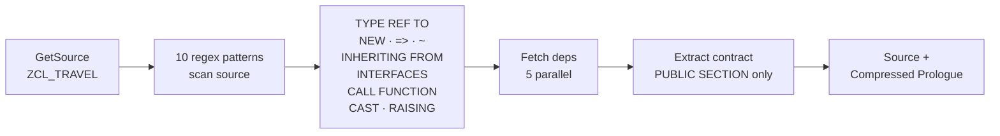
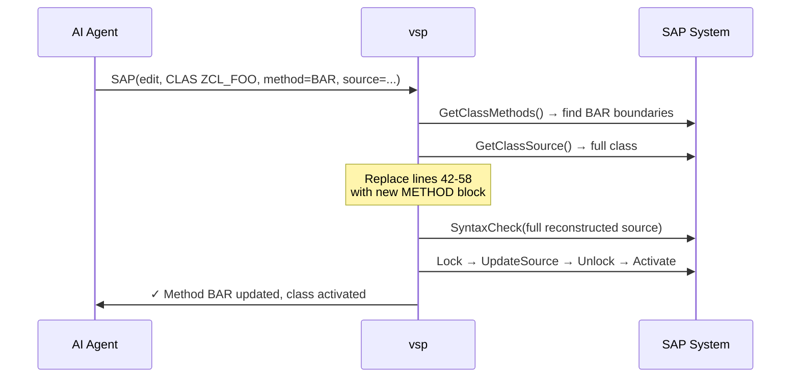
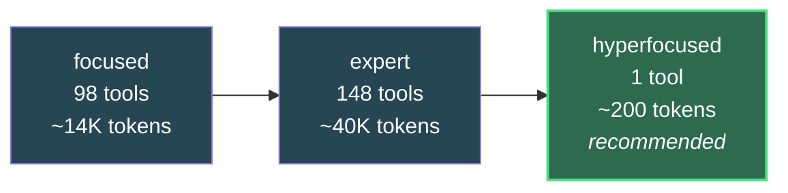

# Vibing Steampunk (vsp)

**AI-Agentic Development Unlocked for ABAP** — any system with ADT enabled, 7.50 upwards.
The available surface varies by release, and `vsp compat` reports it per system: RAP needs
S/4, AMDP needs HANA, and some ADT resources present on S/4 are absent on ERP.

> **ADT ↔ MCP Bridge**: Gives Claude (and other AI assistants) full access to SAP ADT APIs.
> Read code, write code, debug, deploy, run tests — all through natural language (or DSL for automation).
>
> **New in the last three releases** — the part of a root cause that never fit in a tool:
>
> - **[The MIME repository, byte-exact](#the-mime-repository-byte-exact--smw0-over-plain-adt).**
>   Every file anyone uploaded through SMW0 — images, audio, a font, a game — read back
>   whole. The bytes are a data cluster of 255-byte lines whose last line is padded, so
>   the cluster cannot say where the file ends; `filesize` in WWWPARAMS can, and that is
>   the step that makes it exact rather than nearly right. Nothing installed on the server.
> - **[Cluster tables, decoded](#cluster-tables-decoded--baldat-indx-stxl-over-plain-adt).**
>   BALDAT, INDX, STXL — every table an `EXPORT ... TO DATABASE` ever wrote — read over
>   plain ADT and decoded here: SAP's LZH and LZC decompressed in Go, the cluster format
>   walked, the fields named from DD03L. What only `IMPORT` could read, without a line of ABAP.
> - **[A dump's own why](#post-mortem-from-a-dump-to-what-was-logged-around-it)** — `dumps --explain`
>   now reads the whole ST22 document, not just the stack: the message it raised with its
>   variables, the system fields, the failing source line, and the runtime's chosen variables
>   per frame — so a stale handle or an unresolved pointer is on screen, not dug out by hand.
> - **[The application log with its messages](#post-mortem-from-a-dump-to-what-was-logged-around-it)**,
>   by object and date range, and the same log from a bare SE16H export of two tables.
> - **[Spool and jobs](#jobs-and-spool--sm37-and-sp01-as-tables)** — SP01's list decoded
>   from TemSe, a job's steps and its log, exported for the whole night in one command.
> - **[Where the settings are](#what-is-it-set-up-to-do--variants-test-data-documentation-the-img)** —
>   a report's variants with the screen's own labels, SE37's saved test data, SE61
>   documentation as Markdown, and the IMG searched by title with the activity's transaction.
> - **[Texts and the title, from the same call](#selection-texts-and-text-symbols-without-leaving-the-call)** —
>   selection texts and text symbols written as a plan with a diff, activated so they stay,
>   and a hint after every program create that names the fields still without one; the
>   [description set without touching the source](#the-description-and-the-binary-itself).
> - **`vsp update`** — the release for this platform, verified against `checksums.txt`,
>   renamed into place of the running binary, from the repository the binary was built
>   for (`--repo owner/name` to point elsewhere).
> - **[A response cache](#response-cache)** that turns a 4-second `slim` into 10 ms, on
>   Go-native SQLite when it should outlive the process.
>
> And still the one that started it: the whole ABAP debugger — breakpoints, attach, stepping,
> call stack **and variables** — through SAP's own ADT resources over a classic-RFC tunnel or a
> plain HTTPS session, with **nothing installed on the server** and no SAP SDK.
>
> See also: [OData ↔ MCP Bridge](https://github.com/oisee/odata_mcp_go) for SAP data access.
>
> **Want to review or test?** Start here: **[Reviewer Guide](docs/reviewer-guide.md)** — 11 hands-on tasks, 6 of them fully offline.


## Hot Right Now

### The ABAP Debugger over RFC — Nothing Installed on the Server

The debugger needs one thing above all: a **stable ABAP session**.
`attach_debuggee( )` returns an object reference, and step, stack, and variables
all hang off it — which is why a debug loop spread over independent HTTP calls
kept losing its debuggee. A pinned classic-RFC conversation *is* that session,
natively, with no ICF, no CSRF, and no WebSocket upgrade.

```bash
vsp rfc debug                                    # one pinned session, held for the whole loop
dbg> ebp ZADT_DEBUG_LOOP 9                       # breakpoint, by object name — ADT resolves the URI
dbg> eclipse 120                                 # listen, attach, stack — through SAP's own ADT resources
dbg> elocals                                     # the stopped frame's variables, with values
dbg> estep over
dbg> estack
```

The same six commands work in `vsp adt debug`, over HTTPS, against a system with
no gateway port. An integration test runs that script over both transports and
fails if they disagree about where the debuggee stopped or what it could see
(`go test -tags=integration -run Conformance ./pkg/saprfc/`).

From an MCP client the same loop is `SetBreakpoint` → `DebuggerListen` →
`DebuggerGetVariables` → `DebuggerStep` → `DebuggerDetach`. `DebuggerListen`
attaches for you: a debuggee is only attachable while it waits, so a caller that
has to copy an id between two tool calls loses the race.

**Nothing is installed on the server for this.** `eclipse` drives the very
resources Eclipse uses — `/sap/bc/adt/debugger/listeners`, `/sap/bc/adt/debugger`,
`/sap/bc/adt/debugger/stack` — tunnelled through `SADT_REST_RFC_ENDPOINT`. The
only reason a normal tool cannot use them is that ADT keeps the debug session in
an ABAP roll area, reachable again only through a `sap-contextid` cookie; over a
pinned RFC conversation the roll area *is* the session, so there is nothing to
correlate. You get ADT's own answers back: source URIs per stack frame, DYNP
screen frames, the authorization flags, the action catalogue — and SAP labels
the session `RFC session: <instance>` itself.

**No RFC channel at all?** Then use `vsp adt debug`: the identical loop over one
stateful HTTPS session. The debugger was never an RFC feature — listen, attach,
stack and step are ADT resources, and RFC was one way to carry them. What they
need is a *session*, and over HTTPS that is the stateful ICF session
`sap-contextid` selects. Verified against A4H over plain HTTPS, with a cookie or
a password and no gateway port in sight — which is the shape of every system
where you can sign on to ADT but nobody will give you an RFC user
([`docs/design/http-only-systems.md`](docs/design/http-only-systems.md)).

**Breakpoints need no ABAP either.** `POST /sap/bc/adt/debugger/breakpoints`
answers 200 on both transports and writes the same `ABDBG_EXTDBPS` row a Z
facade would. One asymmetry is real: SAP answers the *GET* with 200 and an empty
body, because in ADT the breakpoint set is the IDE's state — Eclipse posts it
whole rather than asking. So a client keeps its own record, and adding one
breakpoint is a read-modify-write.

There is also a typed, smaller-payload path over a little ABAP facade
([`abap/src/zadt_debug`](abap/src/zadt_debug/)) for systems where the ADT
debugger resources are absent or blocked — and for the one thing ADT will not
answer, reading the server's own breakpoint table:

```bash
dbg> bp SAPLZADT_DEBUG/LZADT_DEBUGU01 9          # external breakpoint (name the include!)
dbg> catch 150                                   # wait for a hit, attach, show the stack
dbg> step over
dbg> stack
dbg> detach
```

Both paths are proven live on A4H: the breakpoint was hit by a function module
called over a **second** RFC connection, the stack showed the real entry chain
`%_RFC_START` → `REMOTE_FUNCTION_CALL` → the module, stepping walked it line by
line, and afterwards the debuggee ran on and committed its work.

**Variables are read *and* written.** `elocals` walks the debugger's variable
tree to the stopped frame's own data; `eset LV_AMOUNT 900` puts a value back, and
the next statement computes with it — measured on A4H, a value that arrived from
the database as 46 became 901 downstream instead of 47. That turns the debugger
into a scenario harness: reaching a state by arranging for the system to produce
it is usually the hard part, and this skips it. It changes real execution,
database writes included, so it is not something to do in somebody else's session
without asking. `eframe` moves the cursor to another stack entry, so the caller's
half of a call boundary is readable too.

**Customer code by default.** A breakpoint set in a SAP standard program is
accepted, given an id, and then never fires: without system debugging there is
nowhere to stop. That is SAP's behaviour, not a filter of ours — `esys` turns it
on for the cases that need it. Staying out costs less than it sounds, because a
breakpoint on the line that *calls* a standard module captures what went in, and
one on the line after captures what came back.

**It catches web requests.** An external breakpoint fires for an ICF session just
as it does for RFC: a function module triggered through `/sap/bc/soap/rfc` over
plain HTTP was caught by a listener on an HTTPS debug session, with the whole web
stack visible — `%_HTTP_START` → `HTTP_DISPATCH_REQUEST` →
`CL_HTTP_SERVER->EXECUTE_REQUEST` → the SOAP handler → the module. An OData
request is that same path with the Gateway handler, so debugging one needs
nothing new.

The read half needs no ABAP either: `vsp rfc debuggees`, `vsp rfc breakpoints`
and `vsp rfc watch` read `ABDBG_ACTIVATION` and `ABDBG_EXTDBPS` directly — who is
parked in the debugger and where, short dumps included.

**It is tested without a system.** `vsp adt debug --record` captures a live
session to a cassette — every request and every answer — and the tests replay
it, so `go test ./...` drives the real debugger with no SAP, no RFC channel and
no Z code. The committed cassettes are real 7.58 sessions: catching a stopped
program, reading its stack, reading locals with their values, stepping into a
subroutine and back out, writing a variable, expanding a structure and a table,
and a statement-level trace. A recording is an oracle rather than a mock —
nobody writes the answers, so nobody can write them to match the code, which is
how four defects surfaced the first time it ran.

Because a cassette is taken from a live system, the recorder drops every header
that carries a session and blanks the eight places a debug session names the
application server, and a test re-checks the committed files on every run.

**7.50 works too, and did not before.** That release has no
`/sap/bc/adt/debugger/stack`: the listener caught a debuggee, the attach
succeeded, and the first stack read returned 404 — and since catching a debuggee
ends with a stack read, every catch was thrown away. It serves the same document
from the dispatcher instead. The shape is discovered once per session and
remembered.

### Debug from your editor (DAP)

`vsp dap` is a Debug Adapter Protocol server on stdin/stdout. VS Code, nvim-dap,
JetBrains and other DAP clients can use it to set breakpoints in ABAP and step
through it on a real system. It is the same debugger as `vsp adt debug`: SAP's
own `/sap/bc/adt/debugger*` resources on one held stateful session, with nothing
installed on the server.

- **Logon:** vsp's usual config (a `.vsp.json` system, or `SAP_*` env). The launch
  configuration names a system and a user, never a password.
- **What it does:** it arms your breakpoints and waits. Run the program in SAP
  (SE38, a unit test, an RFC call, a job) and the editor stops on the line. vsp
  never starts the program itself, and it is not an MCP tool.
- **Breakpoints:** set them in files named by vsp's export convention
  (`zcl_x.clas.abap`, `zrep.prog.abap`, `zgrp.fugr.z_fm.abap`, ...). Stack frames
  open the local file when it is under `sourceRoot`. Otherwise the source is read
  from SAP.
- **Read-only systems:** you can still debug, but you can't change variables.

VS Code: until the vsp extension ships, any extension can declare the adapter in
its `package.json`. The `launch.json` entry then uses that type:

```jsonc
// package.json of a local extension
"contributes": {
  "breakpoints": [{ "language": "abap" }],
  "debuggers": [{ "type": "abap-sap", "label": "ABAP (vsp)", "program": "vsp", "args": ["dap"] }]
}

// .vscode/launch.json
{ "type": "abap-sap", "request": "attach", "name": "ABAP on A4H",
  "system": "a4h", "object": "ZVSP_DEBUG_DEMO", "sourceRoot": "${workspaceFolder}" }
```

nvim-dap:

```lua
local dap = require('dap')
dap.adapters.vsp = { type = 'executable', command = 'vsp', args = { 'dap' } }
dap.configurations.abap = {
  { type = 'vsp', request = 'attach', name = 'ABAP on A4H',
    system = 'a4h', object = 'ZVSP_DEBUG_DEMO', sourceRoot = '${workspaceFolder}' },
}
```

Launch and attach take the same arguments: `system`, `user` (whose debuggees to
catch; the default is the logon user), `object` and `include` (optional, resolved
at start), `sourceRoot`, `systemDebugging` and `listenSeconds`. Supported
requests: breakpoints, continue, step over/in/out, the stack, and variables
(locals, globals, and structures and tables expanded in place). Changing a
variable is also supported.

### AMDP debugging over plain ADT — the breakpoint fires

An AMDP method runs inside HANA, not inside ABAP, so debugging one means
bridging two debuggers. ADT does that itself, and nothing has to be installed:

```bash
vsp adt debug -s a4h -c "astart; abp ZCL_MY_AMDP 41; aresume 12; astop"
# and, while it waits, run the method from anywhere
```

SAP answers `ON_BREAK` with the position inside the SQLScript. This project
spent months concluding the opposite, through a Z service and a WebSocket
protocol built to reach what the system was already offering.

**With values.** `alocals` lists everything in scope — scope, type, and for a
table its handle and row count — and costs no request at all, because the stop
event already carries it. `avar LV_I` reads what a variable holds:

```
output   ET_RESULT   table[0] handle 3000001
input    IV_COUNT    INTEGER
local    LV_I        INTEGER
→ LV_I    INTEGER    1
```

Reading a variable is asynchronous and does not advertise it: the resource
answers 200 with an empty body and puts a request id in `Location`, which reads
exactly like a variable that is out of scope. The value arrives through the same
queue as everything else. Table *contents* are the one thing still missing — the
address is right and HANA refuses to build its data provider from it; see
`AMDPTableRows` for where it stands.

The trap is that answers arrive as a **queue** with acknowledgements at its
head. Resume once, see `SYNC_BREAKPOINTS`, and you conclude the breakpoint never
fired — while the debuggee is, at that moment, blocked on it. `aresume` waits
past them, and reports SAP's verdict on the way (`state="VALID"`), because a
refused breakpoint and a method that never ran look identical otherwise.

The whole choreography stays on one held session: the ADT resource keeps its
handles in ABAP session memory, so a second connection finds nothing.

Reachable from an agent too: `SAP(action="debug", target="AMDP_ADT_START")`.

### Post-mortem: from a dump to what was logged around it

A debugger helps when you can reproduce the failure. Usually nobody can:
there is a dump from Tuesday, a user who has moved on, and no way to make it
happen again.

```bash
vsp -s a4h dumps --group                          # what keeps failing, not what failed once
vsp -s a4h dumps --similar latest                 # what else looks like this one, and how closely
vsp -s a4h dumps --explain latest --tolerance 10m # the why: message, failing line, stack, and the log around it
vsp -s a4h applog --program ZCL_ORDER_POST        # who logged what, and from where
```

`--explain` reads the one formatted document ST22 keeps and pulls the causal
detail out of it — no extra round trips. Before the stack it prints the message
the dump raised with its own variables (`message SY 373 (type X) with -1`), the
system fields that frame it (`SUBRC`, `FDPOS`, `PFKEY`, `TITLE`), and the source
line it died on with a line either side, the failing one marked. `--json` adds
a `detail` object with the full `systemFields`, `source`, and the runtime's
`variables` per stack frame — where a stale handle or an unresolved pointer
shows up as its value. So the answer to "why" is on screen, not reconstructed by
hand from the raw dump.

`--group` collapses dumps by runtime error and terminated program, which is
structural. Grouping by "the same afternoon" would make a busy hour look like
one incident.

`--similar` answers "is this new, and how often does it happen" on a ladder,
and says which rung each match is on:

| rung | claim |
|---|---|
| 1 | same error, same program, same line — the same bug |
| 2 | same error, same program — the same bug or its siblings |
| 3 | same error, same application component — a neighbourhood |
| 4 | same error — a class of failure |

Rungs 2 and 4 come free with the listing. Rungs 1 and 3 need the failing line
and the application component, which are in the dump detail and nowhere else,
so they cost one fetch per candidate — bounded by `--deep`, and skipped
entirely on a release that has the feed but not the detail resource. A rung is
an argument, not a verdict: rung 4 is the same class of failure and is not the
same bug, and the output says so on every row rather than in a footnote.

Two things the ladder refuses to do. Three different function groups on a live
system all terminate at `SAPMSSY1` line 36, because that is where the RFC entry
point is — so the line alone is never rung 1 without the program. And custom
code is usually assigned to no application component, which is reported as no
neighbourhood rather than as one shared neighbourhood of everything unassigned.

`--explain` is the interesting one. Correlating a dump with the application log
is a time join, and a time join is where a tool starts lying — two things in the
same second is not causation. What rescues it is that a log entry records *the
program that wrote it*. So time is the filter and the program is the reason:

| rank | why |
|---|---|
| strongest | written by the program that dumped |
| | written by a program on the dump's call stack — on the path by construction |
| | written by something a stack frame calls — where a bad value gets prepared (see below) |
| | same user, shortly before |
| weakest | same user after the dump — error handling, not cause |

Every row states its own argument, because the argument is what lets a person
overrule the ranking. A match is a candidate; "the cause" is not ours to say.

One rung does not fire yet, and the tool says so rather than leaving a gap that
looks like an answer: asking what a program calls needs
`/sap/bc/adt/cai/callgraph`, which is advertised on none of 7.50, 7.57 or 7.58
and answers 404. The ranking is right and only the source of callees is
missing; where-used over CROSS would supply it.

All of it over plain ADT — no RFC, no gateway, no Z code. SAP's own way into the
application log is the `BAL_*` function group, which cannot be called remotely
by any transport; the log's tables are ordinary tables, so free SQL reads them
instead — the headers from BALHDR, and with `--messages` the messages from
BALDAT, which is a cluster table and needs one more step:

```bash
vsp -s a4h applog --object ZDEMO_LOG --since 2026-09-01 --messages
```

```
2026-09-04 12:00:01  ZDEMO_LOG/POST  log 22274  TESTUSER  ZCL_DEMO_POST=================CP
    000001 E ZDEMO_MSG 017       20260904100001.5909840  Order 4711 has no delivery block
           context ZDEMO_ORDER_KEY: 0000004711
```

### Jobs and spool — SM37 and SP01 as tables

A night job failed. `vsp jobs list --since` shows it with its status, its
steps — program, variant, user — and the spool number each step wrote;
`vsp spool read` prints that spool, and `vsp spool export` writes every
matching request to a directory with an index of who wrote what, when, from
which job. All of it from TBTCO, TBTCP, TSP01 and TST03 over free SQL: the
spool content is the TemSe object decoded here — records, print controls,
the list format's escapes — checked line for line against what XBP returns.

Two things are not tables. The job log is a TemSe object most systems keep
in files, and so is spool on a system configured that way; both come over
RFC through XBP, which `vsp jobs log` and `--via rfc` do. On the MCP side:
`job_list`, `job_log`, `spool_list`, `spool_read`.

```bash
vsp -s a4h jobs list --program ZDEMO_NIGHTLY_RUN     # every job with a step running it
vsp -s a4h spool list --job ZDEMO_NIGHTLY --top 20
vsp -s a4h spool export --user TESTUSER --since 2026-09-01 --out ./spool
```

### What is it set up to do — variants, test data, documentation, the IMG

The other half of a root cause is configuration, and it sits in tables too.
`vsp variants` reads a report variant as a table of fields with their labels,
kinds, types and values, from VARI and the program's selection texts; that is
what a job's step selected, without `RS_VARIANT_CONTENTS`. `vsp fmtest` reads
the Function Builder's saved test data from EUFUNC: every set's inputs, what
came back, the runtime, the interface as it was. `vsp docs` renders SE61
documentation as Markdown, includes resolved — data elements, reports,
function modules, classes, messages — and walks the IMG: `docs img` finds
activities and folders by their titles and gives the path to each, `docs
activity` gives the transaction and the activity's own text. MCP: `variants`,
`fm_test_data`, `documentation`, `img_search`, `img_activity`.

```bash
vsp -s a4h variants ZDEMO_NIGHTLY_RUN                # the variants, who made them, when
vsp -s a4h variants ZDEMO_NIGHTLY_RUN MONTH_END --json
vsp -s a4h fmtest STRING_CONCATENATE
vsp -s a4h docs read DE BALLEVEL
vsp -s a4h docs activity /IWBEP/CP_DELETE_JOB
```

### Selection texts and text symbols, without leaving the call

A selection text is maintained in a screen three clicks from the code, and a
program created over MCP has none. `vsp texts` reads and writes the text pool
over ADT — selection texts (S) and headings (H) of a program, text symbols
(I) of a program or a class — and a write is a plan first: what is added,
what changes from what, what is already so, what is refused (a key the
screen does not have, a key SAP would reject, a text past 30 characters).
Nothing is locked when nothing differs.

```bash
vsp -s a4h texts get ZDEMO_RUN                       # S, I and H entries
vsp -s a4h texts set ZDEMO_RUN P_DEVC="Package to scan" S_OBJ="Object names"
vsp -s a4h texts set ZDEMO_RUN --kind I 001="Nothing found"
vsp -s a4h texts set ZDEMO_RUN --dry-run P_DEVC="Package to scan"
vsp -s a4h texts set CLAS ZCL_DEMO --kind I 001="Loaded"
vsp -s a4h texts set ZDEMO_RUN --delete P_MODE            # the entry a removed field left behind
```

The text elements are their own ADT resource with their own lock; the lock,
the write, the unlock and the activation happen in the one call. The
activation matters: the PUT lands as an inactive version, and activating the
program does not carry it — texts written without it read back unchanged
from the active version and look lost. MCP: `i18n` with `op: texts_get` /
`op: texts_set`, `create PROGRAM` takes a `texts` map, and after a program
is created or written the result says which screen fields still have no
text and which `TEXT-xxx` the source uses but never defines — with the call
that sets them.

### The description, and the binary itself

The description is the short text SE38 shows as the title and prints at the
head of a list. Creating over ADT sets it once, from the file's header
comment when deploying — and SE38's own template put `*& Report ZDEMO` there,
which became the description of more than one program. The header line is
skipped now, and the text can be set later without touching the source:

```bash
vsp -s a4h description ZDEMO_XFER                    # what it is
vsp -s a4h description ZDEMO_XFER "DPL snapshot transfer: download / upload / transplant"
vsp -s a4h description CLAS ZCL_DEMO "Demo class"    # PROG, INCL, CLAS, INTF, FUGR, FUNC, TABL, DDLS
```

MCP: `edit` with `type: set_description`, and a `description` on
`deploy_from_file` and `write_program` is written after the source.

**A write with no transport named** used to leave the choice to SAP, which
answered with a request of its own — *Generated Request for Change
Recording* — one per write, so a day's work on one feature ended up spread
over three requests beside the one already open. Now the write asks the
transport check what Eclipse's dialog asks it: which of your open requests
fit. The object's own request wins, then the one already holding objects of
the package, then the only candidate, then the newest; with none and
`--enable-transports`, one is created and the result says so. Every result
carries `transport` and, when the choice was made here, `transportNote`.
`--transport-choice off` (or `SAP_TRANSPORT_CHOICE=off`) restores the old
behaviour.

**A request filed under a CTS project.** Systems that organise their requests
in CTS projects expect each request to carry one. Where the project is
mandatory, ADT refuses a request without it — *Change requests must be
assigned to a project* — so vsp could not create a request there at all, and
elsewhere it created one outside any project. `--cts-project` and `--transport-target`
(`SAP_CTS_PROJECT`, `SAP_TRANSPORT_TARGET`, or `cts_project` /
`transport_target` per system in `.vsp.json`) now apply to every request vsp
creates, the automatic one above included; `create_transport` also takes
`cts_project` and `target` per call. ADT's answer names the project by its
external ID, not the name it stored — E070A (`SAP_CTS_PROJECT`) is the record.

**Merging requests, moving an entry** is SE09's Utilities → Reorganize and
nothing in ADT — the organizer's resources add objects and release, none
removes an entry — and the function modules behind SE09 are not
remote-enabled. They are reachable through ZADT_VSP's `CALL FUNCTION`
bridge, which now takes JSON for structure and table parameters and turns
a dialog off when told to:

```bash
SAP_ENABLE_TRANSPORTS=true vsp -s a4h transport merge TR-A TR-B --into TR-C     # tasks and objects move, sources are deleted
SAP_ENABLE_TRANSPORTS=true vsp -s a4h transport move "PROG ZDEMO_RUN" --from TR-A --to TR-B
```

Adding an entry nobody edits -- a `LIMU REPT` for a report's texts, a `TABU`
with the keys of the customizing rows it carries -- and taking one out go the
same way:

```bash
SAP_ENABLE_TRANSPORTS=true vsp -s a4h transport add TR-A "LIMU REPT ZDEMO" "R3TR PROG ZDEMO2"
SAP_ENABLE_TRANSPORTS=true vsp -s a4h transport add TR-A "R3TR TABU ZDEMO_CONF" --key 100KEY1 --key "100KEY2*"
SAP_ENABLE_TRANSPORTS=true vsp -s a4h transport remove TR-A "PROG ZDEMO"
```

MCP: `system` with `merge_transports` (`source`, `target`),
`move_transport_object` (`object`, `from`, `to`), `add_transport_object`
(`transport`, `objects` or `object` + `keys`) and `remove_transport_object`
(`transport`, `object`). All need ZADT_VSP on the
system — redeploy it after this release, the bridge changed.

**A transport of copies** of a request, the way SE01 builds one: the request is
created over ADT (`tm:type` T, with a target), and its object list copied in
with `TR_COPY_COMM` through the same bridge — from each task that holds
objects while the request is modifiable, since the function copies only the
entries of the request it is given, and from the request itself once it is
released. The description defaults to `ToC ` and the original's. ADT takes a
target without a client (`QAS`, not SE01's `QAS.100`), or a target group.
Nothing is released unless asked:

```bash
SAP_ENABLE_TRANSPORTS=true vsp -s a4h transport toc TR-A --target QAS
SAP_ENABLE_TRANSPORTS=true vsp -s a4h transport toc TR-A --target /GROUP/ --release
```

MCP: `system` with `copy_to_toc` (`transport`, `target`, optional
`description`, `cts_project`, `release`).

Under `--allowed-packages`, every object the copy would carry is checked
first (a LIMU entry by its class, interface or program; one whose object
cannot be told, such as `LIMU FUNC`, is refused), and any offender refuses the
whole copy before anything is created. Entries a modifiable request holds
itself, outside its tasks, are not copied; they are listed under `skipped`.
If a list fails to copy or the release fails, the result is an error that
names the transport of copies, what was copied, what was not, and the
release status. `--read-only` refuses it like any transport write.

**Upload a transport** into the connected system's import queue -- and no
further. A released request's cofile `K<nr>.<SID>` and data file
`R<nr>.<SID>` are written into DIR_TRANS of the system vsp is connected to
(`cofiles/`, `data/`), and the request is added to that system's import
buffer, as STMS's *Extras > Other Requests > Add* does. vsp never imports:
the import stays a human step in STMS.

```bash
SAP_ENABLE_TRANSPORTS=true vsp -s qassys transport upload --cofile ./K900123.DEV --datafile ./R900123.DEV   # waits up to --wait (60s) for the outcome
SAP_ENABLE_TRANSPORTS=true vsp -s qassys transport status TR-EXAMPLE --job 12345678   # queued / pending / job_failed / unknown, read-only
SAP_ENABLE_TRANSPORTS=true vsp -s qassys transport buffer TR-EXAMPLE      # read-only view of the queue
SAP_ENABLE_TRANSPORTS=true vsp -s devsys transport download TR-EXAMPLE -o ./out   # copy out of DIR_TRANS; changes nothing, but refused under --read-only (data files can hold table contents)
```

MCP (expert mode only): `system` with `upload_transport` (`cofile_path` +
`datafile_path`, or `cofile_name`/`cofile_base64` + `datafile_name`/`datafile_base64`),
and the read-only `transport_status` (`transport`, `job`) and `transport_buffer`
(optional `transport`).

The upload answers as soon as the files are written and the background job
that adds the request is released: status `pending` and the job's number.
`transport_status` / `vsp transport status` then say `queued` only when the
buffer file holds the request and the job is done, `pending` while it runs,
`job_failed` when it ended without the request in the buffer, and `unknown`
otherwise -- check STMS and the job in SM37 then. The job also pushes its
outcome to the WebSocket that started the upload (AMC application
`ZVSP_TRANSPORT`, channel `/buffer`, which `vsp install zadt-vsp` creates), so
`vsp transport upload` learns it within a second or two instead of polling;
the status call still decides, and without the AMC application the upload
works the same, polling. An upload committed but
never handed to a job (the session ends, or a new upload begins) has its files
deleted again.

A request whose SID is the connected system's own (exported from this very
system) is uploaded like any other: putting a system's own released request
back into its queue -- after its files were lost, say -- is a legitimate use,
and the import, if any, is still a human decision in STMS.

The rules, checked in vsp and again in ZADT_VSP's `ZCL_VSP_TRANSPORT_SERVICE`:
both files, matching number and SID, the cofile's shape (a header and an
export step from its SID), 50 MB together; the target is always the server's
own system and client (a `system`, `client` or directory parameter is
refused); a file that exists in DIR_TRANS is never overwritten, not even an
empty one; a request already in the buffer is not added again; and the only
tp command that can be sent is the literal `ADDTOBUFFER`, which a test over
the ABAP source enforces. Refused under `--read-only` and
`--transport-read-only`; needs `--enable-transports`; `--allowed-transports`
applies to the request. On the system it needs ZADT_VSP (redeploy:
`vsp install zadt-vsp`) and `S_CTS_ADMI` with `EPS1` (files) and `TADD`
(buffer). tp is started over synchronous RFC, which a ZADT_VSP (APC) session
may not do, so the add runs as background job `ZVSP_TRANSPORT_BUFFER` under
the caller's user (`S_BTCH_JOB` to release it); vsp waits for its result.
The add is recorded in tp's user log (`ULOG`), the TMS alert log and the
cofile (a `<SID> <` step line) -- not in TPSTAT, which has no row for
ADDTOBUFFER. `transport_buffer` / `vsp transport buffer` read the buffer file
`DIR_TRANS/buffer/<SID>` directly (no tp, no job), so they stay available
under `--read-only`. If the buffer add fails while the request is certainly not in the
buffer, the two files this upload wrote are deleted again. Taking a request
out of the queue again is done in STMS.

Whether a request has been imported, and how it went, is in TPALOG: MCP
`system` with the read-only `import_status` (`transport`: one request, a
comma-separated list or an array; optional `since`, `YYYYMMDD[hhmmss]`) lists
the tp steps each request has in this server's own system, oldest first, with
the worst return code. No steps means tp has not touched the request there, or,
with `since`, not since that time: an earlier import is filtered out, not absent.
Each step carries its client, step code, return code, time and target system
(`TARSYSTEM`). Step times and `since` are UTC (`TRTIME` is a UTC time stamp).
In the system the request was exported from, TPALOG also holds the export
steps (`E`, `e`, `f`), and `maxRc` covers them too, so having steps there does
not mean the request was imported. It reads TPALOG over classic RFC (`RFC_READ_TABLE`, with a WHERE clause vsp
builds from the checked request numbers), so it needs the system's RFC
settings, `--enable-transports` (or `--allow-transportable-edits`) and a
request that `--allowed-transports` lets through, and it stays available under
`--read-only`.

**Import an abapGit zip** into a package in one call, with the abapGit
installed on the system: an offline repository for the package, abapGit's
deserialize checks, deserialize, activation -- and back come the outcome,
abapGit's errors and warnings, the TADIR rows created or changed and the
repository key. `git delete-objects` undoes it item by item.

```bash
vsp -s devsys git import-zip ./demo.zip --package '$ZDEMO'               # waits up to --wait (5m) for the job
vsp -s devsys git import-zip ./demo.zip --package '$ZDEMO' --overwrite   # into its existing offline repository, overwriting
vsp -s devsys git import-status 12345678                                 # a job still running, read-only
vsp -s devsys git delete-objects --package '$ZDEMO' "PROG ZDEMO_REPORT" "CLAS ZCL_DEMO"
vsp -s devsys git delete-objects --package '$ZDEMO' --delete-repo "PROG ZDEMO_REPORT"   # and unregister its offline repository
vsp -s devsys git object-versions --package '$ZDEMO' "CLAS ZCL_DEMO" --sha256          # read-only: the versions to expect
vsp -s devsys git delete-objects --package '$ZDEMO' "CLAS ZCL_DEMO" \
    --expect "CLAS ZCL_DEMO sha256=<from object-versions --sha256>"                     # only while it is still that version
```

MCP: `system` with `git_import_zip` (`file_path` or `zip_base64`, `package`,
`repo_name`, `overwrite`, `transport`, `wait_seconds`), the read-only
`git_import_status` (`job`), `git_delete_objects` (`package`, `objects`,
`delete_repo`, `expect_repo`, `keep_order`), and the read-only `git_object_versions`
(`package`, `objects`, `sha256`).

Nothing that exists is overwritten without `overwrite`, and a package that
already has a repository is refused without it. A package that exists
without a repository is imported into without `overwrite`; its own package
entry is left as it is. `overwrite` also needs deletes allowed
(`--disallowed-ops` without `D`), since abapGit deletes and recreates an
object whose type changed. Unmet requirements or APACK
dependencies, an object of another package, a package move, potential data
loss, an unsupported object type and table content refuse the import; a
local object the zip does not have is never deleted. Before a byte is sent,
vsp reads the zip's `.abapgit.xml` and folders and checks the target package
and every package the zip maps to against `--allowed-packages`; ZADT_VSP
checks again that every file maps to one of those packages. A transportable
package needs `--allow-transportable-edits` and a transport (named, or chosen
as for any write); a local one takes none, and only a local one is created by
the import. Refused under `--read-only`.

`git_delete_objects` deletes exactly the listed TADIR items -- each only when
the package's TADIR has it, each through the same gated delete as any other
-- then the package itself if nothing and no subpackage is left and no
abapGit repository is registered for it. Nothing outside the package is
deleted, a package is never an item, and when an object cannot be deleted
the repository and the package stay. The repository registered for the
package (its row: URL, branch, settings) is kept unless `delete_repo: true`
(`--delete-repo`) is given, and then it is unregistered only if it is offline
and the package is empty after the deletes; ZADT_VSP checks both again. An
online repository is never unregistered: `delete_repo` with one is refused
before anything is deleted. A repository abapGit cannot open counts as
online, and the package is never deleted while any repository is registered
for it. Objects are deleted at their own ADT address (an include, a
structure), looked up by name.

To delete only what is still the version you decided on, read the versions
first (`git_object_versions`, `vsp git object-versions --sha256`) and pass
them back: an object `{"type", "name", "expect": {"sha256": ...}}` (or
`"stamp"`; with both, sha256 decides). vsp takes the object's ADT lock,
reads its version again while it holds the lock, and deletes it only on a
match; otherwise its status is `changed`, with what it is now (`observed`),
and it is kept. A version that cannot be read never matches. Objects are
checked and deleted one at a time: when one comes back `changed` (or
`failed`), **the other objects listed are still deleted**; only the
repository and the package are kept. There is no all-or-nothing mode yet.

Objects are deleted users before what they use: code (PROG, CLAS, INTF,
FUGR, XSLT and any type not named here), then RAP (SRVB, SRVD, BDEF,
DCLS/DDLX, DDLS), then search helps and lock objects (SHLP, ENQU), table
types (TTYP), tables and structures (TABL), data elements (DTEL), domains
(DOMA); within a type, in the order given. An append structure is not
yet ordered before the table it extends (both are TABL): list it first.
`keep_order: true` (`--keep-order`) deletes exactly in the order given.
The result's `order` is every delete attempt in the order made; an object
retried after a failure is listed twice. Each expectation is read right before its own delete,
after the deletes ahead of it, while a sha256 read before the call is of the
state before any of them -- which is why the order matters: deleting a data
element first changes the serialisation, and so the sha256, of a table that
uses it, and the table would come back `changed`.

The ADT lock is the workbench enqueue: a second ADT session -- even the same
user's -- is refused while it is held (checked live: `EU 510`), and abapGit's
import refuses an object with that lock entry. That editors outside ADT (SE38,
SE24, SE11, SE51 for dynpros, SE41 for GUI status, SE63/SE61 for texts and
documentation) take the same enqueue for every part they write is expected
but has not been verified for each of them; anything that writes the tables
directly, without the enqueue, is not held off by it.
`expect_repo: {"key", "name"}` (`--expect-repo-key`, `--expect-repo-name`)
unregisters the repository only when it is exactly that row; otherwise
`repoNote` is `kept: registered repository is <key> <name>`.

**Use `sha256` when it matters.** It is the SHA-256 (lower-case hex) of the
UTF-8 text of the lines `<file name>=<SHA-256 of the file>`, one per file
of the object's abapGit serialisation in its original language only,
sorted, joined by LF without a final LF -- so it covers everything abapGit
serialises for the object. It sees only the active version: an object with
an inactive version (a row of the inactive worklist DWINACTIV for it or a
part of it, reported as `inactive`) is never a sha256 match, so
unactivated work is not deleted unnoticed. Reading it serialises the object
with abapGit, which only reads.

The stamp is cheaper and coarser:
`v2:<TABLES>:<YYYYMMDDHHMMSS>:<ROWS>:<DIGEST>`, the newest change date and
time over the object's dated version rows (active and inactive), the number
of those rows, and the first 16 hex digits of a SHA-256 over the rows of
some tables that carry no date:

| Type | Dated rows | Digest |
|------|------------|--------|
| CLAS, INTF | REPOSRC (every include of the pool but CS, which is regenerated without the source changing), REPOTEXT (text pool) | SEOCLASSDF, SEOCLASSTX, SEOCOMPOTX |
| PROG | REPOSRC, REPOTEXT (text pool), D020S (dynpro generation) | |
| TABL | DD02L, DD09L (technical settings), DD12L (indexes) | DD02T, DD35L (search help assignment), TDDAT |
| DTEL | DD04L | DD04T |
| DOMA | DD01L | DD01T, DD07L, DD07T |
| TTYP | DD40L | DD40T |
| DDLS | DDDDLSRC | DDDDLSRCT |

**What the stamp does not see**, so that a change there alone leaves it as
it was: documentation (DOKHL/DOKTL) of every type; a program's GUI status
and titles (EUDB, RSMPTEXTS) and a dynpro changed without being generated;
a class's or interface's SOTR texts, sub-component texts (SEOSUBCOTX:
parameter and exception descriptions), relations and friends (SEOMETAREL,
SEOFRIENDS) and component properties its source does not carry; a table's
field texts (DD03T), foreign keys (DD05S, DD08L) and search help field
mapping (DD36M), unless the change also updated a dated row; and two
changes within the second the stamp was read in. Other types have no stamp.

The stamp also moves where sha256 does not: on a translation in any
language (it reads the text tables in every language; sha256 covers the
original language only), and on a dynpro's regeneration (D020S's
generation date moves without a change). Both give a `changed` where
nothing sha256 covers changed -- the safe side. Inactive versions are
looked up by name, whatever the object type, so an inactive DTEL ZFOO also
marks DOMA ZFOO inactive -- the safe side too. A ZADT_VSP too old to report
`inactive` makes a sha256 expectation `failed` ("ZADT_VSP too old"), never a
match.

A zip is refused above 20 MB, 50,000 entries or 200 MB unpacked (its
declared sizes, checked by vsp and again by ZADT_VSP before abapGit unpacks
it), and with more than one `.abapgit.xml` at its root. If the import's
commit gets no answer, the job may be running: vsp says so, and
`git_import_status` or SM37 (job `ZVSP_GIT_IMPORT`) tells.

abapGit's deserialize commits with `WAIT`, which a ZADT_VSP (APC) session may
not do (it dumps `APC_ILLEGAL_STATEMENT`), so the import runs as background
job `ZVSP_GIT_IMPORT` under the caller's user; its outcome is pushed to the
WebSocket that started it (AMC application `ZVSP_GIT`, channel `/import`) and
kept a week for `git_import_status`. Needs ZADT_VSP with the git service,
which `vsp install zadt-vsp` deploys where abapGit is installed (with the job
program and the AMC application); without abapGit the rest of ZADT_VSP still
runs.

`vsp update` fetches the latest release for this platform, compares it with
the running version, verifies the download against the release's
`checksums.txt`, and puts it in place of the running binary — the old one is
renamed aside first, which is what Windows allows for a running executable.
The release comes from the repository the binary was built for: these
releases are `github.com/oisee/vibing-steampunk`, and a fork's own releases
update from that fork; a local `make build` carries no stamp and uses the
default. `--repo owner/name` points at a different repository
for one run.

```bash
vsp update --check                                   # vsp 2.56.0, latest in oisee/vibing-steampunk is 2.57.0 (vsp-linux-amd64): update available
vsp update                                           # download, verify, replace
vsp update --version v2.55.0 --force                 # a particular release, newer or not
vsp update --repo myorg/vibing-steampunk --check     # a different fork's releases
```

### Cluster tables, decoded — BALDAT, INDX, STXL over plain ADT

BALDAT is one of a family: INDX, STXL, and every table an `EXPORT ... TO
DATABASE` writes to. The rows are ordinary — a key, a sequence number, a byte
count and a RAW column — and ADT's data preview returns all of them. What
nothing on the SAP side does for a remote caller is turn the RAW column back
into data: it is an SAP-compressed data cluster, and only `IMPORT` reads it.

`vsp cluster` does it here. SAP's "LZH" turned out to be DEFLATE behind an
eight-byte header and a two-bit prefix, so the standard library inflates it;
"LZC" is compress(1) and is ~100 lines. The cluster itself carries a type
descriptor for every exported object — kind, length and decimals of every
field, nested for structures, a line type for a table inside a structure —
so the values come back typed: packed numbers as decimals, time stamps with
their microseconds, strings from their out-of-line segments, a table-typed
component as its rows. What it does not carry is field names. `--layout`
supplies them: a DDIC structure is read from DD03L, includes resolved, and
laid over the descriptor field by field — type family, byte length and
decimals checked at every leaf, so a structure that does not fit is refused
with the field named rather than guessed at. Two layouts are built in:
`applog` for BALDAT, and `stxl` for SAPscript text, which STXL gets by
default.

```bash
vsp cluster decode snapshot.bin --json                 # an EXPORT TO DATA BUFFER, downloaded, decoded offline
vsp -s a4h cluster read INDX --where "relid = 'ZV'" --schema   # every object, every field typed
vsp -s a4h cluster read INDX --where "relid = 'ZD'" --layout ZDEMO_S_HEADER
vsp -s a4h cluster read INDX --where "relid = 'ZD'" --layout "HDR=ZDEMO_S_HEADER,ITEMS=ZDEMO_S_ITEM"
vsp -s a4h cluster read STXL --where "tdname = 'ZDEMO_TEXT'"   # the text, lines and formats
vsp -s a4h cluster read BALDAT --where "relid = 'AL' AND log_handle = '...'" --layout applog
vsp cluster decode baldat.txt --layout applog                  # from an SE16H download, no system
```

The offline form is the one for a system where SE16H is all you have: export
BALHDR to find the log handles, export the matching BALDAT rows, decode them
on your machine. On the MCP side it is `analyze type=cluster_read`, and
`application_log` takes `messages: true`.

Verified against clusters written by a 7.58 kernel: every elementary type,
compressed and not; DDIC-typed structures and tables; tables inside
structures, tables inside table rows, sorted and hashed tables, tables of
strings, bare strings — and against BALDAT from a 7.5x system. Version 5
clusters — what a pre-Unicode kernel wrote, and what old rows still are
after a Unicode conversion — are read too, from EUFUNC and AQLDB. The same
reader opens VARI (report variants, one object per parameter), LTDX (ALV
layouts), MONI (workload statistics), SOC3 (SAPoffice documents), EUDB and
STXL on sight, and EUFUNC gives the Function Builder's saved test data:
every parameter by name, the result, the runtime, the return code.

`vsp cluster decompress` is the compression alone, for streams that are
not clusters — REPOSRC's source column, dumped to a file by a few lines of
ABAP, decompresses with `--skip 1 --text`.

Checked on 7.50, 7.57 and 7.58. 7.50 serves the dump feed but not the detail
resource, so there is no call stack to read there — the correlation drops that
rung and still ranks on the rest.

### The MIME repository, byte-exact — SMW0 over plain ADT

Anything uploaded through SMW0 — a logo, a sound, a font, a PDF, a Z-machine
game a websocket handler loads at runtime — is reachable, and comes back byte
for byte.

It is not a column you can select. SMW0 writes the file into `WWWDATA` as an
INDX-style data cluster: LZH-compressed, split over as many rows as it takes,
and inside the cluster a table of fixed **255-byte lines**. The last line is
padded with zeroes, so the cluster alone cannot say where the file ends. The
true length is the `filesize` parameter in `WWWPARAMS`, and truncating to it is
the whole difference between a file and a nearly-right file.

```bash
vsp -s a4h w3mi list                                  # every MIME object with size and type
vsp -s a4h w3mi list 'ZDEMO%'                         # SQL LIKE on the object id
vsp -s a4h w3mi get ZDEMO_LOGO.PNG --out logo.png
vsp -s a4h w3mi get ZDEMO_LOGO.PNG --abapgit-dir src/ # the abapGit pair, ready to commit
```

Both halves are ordinary table reads, so nothing goes on the server: no
abapGit, no RFC, no `ZADT_VSP`. `--abapgit-dir` writes the pair abapGit
expects — `<name>.w3mi.data.<ext>` plus `<name>.w3mi.xml`, with the object id
escaped the way abapGit escapes it (`ZORK-MINI.Z3` → `zork-mini%2ez3`).

The `filename` parameter is deliberately **not** written into that XML, and a
test enforces it: it records the path the file was uploaded from — a user name,
a host, a directory layout — and these files are meant to be committable.

Where a wrong answer would look like a right one, it refuses instead of
guessing. A non-zero byte past `filesize` means `filesize` and the cluster
disagree; a cluster shorter than `filesize` means the object is truncated on
the system. Both say so rather than hand back a plausible file.

Verified on arithmetic that can fail. A 52216-byte game came out of 205 lines
of 255 = 52275, truncated to `filesize`, and the 59 discarded bytes were all
zero — then the file checked *itself*: a Z-machine v3 header declares its own
length at `0x1A` and its checksum at `0x1C`, and both matched what came out.
Two further extractions by different routes produced the identical md5. A
single bad byte anywhere would have broken the checksum.

### What really ran: `vsp trace`

A static call graph is a hypothesis. ABAP resolves `CALL FUNCTION lv_name`,
`PERFORM (f)`, `CALL METHOD (m)` and every RFC destination at runtime, so only a
measurement knows what a program actually called.

```bash
vsp trace run ZADT_DEBUG_LOOP --call     # arm a SAT trace, fire it, print the tree
vsp trace list                           # traces this system holds
vsp trace tree <ID> --json               # one JSON object per statement
```

SAT does the measuring and vsp reads the result, so it costs almost nothing and
runs against real workloads. The tree it produced for a two-statement module
already contains an edge no extraction would find:
`PERFORM (ext) %_BEFORE_COMMIT → SAPMSSY0`.

And the expensive half, for when the tree is not enough and you want the values:

```bash
vsp trace unit ZADT_DEBUG_LOOP --line 9 --call --values
```

anchors a breakpoint, waits for somebody to run the unit, then steps *over* its
statements — never descending into what it calls — and writes one JSON object per
stop. Against A4H that is the unit's whole data flow in seven records: line 9
with `LV_LOW` empty, line 14 with `LV_LOW=44` once the SELECT had landed, line 15
with `LV_COUNTER=45`, then an exit marker. Values are redacted to `«type:length»`
unless `--values` is given, because a capture at a code boundary is business data
by construction.

It is a deliberate mode, and the numbers say why. A stop needs the step, the
stack and the variables — four round trips, since variables take two. Measured
on A4H over a LAN in August 2026 that is about 45ms a stop, some 1300 a minute.
`/sap/bc/adt/debugger/batch` takes them as one multipart document and works
through the tunnel: **14ms, some 4300 stops a minute** on the same system. The
harness is `pkg/saprfc/step_cost_test.go`, behind the `integration` tag; the
numbers are one machine on one network, not a specification. Two other
measured limits shape it — SAP allows **30 external breakpoints per user**, and
stepping past the end of a unit whose caller is standard code ends the debuggee
rather than stopping, which is why a recording ends with an explicit `exit`
record instead of an error.

The write-up, with everything that had to be learned on the way:
[`reports/debugger-over-rfc.md`](https://github.com/oisee/open-rfc-go/blob/main/reports/debugger-over-rfc.md).

### Classic RFC — Call Any Function Module, No SAP SDK

vsp now speaks **classic RFC** next to ADT, through the pure-Go, SDK-free
[open-rfc-go](https://github.com/oisee/open-rfc-go) client — no NW RFC SDK, no native
library, no cgo. Same system, second protocol: ADT reads and writes code, RFC calls
the business logic.

```bash
vsp rfc info                                     # RFC_SYSTEM_INFO (sysid, release, host)
vsp rfc search 'BAPI_USER_*'                     # find RFC-enabled function modules
vsp rfc describe STFC_STRUCTURE                  # FM interface as an MCP-tool JSON Schema
vsp rfc call Z_DOUBLE '{"N":21}'                 # call any FM with JSON parameters
vsp rfc read-table T000 --fields MANDT,MTEXT     # RFC_READ_TABLE
```

The destination is derived from the system you already configured: host from the ADT
URL, system number from its port, gateway port `3300 + sysnr`. Override per system in
`.vsp.json` (`rfc_host`, `rfc_sysnr`, `rfc_port`) or per command (`--rfc-host`,
`--sysnr`, `--port`). RFC logon uses `rfc_user`/`rfc_password`, else `SAP_USER`/
`SAP_PASSWORD`, else the system's own credentials. An MCP server takes the RFC
settings of its own system (the one named by `-s`/`SAP_SYSTEM`, else the entry whose
URL and client match its own; a named entry whose URL or client is not the server's
is refused), and logs on with that entry's `rfc_user`/`rfc_password`,
else its own credentials. `SAP_USER`/`SAP_PASSWORD` are used only by a server without
credentials of its own (cookie or SSO logon), and only when `SAP_URL` and
`SAP_CLIENT` name its system.

In MCP it is one more action on the single `SAP` tool — the tool space stays as small
as it was:

```
SAP(action="rfc", params={"op":"info"})
SAP(action="rfc", target="Z_DOUBLE", params={"op":"call","args":{"N":21}})
SAP(action="rfc", target="STFC_CONNECTION")      # describe (default with a target)
SAP(action="rfc", target="T000", params={"op":"read_table","fields":["MANDT"],"top":5})
SAP(action="rfc", target="ZREPORT", params={"op":"run","variant":"DEFAULT"})  # background job: spool + job log
```

Types are handled end to end — scalars (incl. STRING/XSTRING, DATE/TIME, packed
DEC/TIMESTAMP, FLOAT), flat **and deep** structures and tables (xRFC) — and both the
classic and fast serializations on the wire.

And RFC does things ADT cannot:

```bash
vsp rfc probe                                    # what is this system, and what may this user do here
vsp rfc export ZPACKAGE -o pkg.zip               # abapGit ZIP in one call
vsp rfc run RSPARAM --wait 60 --spool            # run a report as a background job, read its spool
vsp rfc adt GET /sap/bc/adt/discovery            # ADT REST tunnelled through RFC, for when ICF is closed
vsp rfc debuggees                                # who is parked in the debugger, and where
```

### And the debugger is only the hard case — potentially all of ADT rides RFC

`SADT_REST_RFC_ENDPOINT` takes a whole HTTP request, so **any** ADT resource is
reachable over the gateway port: source read and write, activation, ATC, unit
tests, transports, search, refactoring — the surface vsp already speaks, on a
system where ICF is closed, HTTPS terminates somewhere inconvenient, or CSRF and
cookies are a fight:

```bash
vsp rfc adt GET /sap/bc/adt/discovery                 # 200, 299 KB atomsvc
vsp rfc adt GET /sap/bc/adt/programs/programs/RSUSR000/source/main
vsp rfc adt POST /sap/bc/adt/atc/runs Content-Type=application/xml --body run.xml
```

Read paths are proven (discovery, program source with `ETag`/`Last-Modified`, a
missing object answering ADT's own 404 document). The write sequence has been
**demonstrated by hand** on A4H and is not yet covered by a test, so it is shown
here as a worked example rather than as a guarantee:

```
POST …/oo/classes/zcl_x?_action=LOCK&accessMode=MODIFY   → 200, a lock handle
PUT  …/oo/classes/zcl_x/source/main?lockHandle=…         → 200   ← a separate request
POST …/oo/classes/zcl_x?_action=UNLOCK&lockHandle=…      → 200
POST /sap/bc/adt/activation?method=activate              → activated
```

An ADT lock is bound to an ABAP session — precisely what a short-lived HTTP
client cannot hold, which is why `LOCK` in one call and `UPDATE_SOURCE` in the
next fails with `InvalidLockHandle`, and why `EditSource` has to do everything
inside a single call. A pinned RFC conversation holds exactly that session, so
the handle is still valid on the next request.

And the class used for the test is one the HTTP client **could not even lock**:
it answers `MODIFICATION_SUPPORT=NoModification`, which is SAP saying "no
modification assistant needed here", not "read-only". So editing over RFC is not
merely equivalent to editing over HTTP — on that system it is strictly more
capable. (Order matters: activate *after* unlock, or the object's own ENQUEUE
answers `403 … is currently editing …`.)

### Package Analysis Suite

Five analysis commands that answer real questions about your ABAP packages:

```bash
vsp health --package '$ZDEV'                    # tests + ATC + boundaries + staleness
vsp health --package '$ZDEV' --report html      # full HTML report with details
vsp slim '$ZDEV' --level methods                # dead code detection (method-level)
vsp api-surface '$ZDEV' --include-subpackages   # Clean Core: which standard APIs do you use?
vsp boundaries '$ZDEV'                          # directional boundary crossing analysis
vsp boundaries '$ZDEV' --format mermaid         # visual graph with package subgraphs
```

### Transport & Change History

```bash
vsp changelog '$ZDEV' --since 20260101          # what changed in this package?
vsp changes '$ZDEV' --attribute SAPTEST         # group transports by CR attribute (E070A)
```

### Directional Boundary Crossings

Not just "crossed" or "not crossed" — **which direction** the dependency flows:

| Direction | Meaning | Verdict |
|-----------|---------|---------|
| UPWARD | child → parent | OK |
| COMMON | anything → _00 package | OK |
| SIBLING | module → module | BAD — extract to common |
| DOWNWARD | parent → child | BAD — inverts hierarchy |
| EXTERNAL | cross-hierarchy | WARN — isolation violation |
| CIRCULAR | A→B + B→A siblings | BAD — coupled modules |

Export to 7 formats: `text`, `json`, `md`, `mermaid`, `html`, `dot` (Graphviz), `plantuml`, `graphml` (Gephi/yEd).

### Side Effect & LUW Analysis

```bash
vsp -s dev effects ZCL_DEMO_ORDER      # from SAP
vsp effects --file ./local.abap        # no system needed
```

```
  LUW          unsafe
               both commits and registers deferred work — part of what it queues
               is committed by each
  reads        ZDEMO_ORDERS
  writes       ZDEMO_ORDERS
  effects      COMMIT WORK, IN UPDATE TASK
```

Also `SAP(action="analyze", params={"type": "effects", ...})`.

The interesting effects in ABAP are not database writes but **LUW effects**: a
unit calling `IN UPDATE TASK` has not written anything yet, and whoever calls
`COMMIT WORK` higher up triggers everything it queued. That is invisible
coupling, and nothing in SAP's toolchain reports it.

The analysis is **local** — it reads the unit's own source and nothing it calls
— and every answer says so.

The parser detects transactional patterns in ABAP source:

| What | Detected |
|------|----------|
| DB read/write | SELECT, INSERT, UPDATE, DELETE, MODIFY |
| LUW ownership | COMMIT WORK, ROLLBACK WORK |
| Deferred execution | IN UPDATE TASK, IN BACKGROUND TASK |
| Async | STARTING NEW TASK (aRFC), SUBMIT VIA JOB |
| External calls | RFC DESTINATION, HTTP client, APC/WebSocket |
| Transactions | CALL TRANSACTION, LEAVE TO TRANSACTION |
| Transformations | CALL TRANSFORMATION |

LUW classification: **safe** / **participant** / **owner** / **unsafe**.

### Health Reports

Full health reports with test details, ATC findings, and boundary crossings:

```bash
vsp health --package '$ZDEV' --details          # text with all details
vsp health --package '$ZDEV' --report md        # → _ZDEV.md
vsp health --package '$ZDEV' --report html      # → _ZDEV.html
vsp health --package '$ZDEV' --report my.html   # → my.html
```

Tests discover embedded local test classes across the full package hierarchy — the same as Eclipse Ctrl+Shift+F10.

### More

- `vsp graph co-change CLAS ZCL_FOO` for transport-based co-change analysis
- `vsp graph where-used-config ZKEKEKE` for heuristic TVARVC usage discovery
- `.vsp.json` `transport_attribute` for per-system CR correlation config
- **[Analysis & Refactoring Guide](docs/analysis-refactoring-guide.md)** for what these commands do
- **[Graph Guide](docs/graph-guide.md)** for examples, data sources, and current limits

## 0x1D3 Stars!

Read the latest: **[The frontier went down a layer](articles/2026-09-11-the-frontier-went-down-a-layer.md)** — since April: a rogue DIAG server a real SAP GUI draws from, the family's first SAP-LZH *writer* accepted by a live kernel, and the dump-RCA loop closing on itself. 467 stars, and still only 5% explored.

Earlier: **[Still Only 5%](articles/2026-08-25-still-five-percent.md)** · **[VSP Is Only 5% Explored](articles/2026-04-07-vsp-only-5-percent-explored.md)** · **[Agentic ABAP at 100 Stars](articles/2026-02-18-100-stars-celebration.md)**

## What's New

The headline changes are in the **"New in the last three releases"** callout at the top of this README; the full version history is in [CHANGELOG.md](CHANGELOG.md). Latest release: **[v2.59.1 — built by CI](https://github.com/oisee/vibing-steampunk/releases/tag/v2.59.1)**.

### v2.60.0 — upcoming

**New:** `vsp dap`, a Debug Adapter Protocol server. It lets you debug ABAP from VS Code, nvim-dap or JetBrains on a real system, with no Z code. See [Debug from your editor (DAP)](#debug-from-your-editor-dap).

**New:** read summary. `SAP(action="read", ..., params={"summary": true})`
(`vsp source read ... --summary`) returns the lines, bytes and `sha256` of
the source instead of the source. `params={"if_none_match": "<sha256>"}`
(`--if-none-match`) answers "unchanged: source sha256 …" while the source
still has that digest. Only the object's own source is compared, not the
dependency context. A read with `include_hash` now carries the same `sha256`. The digest is over the exact text, not normalised. See
[Read Summary](#read-summary--is-this-the-version-i-already-have).

**Moved out:** the ABAP transpilers (`vsp compile`) now live in [ABAPiti](https://github.com/oisee/abapiti).

**Platforms:** six binaries: linux-amd64, linux-arm64, darwin-amd64,
darwin-arm64, windows-amd64 and windows-arm64. `vsp-linux-386`,
`vsp-linux-arm` and `vsp-windows-386` are no longer built. On those platforms,
install from source instead:
`go install github.com/oisee/vibing-steampunk/cmd/vsp@latest`
(`vsp update` from v2.59.x only reports that the release has no asset for
the platform and leaves the installed binary alone; from v2.60.0 on it says
why and gives this command).

### v2.59.1 — new since v2.59.0

The first release built, checked and published by CI on the tag push
(`.github/workflows/release.yml`), not by hand.

**Release assets fixed**

- **`vsp-linux-amd64` is static again.** v2.59.0's needed glibc 2.34 or later.
  Every binary is now built with `CGO_ENABLED=0`.
- **`LICENSE` and `NOTICE` ship with the binaries.** Apache-2.0 components are
  embedded.
- **The build info names the release commit.** CI refuses a binary whose Go
  VCS stamp is not the tag's commit or comes from a modified tree. It runs
  `--version` on Linux, macOS and Windows (x64 and ARM), and publishes only
  after downloading the draft back and comparing it byte for byte (#329).

**New**

- **Has a transport been imported here, and how did it go?** MCP `system`
  `import_status` reads a request's tp steps from TPALOG, read-only (#332,
  ported from #297).
- **Activation failures say why.** `vsp install`, `copy`, `source write` and
  `source edit` print the activation messages: object, line and text,
  capped at 20 (#333).
- **Long writes take the call timeout.** WriteSource, EditSource and the
  activations honour `--call-timeout` / `params.timeout`, so a large program
  is no longer cut at 60 s. A lock taken before the time ran out is still
  released. If vsp cannot confirm the release, it says the lock may still
  be held (#333).

**Fixed**

- **Deleting or updating with your own lock handle on SAP_BASIS 816.** The
  package check now runs inside that lock's session, so the write no longer
  comes back 423 (#331, ported from #292).
- **No false "package does not exist".** The check before a create read
  "404" anywhere in an error, including a port number in its URL, so a
  timeout could be reported as a missing package (#338).

**Removed**

- **Three MCP tools that did nothing useful.** `InstallAbapGit` deployed
  nothing but reported success, `InstallDummyTest` was a test tool, and
  `WriteDataElementLabels` always refused. abapGit's standalone edition still
  installs with `vsp install abapgit --edition standalone` (#334, #277).

**Coming in the next release: fewer platforms.** `vsp-linux-386`,
`vsp-linux-arm` and `vsp-windows-386` will no longer be built. Together they
were about 6% of downloads. The remaining six are linux, macOS and Windows,
each on amd64 and arm64.

### v2.59.0 — new since v2.58.0

**Transports and change control**

- **Upload a released transport and add it to the import queue — never import.**
  `vsp transport upload` / `system` `upload_transport` writes the cofile and
  data file into DIR_TRANS and adds the request to the buffer; the import
  itself stays a human step in STMS (#296). Also: `transport status`,
  `transport buffer` and `transport download`.
- **A transport of copies** of a request, as SE01 builds one (#247); entries
  added to a request and taken out, as SE09 does (#262); requests filed under
  a CTS project (#246); a refused release is reported, not swallowed (#248).

**abapGit offline zip import** (#301). `vsp git import-zip` / `system`
`git_import_zip` imports an abapGit zip with the abapGit already on the
system, as a background job; `git import-status` reports on it and
`git delete-objects` removes exactly what it brought. Needs ZADT_VSP and
abapGit. Every package the zip maps to must pass `--allowed-packages`.
`git delete-objects` deletes only what is still the version you saw:
per-object `expect` (sha256, or a coarser stamp), checked under the ADT
lock, `expect_repo` for the repository row, and the read-only
`git_object_versions` (`vsp git object-versions`) to read them (#320).

**Code, run and checked**

- **[ExecuteABAP](#executeabap) answers JSON**: `result_text` is the value in
  full, `RETURN_VALUE( x )` hands back any number of values (structures and
  tables as JSON), and a run that did not finish says where in your code (#298).
- **[ABAP Unit results](#abap-unit-results) as JSON** with counts; a class
  ABAP Unit refused to run is not a pass; `only_failures` for a short answer (#298).
- **Check a snippet without running it**: `vsp check-abap` / `analyze`
  `check_abap`, SAP's own syntax check, findings in the snippet's lines (#300).
- **Long calls take a `timeout`** (seconds), and `--call-timeout` /
  `SAP_CALL_TIMEOUT` sets the server's default (#299).
- **Run a report as a background job** from the SAP tool (#261).

**Read and find**

- **Exact-name search**: `params.exact` / `vsp search --exact` (#299).
- **A package's inventory in one call**: `read` `DEVC $PKG` with
  `params.inventory` — objects with author and date, subpackages, and its
  abapGit repository (#299).
- **An IDoc as WE02 shows it** (#268).
- **`vsp query`** accepts the common ANSI spellings and explains what SAP
  refuses (#267).

**Create**

- Domains and data elements (#273), structures and append structures from
  DDL (#272), message classes with messages in the language asked (#270),
  and enhancement implementations — source plug-ins and BAdI
  implementations (#263).

**Safety and quality**

- **Delete only the version you saw**: `git_delete_objects` takes an expected
  stamp or sha256 per object, checked under the object's lock right before its
  DELETE; a changed object is kept and reported (#320). Dependent objects are
  deleted before what they use (#323), and `git_object_versions` reads the
  versions first.
- Typed abapGit files take their name from the file name, never the content,
  so a TOP include can no longer overwrite its main program (#305, #312).
- Table reads with caller SQL are refused under `--block-free-sql` (#310);
  every ZADT_VSP WebSocket authenticates the way its ADT client does (#306).
- Graph and health: program callers and their main programs (#309), one data
  source for CLI and MCP (#322), health reads classes and function groups and
  names what it could not read (#325).
- A leak scan blocks commits that carry system identifiers (CI and an opt-in
  pre-push hook); correctness lint blocks new code; the PR report shows
  complexity and token drift; an advisory integration run against the OSD SAP
  emulator on every PR (#311, #321, #324, #326).

**Fixed**, among others: concurrent callers of one client no longer break
each other's locks (#251); a cookie-jar race (#229); credentials and the CSRF
token stay on the SAP host across redirects (#257); namespaced objects and
function groups (#233, #274, #282); activation of a group with its inactive
parts (#271); a failed transport download is an error (#302).

**Behaviour changes you may notice:**

- `execute_abap` (MCP) answers JSON instead of text.
- `vsp execute` exits non-zero when the code did not finish, never ran, or
  left its temporary program behind; `vsp test` exits non-zero when a test
  class was not run.
- `vsp update` follows the repository the binary was released from (#259).
- `git_delete_objects` refuses an object given as a map with a key other
  than `type`, `name` and `expect` (a typo such as `expected` used to be
  ignored) (#320).

### v2.59.0 — behaviour changes since v2.58.0

**`--read-only` now also refuses**, each before anything reaches SAP:

- transport writes (create, release, delete, merge, move, entry add/remove),
  even with `--enable-transports`;
- gCTS create, delete, clone, pull, commit and switch-branch;
- code execution: `SAP(action="rfc")` `call`, `CallRFC` (`debug CALL_RFC`),
  `RunReport` / `RunReportAsync`, and unit test and code coverage runs
  (`RunUnitTests`, `GetCodeCoverage`) that include dangerous or critical tests
  (`include_dangerous`). Ordinary runs still work;
- object and system changes: `SetTextElements`, `MoveObject` (`edit MOVE`,
  `debug MOVE`), publishing and unpublishing service bindings,
  `SetPrettyPrinterSettings`, and every lock except a READ lock
  (`LockObject`, `edit LOCK`);
- debugger variable writes through the ADT client (`DebuggerSetVariableValue`).

**The CLI honours `read_only` in `.vsp.json` and `SAP_READ_ONLY`** for
`vsp rfc call`, `rfc run`, `rfc adt` with a method other than GET/HEAD/OPTIONS,
`vsp trace run --call`, `vsp trace unit --call`, the Run button of
`vsp debug ui`, `run` and `call` in the `vsp debug` REPL, `eset` and
writing `adt` requests in the `vsp rfc debug` / `vsp adt debug` REPLs, and the
`vsp lua` bindings that overwrite variables (`setVariable`, `injectCheckpoint`,
`forceReplay`, `replayFromStep`).

**`--block-free-sql`** (and `block_free_sql` / `SAP_BLOCK_FREE_SQL` on the
CLI) refuses `rfc read_table` / `vsp rfc read-table` with a caller's WHERE.
Reads without one, and `search`, are unchanged.

**RFC goes only to the server's own system.** When `-s` / `SAP_SYSTEM` names a
`.vsp.json` entry whose `url`/`client` differ from `SAP_URL`/`SAP_CLIENT`, the
server warns at startup and refuses RFC use. An entry without a `url` (gateway
only) still applies. A per-call `host`, `sysnr` or `port` on
`SAP(action="rfc")` that differs from the server's own gateway is refused, so
the configured RFC credentials never go to a caller-chosen destination.

**Known gaps** (not gated by `--read-only` yet): setting and deleting
breakpoints, debugger stepping, starting an AMDP debug session, arming and
removing traces (`vsp trace run` without `--call`, `vsp trace rm`), and the
per-call RFC `user` override, which can still try other users' logons with the
configured password and so risks locking an account. The name mask of
`rfc search` is not escaped. `vsp rfc adt POST` is checked as a workflow
operation (`W`), while `vsp adt request` checks the same kind of request as an
update (`U`). Both are refused under read-only, but they use different
operation letters.

**Build and transport:** `go.mod` pins `toolchain go1.26.8`. mcp-go v1.1.0
answers 403 to a request from a loopback address that carries a non-loopback
`Host` header (DNS-rebinding protection), so a reverse proxy on the same host
must rewrite `Host` to reach vsp over HTTP.

### Hyperfocused Mode — 1 Tool to Rule Them All (Recommended)

**Recommended for most setups.** Single `SAP(action, target, params)` tool covers most of what the 148 individual tools do — gCTS, revision history and i18n still need `--mode expert`. The same tool is now registered in focused and expert too, so an agent in either can reach the `analyze` surface. Minimal token overhead, maximum capability.

```
SAP(action="read",   target="CLAS ZCL_TRAVEL")
SAP(action="edit",   target="CLAS ZCL_TRAVEL", params={"source": "..."})
SAP(action="create", target="DEVC", params={"name": "$ZOZIK", "description": "New pkg"})
SAP(action="help",   target="debug")
```

| Metric | Focused (98 tools) | Expert (148 tools) | Hyperfocused (1 tool) |
|--------|-------------------:|-------------------:|----------------------:|
| MCP schema tokens | ~14,000 | ~40,000 | **~200** |
| Reduction | — | — | **99.5%** |

All safety controls (`--read-only`, `--allowed-ops`, `--allowed-packages`) work identically — the universal tool routes through the same handler → ADT client → `checkSafety()` chain.

> *Thanks to [Filipp Gnilyak](https://github.com/nickel-f) for the hyperfocused mode concept.*

### Context Compression — Built-in ABAP Understanding

`GetSource` auto-appends a **compressed dependency prologue** — public API signatures of every referenced class, interface, and FM. One MCP call = source + full surrounding context.

**How it works:**


```mermaid
graph LR
    A["GetSource<br/>ZCL_TRAVEL"] --> B["10 regex patterns<br/>scan source"]
    B --> C["TYPE REF TO<br/>NEW · => · ~<br/>INHERITING FROM<br/>INTERFACES<br/>CALL FUNCTION<br/>CAST · RAISING"]
    C --> D["Fetch deps<br/>5 parallel"]
    D --> E["Extract contract<br/>PUBLIC SECTION only"]
    E --> F["Source +<br/>Compressed Prologue"]
```

**Compression by object type:**

Ratios below are observed on real objects, not computed by a test — treat them
as orders of magnitude. The 1x for interfaces is structural: an interface is
already its own contract, so nothing is stripped.

| What | Keeps | Strips | Observed ratio |
|------|-------|--------|:--------------:|
| **Class** | `CLASS DEFINITION` + `PUBLIC SECTION` | Protected, Private, Implementation | **7–30x** |
| **Interface** | Full `INTERFACE...ENDINTERFACE` | — | 1x (already compact) |
| **Function Module** | `FUNCTION` line + `*"` signature block | Body | **5–15x** |

**Real-world example** — `ZCL_ABAPGIT_ADT_LINK` (abapGit codebase):
- 8 dependencies detected → 8 resolved, 0 failed
- Dependencies include: `ZIF_ABAPGIT_DEFINITIONS` (massive interface), `ZCX_ABAPGIT_EXCEPTION`, `CL_WB_OBJECT` (14 methods), `IF_ADT_URI_MAPPER` (8 methods), etc.
- All compressed to **public signatures only** — no implementation bodies, no private sections

### Method-Level Surgery — Read and Edit Individual Methods

Why pull an entire 1000-line class when you only need one 30-line method?

```
# Read just the FACTORIAL method — not the whole class
SAP(action="read", target="CLAS ZCL_CALCULATOR", params={"method": "FACTORIAL"})

# Edit just that method — vsp handles the rest
SAP(action="edit", target="CLAS ZCL_CALCULATOR", params={
  "method": "FACTORIAL",
  "source": "  METHOD factorial.\n    ...\n  ENDMETHOD."
})
```

**What happens under the hood on edit:**


```mermaid
sequenceDiagram
    participant LLM as AI Agent
    participant VSP as vsp
    participant SAP as SAP System

    LLM->>VSP: SAP(edit, CLAS ZCL_FOO, method=BAR, source=...)
    VSP->>SAP: GetClassMethods() → find BAR boundaries
    VSP->>SAP: GetClassSource() → full class
    Note over VSP: Replace lines 42-58<br/>with new METHOD block
    VSP->>SAP: SyntaxCheck(full reconstructed source)
    VSP->>SAP: Lock → UpdateSource → Unlock → Activate
    VSP->>LLM: ✓ Method BAR updated, class activated
```

The AI only sends/receives the method block (~30 lines). vsp fetches the full class internally, splices in the new method at the right line range, validates, and pushes back. **95% token reduction** vs full-class round-trips.

**Context compression scopes to the method too** — when reading a single method, dependency analysis runs on _that method's code only_, so the prologue contains exactly the types and interfaces relevant to the method you're working on, not the entire class's dependency tree.

| Operation | Tokens (full class) | Tokens (method-level) | Savings |
|-----------|:-------------------:|:---------------------:|:-------:|
| Read source | ~1,000 | ~50 | **20x** |
| Read + context | ~1,600 | ~250 | **6x** |
| Edit round-trip | ~2,000 | ~100 | **20x** |

> *Built-in ABAP parser based on [abaplint](https://github.com/abaplint/abaplint) by [Lars Hvam](https://github.com/larshp) — the same parser that powers abaplint's 392 ABAP statement types.*

### Read Summary — Is This the Version I Already Have?

A read can return what the source *is* instead of the source itself:

```
SAP(action="read", target="CLAS ZCL_CALCULATOR", params={"summary": true})
→ {"objectType": "CLAS", "name": "ZCL_CALCULATOR",
   "uri": "/sap/bc/adt/oo/classes/ZCL_CALCULATOR/source/main",
   "lines": 412, "bytes": 15873, "sha256": "3f0a…", "sourceHash": "sha256:9c1e…"}

# Later: only pay for the body if it changed
SAP(action="read", target="CLAS ZCL_CALCULATOR", params={"if_none_match": "3f0a…"})
→ unchanged: source sha256 3f0a… (CLAS ZCL_CALCULATOR, 412 lines, 15873 bytes); the source was not returned; dependency context not compared: read without if_none_match to refresh it
```

- **`sha256`** is the lower-case hex SHA-256 of the exact text a read returns, **not normalised**: CRLF stays CRLF and a final newline stays. `sha256sum` over the text you received gives the same value.
- **`sourceHash`** is the normalised hash (CRLF→LF, trailing newlines dropped) for `expected_source_hash` on a guarded write. It is left out where WriteSource refuses one (a method-level read, a FUNC, types it does not write as source); `sourceHashNote` then says why.
- **`uri`** is the ADT source that actually served the text. When that is not the one asked for, `requested` names the original: a PROG that ADT knows only as an include is read from `/programs/includes`, and an ENHO names whichever of its endpoints answered.
- **Never from the response cache.** With `VSP_CACHE=true` (or `cache: true` for a system), a plain read can be answered from the cache for up to its TTL. `summary` and `if_none_match` always read SAP, so "unchanged" means unchanged now, not unchanged since the cache entry was made. The fresh answer refreshes the cache entry.
- **`if_none_match` compares the object's own source only.** The dependency context a default read appends is not compared, so a changed dependency still answers "unchanged", and the answer says so. Read without `if_none_match` to refresh the context. Pulling the context into the comparison would cost a round trip per dependency, which defeats the point.
- Neither equals `git_delete_objects`' `expect` sha256: that one is computed on SAP over the object's whole abapGit serialisation (one `<file>=<sha256>` line per file, XML included), so it is never a single source's digest.
- Both are the same single read as a normal one: no extra SAP round trip, and no dependency context (which costs one per dependency).
- With `if_none_match` and a different digest you get the normal read, body and all. `summary` and `if_none_match` together report `"unchanged": true|false`.
- `version` and last-changed author/date are not reported: a plain source GET does not say which version it served nor who changed it, and finding out would cost another round trip.
- CLI: `vsp source read CLAS ZCL_CALCULATOR --summary`, `--if-none-match <sha256>`.

> **Token-saving tip:** make the first full read with `params={"include_hash": true, "include_context": false}`: it returns the source together with its `sha256`. Keep that digest, and before re-reading the object ask with `if_none_match`: an unchanged 400-line class then costs one line instead of thousands of tokens.

### Native Go ABAP Lexer — abaplint in Go

The [abaplint](https://github.com/abaplint/abaplint) lexer has been mechanically ported from TypeScript to native Go (`pkg/abaplint`). This is the same lexer that powers abaplint — 48 token types, all 6 lexer modes (normal, string, backtick, template, comment, pragma), with full whitespace-context encoding.

**Verified via oracle-based differential testing** against the real TypeScript abaplint:

```
=== DIFFERENTIAL KPI ===
Files:   29/29 passed (100.0%)
Tokens:  22,612 total
  Full match:  22,612 (100.0%)  — str + type + row + col
  Str match:   22,612 (100.0%)
  Type match:  22,612 (100.0%)
  Pos match:   22,612 (100.0%)
```

Zero dependencies, zero FFI. Pure Go, ~3.5M tokens/sec, ready for lint rules in Phase 2.

### ABAP LSP — Real-Time Diagnostics

`vsp lsp --stdio` gives Claude Code (and other editors) **automatic** error detection and navigation for ABAP files. No explicit tool calls — the LSP pushes diagnostics **as you type**, debounced, and compressed dependency context on file open.

See [LSP setup](#abap-lsp-for-claude-code) for configuration.

### ABAP Transpilers — Moved to ABAPiti

The WASM/TypeScript/LLVM-to-ABAP transpilers (formerly `vsp compile`) now live in their own repo, **[ABAPiti](https://github.com/oisee/abapiti)**, with their history.

### Full CLI Toolchain — SAP from the Terminal

35+ commands. No SAP GUI, no Eclipse, no IDE. Most work with standard ADT; `lint`/`parse` work fully offline.

```bash
# Package analysis
vsp health --package '$ZDEV'                     # tests + ATC + boundaries + staleness
vsp health --package '$ZDEV' --report html       # full HTML report
vsp slim '$ZDEV' --level methods                 # dead code detection
vsp api-surface '$ZDEV' --include-subpackages    # Clean Core API inventory
vsp boundaries '$ZDEV' --format mermaid          # boundary crossings (visual)
vsp boundaries '$ZDEV' --report dot              # Graphviz export
vsp changelog '$ZDEV' --since 20260101           # transport history
vsp changes '$ZDEV' --attribute SAPTEST          # CR-level grouping

# Graph & dependencies
vsp graph CLAS ZCL_FOO --direction callers       # who uses this class?
vsp graph co-change CLAS ZCL_FOO                 # transport-based co-change
vsp graph where-used-config ZKEKEKE              # TVARVC readers (heuristic)

# Source & editing
vsp source CLAS ZCL_MY_CLASS                     # read source
vsp source CLAS ZCL_MY_CLASS --method GET_DATA   # read single method
vsp context CLAS ZCL_FOO --depth 2               # source + dependency contracts
vsp analyze ZCL_MY_CLASS                         # 13 lint rules (offline)

# Getting connected — before there is any config
vsp detect sap.example.com                       # which port serves ADT, and the config to use
vsp detect A4H --all                             # exhaustive sweep, by system id from SAP Logon
vsp landscape list --probe                       # every system SAP Logon knows, and which answer
vsp landscape import A4H --client 100 --write    # turn one into a .vsp.json entry
vsp -s dev compat                                # what this system supports, and how to route it
vsp -s dev compat --against prod                 # what two releases disagree about

# Classic RFC (no SAP SDK)
vsp rfc info                                     # RFC system info
vsp rfc call Z_DOUBLE '{"N":21}'                 # call any function module
vsp rfc describe BAPI_USER_GET_DETAIL            # FM interface as JSON Schema

# Debugging and tracing (nothing installed on the server)
vsp rfc debug                                    # debug REPL on a pinned RFC session
vsp adt debug                                    # the same REPL over stateful HTTPS
vsp dap                                          # the debugger for editors (Debug Adapter Protocol)
vsp trace run ZFOO --call                        # SAT trace: the measured call tree
vsp trace unit ZFOO --line 12 --values           # record a unit, statement by statement

# MIME repository (SMW0) — binary objects, byte-exact
vsp w3mi list 'ZDEMO%'
vsp w3mi get ZDEMO_LOGO.PNG --abapgit-dir src/

# Tables & search
vsp query T000 --top 5                           # query any table
vsp search "ZCL_*" --type CLAS --max 50          # object search
vsp grep "SELECT.*mara" --package '$TMP'         # source code search

# Testing & quality
vsp test --package '$ZDEV'                       # run unit tests
vsp atc CLAS ZCL_MY_CLASS                        # ATC code check

# Deployment & tooling
vsp deploy zcl_test.clas.abap '$TMP'             # deploy file to SAP
vsp export '$ZORK' '$ZLLM' -o packages.zip       # export abapGit ZIP
vsp install abapgit                              # install abapGit on SAP
vsp install zadt-vsp                             # install ZADT_VSP handler

# Offline tools
vsp lint --file myclass.clas.abap                # offline ABAP linter
vsp parse --stdin --format json < source.abap    # ABAP parser
```

See **[CLI Guide](docs/cli-guide.md)** for the complete reference with feature requirements matrix.

### Other Highlights
- **Lua Scripting Engine**: `vsp lua` — interactive REPL + scripts with 50+ SAP bindings. Query tables, lint code, parse ABAP, debug with breakpoints, record execution, replay state. See [example scripts](examples/scripts/).
- **YAML Workflows**: `vsp workflow run pipeline.yaml` — CI/CD automation with variable substitution, step chaining, and error handling. See [example workflows](examples/workflows/).
- **Bootstrap from CLI**: `vsp install abapgit` + `vsp install zadt-vsp` — deploy dependencies to SAP systems directly from the command line. No SAP GUI needed.

## Key Features

- **Classic RFC without the SAP SDK** — `vsp rfc` and the `rfc` action of the `SAP` MCP
  tool call any RFC-enabled function module over the gateway, in pure Go.

| Feature | Description |
|---------|-------------|
| **Package Health** | `vsp health` — tests, ATC, boundary crossings, staleness in one report (text/md/html) |
| **Dead Code Detection** | `vsp slim` — method-level dead/internal/live classification via WBCROSSGT reverse refs |
| **Boundary Analysis** | `vsp boundaries` — directional crossings (UPWARD/SIBLING/DOWNWARD/EXTERNAL/CIRCULAR) |
| **Side Effect Detection** | `vsp effects` — DB read/write, COMMIT/ROLLBACK, UPDATE TASK, RFC, async, and the LUW class with what it means for the caller |
| **Transport History** | `vsp changelog` + `vsp changes` — transport correlation and CR-level grouping |
| **API Surface** | `vsp api-surface` — Clean Core inventory: which standard APIs does your code use? |
| **Graph Export** | 7 formats: mermaid, HTML, DOT (Graphviz), PlantUML, GraphML (Gephi), JSON, MD |
| **Static Analysis** | `vsp analyze` — 13 lint rules in pure Go, no external dependencies |
| **Hyperfocused Mode** | 1 universal SAP tool, **~200 tokens** vs ~40K for 148 tools |
| **Context Compression** | Auto-compressed dependency contracts — 7–30x compression, built-in ABAP parser |
| **Method-Level Surgery** | Read/edit individual methods — 95% token reduction vs full-class round-trips |
| **ABAP LSP** | Built-in Language Server — real-time diagnostics, go-to-definition, context push |
| **AI Debugger** | Breakpoints, listener, attach, step, stack, variables — over RFC or plain HTTPS, nothing installed on the server |
| **RAP OData E2E** | Create CDS views, Service Definitions, Bindings → Publish OData services |
| **AI-Powered RCA** | Root cause analysis with dumps, traces, profiler + code intelligence |
| **DSL & Workflows** | Fluent Go API + YAML automation for CI/CD pipelines |
| **File Deployment** | Bypass token limits — deploy large files directly from filesystem |
| **Surgical Edits** | `EditSource` tool matches Claude's Edit pattern for precise changes |

## Quick Start

```bash
#Download binary from releases
curl -LO https://github.com/oisee/vibing-steampunk/releases/latest/download/vsp-linux-amd64
chmod +x vsp-linux-amd64

#Or build from source
git clone https://github.com/oisee/vibing-steampunk.git && cd vibing-steampunk
make build
```
### Windows 11 with VS Code + Claude Code extension:
#### 1. Get the latest vsp release:
https://github.com/oisee/vibing-steampunk/releases.

If you have trouble downloading executable files in your browser, use `curl -o url` or `wget` to download the file. Name the file `vsp.exe`.

Put the file in a local folder and open the folder in VS Code.

Add the vsp folder to your `PATH` environment variable for your user. Either through command line or Windows Registry Editor `regedit`. Add the vsp folder to `KEY_CURRENT_USER\Environment\Path`.

Restart your VS Code to recognize the updated `PATH` before progressing to the next steps.

#### 2. Initialize the config files:
Open a terminal in VS Code, then run `./vsp config init` to create config template files:
-	`.env.example`
-	`.vsp.json.example`
-	`.mcp.json.example`

#### 3. Adjust your config files:
 Make sure you delete the comment lines. Refer to the example files in this `README`.

#### 4. Set up authentication

**For basic auth:** Set up a password for your user to allow for basic authentication. Go to `SU01 > Logon Data`, generate an initial password. Then log in again (without SNC/SSO in SAPGUI) and change the initial password. You are now set up for basic authentication via config file in vsp. Set your environment variables `SAP_USER` and `SAP_PASSWORD` accordingly.

You now need to obtain the SAP hostname for your `SAP_URL` environment variable: Log in to any web-based application (e.g. Fiori Launchpad) and obtain the URL from your browser. Attention: `SAP_URL` is not **not** your message/group server from SAP Logon!

**Alternatively use cookie authentication:**
If you cannot set a password for your user, you may still use cookie authentication to access your SAP system from vsp. 

Extract cookies manually and save them in `cookies.txt` in your vsp folder. Use cookies `SAP_SESSIONID_SYS_CLI` and `sap-usercontext` on your previously determined URL (caution: use `https://` prefix for secure connections). Refer to below guide on how to manually extract cookies from your browser.

**Template cookie file:**
```
# Netscape HTTP Cookie File
# https://curl.haxx.se/rfc/cookie_spec.html

https://your.domain.com	FALSE	/	TRUE	0	SAP_SESSIONID_SYS_CLI  YOUR_CONTENT
https://your.domain.com	FALSE	/	TRUE	0	sap-usercontext        YOUR_CONTENT
```
Replace the hostname, `SYS` with your system ID (e.g. DS1) and `CLI` with your client number (e.g. 100).

**For BTP/Cloud based systems**: Use cookies `__VCAP_ID__` and `JSESSIONID` on your domain `https://xyz.ondemand.com`. This also works for BTP trial accounts. Also refer to <a href="https://medium.com/@warren_eiserman/vibe-steam-punk-vsp-for-abap-cloud-mac-claude-2864d601978f">this article</a>.

**Obtaining cookies from your browser session:**

The easiest way to do so is to use Edge as it allows you to display cookie contents from its settings page. From there you can copy & paste them into the newly created `cookies.txt` file.

Open any transaction in WebDynpro or Fiori Launchpad. For older environments like ECC it should work with BRF+ transactions that open in a browser. Login with your credentials. Once logged in it’s a matter of extracting the created session cookies.

In Edge, go to `Settings > Privacy, search and services > Cookies > See all cookies and site data`. Search for your top-level domain. There should be two cookies for your system as described above (`SAP_SESSIONID` and `sap-usercontext` or `VCAP_ID` and `JSESSIONID` if your system is cloud-based). Copy the content values for each cookie to your local file and save.

The created cookies are session cookies. They will eventually expire after a timeout and the values in cookies.txt need to be updated. Usually Claude will tell you if this is the case.

#### 5. Test the connection: 
Use the terminal with this command: `./vsp -s dev search "zcl_*" --type CLAS --max 50`.

You will get prompted with a list of found objects if the connection could be established. 


## CLI Coding Agents

VSP works with **8 CLI coding agents** — not just Claude! Full setup guides with config templates:

| Agent | Model Access | Availability | Config |
|-------|--------------|--------------|--------|
| **Gemini CLI** | Gemini models | Free tier available; paid/API-backed usage also available | `.gemini/settings.json` |
| **Claude Code** | Claude models | Paid usage or subscription-backed access | `.mcp.json` |
| **GitHub Copilot** | Multi-model (plan-dependent) | Free tier available; paid plans unlock more limits/models | `.copilot/mcp-config.json` |
| **OpenAI Codex** | OpenAI coding models / ChatGPT-linked access | Limited or plan-dependent access; API usage also available | `codex.toml` |
| **Qwen Code** | Qwen models | Free tier available; BYOK/API-backed usage also available | `.qwen/settings.json` |
| **OpenCode** | Multi-provider BYOK | Depends on your provider/account | `opencode.json` |
| **Goose** | Multi-provider BYOK | Depends on your provider/account | `~/.config/goose/config.yaml` |
| **Mistral Vibe** | Mistral API or local models | Local/Ollama path can be free; API usage is provider-billed | `.vibe/config.toml` |

Availability, pricing, and model lineups change quickly. Check the linked agent guides and official product docs before copying limits or plan claims into downstream docs.

**[Full setup guide with config examples](docs/cli-agents/README.md)** | [Русский](docs/cli-agents/README_RU.md) | [Українська](docs/cli-agents/README_UA.md) | [Español](docs/cli-agents/README_ES.md)

For the new graph analysis capabilities, see **[Graph Guide](docs/graph-guide.md)**.

## CLI Mode

vsp works in two modes:
1. **MCP Server Mode** (default) - Exposes tools via Model Context Protocol for Claude
2. **CLI Mode** - Direct command-line operations without MCP

### CLI Commands

```bash
# Source operations
vsp -s a4h source CLAS ZCL_MY_CLASS              # read source
vsp -s a4h source read CLAS ZCL_MY_CLASS          # same, explicit
vsp -s a4h source read CLAS ZCL_MY_CLASS --summary              # lines, bytes, sha256 — no body
vsp -s a4h source read CLAS ZCL_MY_CLASS --if-none-match <sha>  # "unchanged" or the source
vsp -s a4h source write CLAS ZCL_FOO < file.abap  # write from stdin
vsp -s a4h source edit CLAS ZCL_FOO --old "X" --new "Y"  # surgical edit
vsp -s a4h source context CLAS ZCL_FOO            # source + dependency contracts
vsp -s a4h context CLAS ZCL_FOO                   # shortcut for above

# Search
vsp -s a4h search "ZCL_*"
vsp -s dev search "Z*ORDER*" --type CLAS --max 50

# Graph analysis
vsp -s a4h graph CLAS ZCL_FOO                      # call graph
vsp -s a4h graph co-change CLAS ZCL_FOO           # transport-based co-change
vsp -s a4h graph co-change PROG ZREPORT --format json
vsp -s a4h graph where-used-config ZKEKEKE        # TVARVC readers (heuristic)
vsp -s a4h graph where-used-config ZKEKEKE --format mermaid > config.mmd
vsp -s a4h loads ZCL_FOO                           # D010INC: what must be loaded for this to run
vsp -s a4h loads ZDEMO_GROUP --direction loaded-by # and what pulls this in
vsp -s a4h examples FUNC Z_CALCULATE_TAX           # real call sites, ranked, from caller source
vsp -s a4h examples CLAS ZCL_TRAVEL --method GET_DATA

# Runtime errors and the application log
vsp -s a4h dumps --since 2026-08-01                # newest first
vsp -s a4h dumps --group                           # what keeps failing
vsp -s a4h dumps --similar latest                  # the same bug, its siblings, its neighbourhood
vsp -s a4h dumps --explain latest --tolerance 10m  # stack + ranked log around it
vsp -s a4h applog --program ZCL_ORDER_POST --top 20
vsp -s a4h applog --user TESTUSER --since 2026-08-01
vsp -s a4h applog --object ZDEMO_LOG --messages    # the messages too, decoded from BALDAT
vsp -s a4h jobs list --since 2026-09-01 --status A  # what was cancelled, with steps and spools
vsp -s a4h jobs log ZDEMO_NIGHTLY 22554500          # the job log, over XBP
vsp -s a4h spool list --job ZDEMO_NIGHTLY           # what the job's steps printed
vsp -s a4h spool read 27302                         # the list, decoded from TemSe
vsp -s a4h spool export --since 2026-09-01 --out ./spool
vsp -s a4h variants ZDEMO_NIGHTLY_RUN MONTH_END      # every field, its label, its value
vsp -s a4h fmtest ZDEMO_CALCULATE_TAX                # SE37's saved test data
vsp -s a4h docs read FU BAL_LOG_CREATE               # SE61 documentation as Markdown
vsp -s a4h docs img "cleanup job"                    # where in the IMG, and which activity
vsp -s a4h texts set ZDEMO_RUN P_DEVC="Package to scan"  # selection texts, a plan first
vsp -s a4h description ZDEMO_RUN "What the report does"  # SE38's title, without touching the source
vsp update                                           # the latest release, verified, in place of this binary
vsp update --repo owner/name                         # from a different repository than the one this build was released from

# Cluster tables — what only IMPORT could read, decoded here
vsp -s a4h cluster read INDX --where "relid = 'ZV'" --schema
vsp -s a4h cluster read INDX --where "relid = 'ZD'" --layout ZDEMO_S_HEADER   # names from DD03L
vsp -s a4h cluster read STXL --where "tdname = 'ZDEMO_TEXT'"                 # SAPscript text
vsp cluster decode baldat.txt --layout applog     # an SE16H export, offline

# Testing & code quality
vsp -s a4h test CLAS ZCL_MY_CLASS                 # run unit tests
vsp -s a4h test --package '$TMP'                  # package-level tests
vsp -s a4h atc CLAS ZCL_MY_CLASS                  # ATC code check

# Deployment
vsp -s a4h deploy zcl_test.clas.abap '$TMP'       # deploy file to SAP
vsp -s a4h export '$ZORK' '$ZLLM' -o packages.zip # export abapGit ZIP

# Bootstrap SAP system (no SAP GUI needed)
vsp -s a4h install abapgit                        # install abapGit
vsp -s a4h install zadt-vsp                       # install ZADT_VSP handler
vsp -s a4h install list                           # show installable components

# Transport management
vsp -s a4h transport list                         # list transports
vsp -s a4h transport get A4HK900094               # transport details

# System management
vsp systems                                       # list configured systems
vsp config init                                   # create example configs

# Self-check: which advertised capabilities actually answer
vsp sweep --reach-only                            # offline; is everything registered and routed
vsp -s a4h sweep --strict                         # read-only probes against a system, non-zero exit on findings

# Start ABAP LSP server (for Claude Code / editors)
vsp lsp --stdio
```

Graph-MVP highlights:

- `vsp graph co-change <type> <name>` for transport-based co-change analysis
- `vsp graph where-used-config <variable>` for heuristic TVARVC usage analysis
- `SAP(action="analyze", params={"type":"co_change", ...})` for MCP co-change
- `SAP(action="analyze", params={"type":"impact", ...})` for reverse dependency impact
- `SAP(action="analyze", params={"type":"where_used_config", ...})` for MCP TVARVC usage

### System Profiles (`.vsp.json`)

Configure multiple SAP systems in `.vsp.json`:

```json
{
  "default": "dev",
  "systems": {
    "dev": {
      "url": "http://dev.example.com:50000",
      "user": "DEVELOPER",
      "client": "001"
    },
    "a4h": {
      "url": "http://a4h.local:50000",
      "user": "ADMIN",
      "client": "001",
      "insecure": true
    },
    "prod": {
      "url": "https://prod.example.com:44300",
      "user": "READONLY",
      "client": "100",
      "read_only": true,
      "cookie_file": "/path/to/cookies.txt"
    }
  }
}
```

**Password Resolution:**
- Set via environment variable: `VSP_<SYSTEM>_PASSWORD` (e.g., `VSP_DEV_PASSWORD`)
- Or use cookie authentication: `cookie_file` or `cookie_string`
- Or let the browser do it: `"auth": "sso"` — see [Browser SSO](#browser-sso-entra-saml-kerberos)

**Config Locations** (searched in order):
1. `.vsp.json` (current directory)
2. `.vsp/systems.json`
3. `~/.vsp.json`
4. `~/.vsp/systems.json`

### Finding a System Before You Can Configure It

Nothing on a workstation knows which port a system serves ADT on. SAP Logon's
landscape file describes SAP GUI connectivity and carries no HTTP at all; Eclipse
ADT asks the person setting up the project. The convention — HTTPS at 443nn,
HTTP at 80nn — is a starting guess and often wrong, because a system behind a web
dispatcher answers on 443 instead.

```bash
vsp detect sap.example.com          # scan, and print the config for what answered
vsp detect DEV --all                # by system id; --all sweeps every conventional port
```

It reports how far each port got, which separates questions that go to different
people: **adt** (the port is right, credentials are a separate matter), **SAP
without ADT** (the port is right and the ICF node is off — that is a conversation
with basis), **a certificate for another host** (the port is right and the name
is not — and the scan follows that name, since an application server behind a
dispatcher presents the dispatcher's certificate). TLS is preferred over plain
HTTP, and when only plain answers it says so.

`vsp landscape list` reads the systems SAP Logon already knows — including the
shared one on a company file server, from SAP Logon's own cache rather than over
the share — and `vsp landscape import` turns them into configuration.

### Knowing What a System Supports

Two SAP releases answer the same ADT request differently, in ways nothing
documents and no feature flag captures: a resource present on one is missing on
the other, and a content type accepted by one is refused by the other.

```bash
vsp -s dev compat                   # quick: what decides routing, in seconds
vsp -s dev compat --full            # the whole surface
vsp -s dev compat --against prod    # only what the two disagree about
```

It reports, per capability, which route the system supports and which to prefer —
because a table of 200s and 404s leaves the reader to work that out again.
Measured across an S/4-generation and an ERP-generation system, five of six
capabilities route the same way; RFC is the one that does not.

### Browser SSO (Entra, SAML, Kerberos)

Some systems have no password to give: sign-in goes through a browser, and what
comes back is a session that expires in hours. Set `"auth": "sso"` and vsp keeps
one for itself — capturing a session on demand, noticing when the server stops
accepting it, and capturing another. Nothing that expires is written into any
config file.

```json
{
  "systems": {
    "dev": { "url": "https://sap.example", "client": "100", "auth": "sso" }
  }
}
```

```bash
vsp -s dev sso login       # first sign-in, in a visible window
vsp -s dev sso status --check   # what is cached, and whether it still works
vsp -s dev search 'ZCL_*'  # from here on, authentication takes care of itself
```

The session is cached in `~/.vsp/sso/<system>.json`, owner-only. Optional tuning
lives in an `sso` block: `trigger_url` (the page whose loading starts the
redirect — the ADT root by default), `profile` (browser profile directory),
`helper` (path to `vsp-sso.exe`), and `on_expiry` — `"window"` opens a sign-in
window when a silent refresh needs a human, `"error"` reports what to run
instead, which is the better choice where nobody is watching a screen.

**Under WSL** the browser step runs as a Windows process. This is not a
convenience: on tenants with device-based Conditional Access the credential that
proves the device — an Entra Primary Refresh Token — is held by the Windows
account broker and cannot be reached from Linux, so a browser started on the
Linux side loops on the identity provider forever. vsp stages a small helper
(`vsp-sso.exe`, from `make sso-helper`) onto the Windows side, runs it through
interop, and reads the cookies back over its stdout. Only cookies cross.

`--sso` is authoritative: any `SAP_USER`/`SAP_PASSWORD` in the environment is
ignored, because basic auth would win in the transport and take the automatic
recovery down with it.

<details>
<summary><strong>MCP Server Configuration</strong></summary>

### CLI Flags
```bash
vsp --url https://host:44300 --user admin --password secret
vsp --url https://host:44300 --cookie-file cookies.txt
vsp --url https://host:44300 --sso --sso-system dev   # browser SSO, self-refreshing
vsp --mode expert          # Enable all 148 tools
vsp --mode hyperfocused    # Single SAP tool (~200 tokens instead of ~40K)
```

### Environment Variables
```bash
export SAP_URL=https://host:44300
export SAP_USER=developer
export SAP_PASSWORD=secret
export SAP_CLIENT=001
export VSP_CACHE=true              # keep read answers; see "Response cache"
export VSP_CACHE_PATH=.vsp-cache/dev.db
export VSP_CACHE_TTL=10m
```

### Response cache

`VSP_CACHE=true` (or `"cache": true` on a system in `.vsp.json`) keeps the
answers to reads: every GET, and data preview queries on the tables that
change with development rather than with business — DD03L, TADIR, CROSS,
T100, the documentation tables. Kept for `VSP_CACHE_TTL` (10 minutes) and
dropped, all of it, on any write through the client, so an edit is never
followed by a stale read. Queries on logs, spool and jobs are never kept.

In memory by default, which is what an MCP session wants: the same class is
read once, not on every turn. With `VSP_CACHE_PATH` (the CLI's default is
`.vsp-cache/default.db`) it lives on SQLite and the next run starts warm:

```
vsp -v slim '$ZDEMO'      # 3.7 s, 28 requests
vsp -v slim '$ZDEMO'      # 0.01 s — [cache] 28 hits, 0 misses
```

`-v` prints the counters at the end, and `SAP()` shows them on the MCP side.
Something changed on the system by someone else within the TTL is the one
case the cache cannot see; delete the file, or wait it out.

### .env File
```bash
# .env (auto-loaded from current directory)
SAP_URL=https://host:44300
SAP_USER=developer
SAP_PASSWORD=secret
```

| Flag | Env Variable | Description |
|------|--------------|-------------|
| `--url` | `SAP_URL` | SAP system URL |
| `--user` | `SAP_USER` | Username |
| `--password` | `SAP_PASSWORD` | Password |
| `--client` | `SAP_CLIENT` | Client (default: 001) |
| `--mode` | `SAP_MODE` | `hyperfocused` (recommended), `focused`, or `expert` |
| `--cookie-file` | `SAP_COOKIE_FILE` | Netscape cookie file |
| `--sso` | `SAP_SSO` | Browser SSO; re-captures the session when it expires |
| `--sso-system` | `SAP_SSO_SYSTEM` | Name for the cached session (default: URL host) |
| `--sso-on-expiry` | `SAP_SSO_ON_EXPIRY` | `window` (default) or `error` when a sign-in is due |
| `--insecure` | `SAP_INSECURE` | Skip TLS verification. CLI subcommands on a `.vsp.json` system (`-s` or `default`) use that system's `insecure` setting instead, for ADT calls and the ZADT_VSP WebSocket alike |
| `--terminal-id` | `SAP_TERMINAL_ID` | SAP GUI terminal ID for cross-tool debugging |
| `--allow-transportable-edits` | `SAP_ALLOW_TRANSPORTABLE_EDITS` | Enable editing transportable objects |
| `--allowed-transports` | `SAP_ALLOWED_TRANSPORTS` | Whitelist transports (wildcards: `A4HK*`) |
| `--allowed-packages` | `SAP_ALLOWED_PACKAGES` | Whitelist packages (wildcards: `Z*,$TMP`) |
| `--call-timeout` | `SAP_CALL_TIMEOUT` | Default budget in seconds of one long MCP call (ExecuteABAP, ABAP Unit, deploy, source write, activation) without its own `params.timeout`; 1–3600, 0 = none (each SAP request then limited to 60s). An invalid value stops startup |

</details>

## Usage with Claude

### Claude Desktop

Add to `~/.config/claude/claude_desktop_config.json`:

```json
{
  "mcpServers": {
    "abap-adt": {
      "command": "/path/to/vsp",
      "env": {
        "SAP_URL": "https://your-sap-host:44300",
        "SAP_USER": "your-username",
        "SAP_PASSWORD": "your-password"
      }
    }
  }
}
```

### Claude Code

Add `.mcp.json` to your project:

```json
{
  "mcpServers": {
    "abap-adt": {
      "command": "/path/to/vsp",
      "env": {
        "SAP_URL": "https://your-sap-host:44300",
        "SAP_USER": "your-username",
        "SAP_PASSWORD": "your-password"
      }
    }
  }
}
```

### ABAP LSP for Claude Code

vsp includes a built-in LSP server that gives Claude Code **automatic** error detection when editing ABAP files — no explicit tool calls needed.

**Add to Claude Code settings** (`.claude/settings.json` or global settings):

```json
{
  "lsp": {
    "abap": {
      "command": "vsp",
      "args": ["lsp", "--stdio"],
      "extensionToLanguage": {
        ".abap": "abap",
        ".asddls": "abap",
        ".asbdef": "abap"
      }
    }
  }
}
```

SAP credentials are resolved from environment variables or `.env` file — same as MCP mode.

**Supported LSP features:**

| Feature | Method | Source |
|---------|--------|--------|
| Real-time syntax errors | `textDocument/publishDiagnostics` | ADT SyntaxCheck |
| Go-to-definition | `textDocument/definition` | ADT FindDefinition |

**Supported file patterns** (abapGit naming convention):

| Extension | Object Type |
|-----------|-------------|
| `.clas.abap` | Class (main source) |
| `.clas.testclasses.abap` | Class test includes |
| `.clas.locals_def.abap` | Class local definitions |
| `.prog.abap` | Program / Report |
| `.intf.abap` | Interface |
| `.fugr.abap` | Function Group |
| `.ddls.asddls` | CDS View |

Namespace convention (`#dmo#cl_flight.clas.abap` → `/DMO/CL_FLIGHT`) is handled automatically.

### Transportable Packages Configuration

To work with transportable packages (non-`$` prefixed), you **must** explicitly enable transport support:

```json
{
  "mcpServers": {
    "abap-adt": {
      "command": "/path/to/vsp",
      "env": {
        "SAP_URL": "https://your-sap-host:44300",
        "SAP_USER": "your-username",
        "SAP_PASSWORD": "your-password",
        "SAP_CLIENT": "001",
        "SAP_ALLOW_TRANSPORTABLE_EDITS": "true",
        "SAP_ALLOWED_TRANSPORTS": "DEVK*,A4HK*",
        "SAP_ALLOWED_PACKAGES": "ZPROD,$TMP,$*,Z*"
      }
    }
  }
}
```

| Env Variable | Purpose |
|-------------|---------|
| `SAP_ALLOW_TRANSPORTABLE_EDITS` | Enable editing objects in transportable packages |
| `SAP_ENABLE_TRANSPORTS` | Enable full transport management (create, release) |
| `SAP_ALLOWED_TRANSPORTS` | Whitelist transport patterns (wildcards supported) |
| `SAP_ALLOWED_PACKAGES` | Whitelist package patterns (wildcards supported) |

**CreatePackage with software component:**
```
CreatePackage(
  name="ZPROD_005",
  description="Sub-package",
  parent="ZPROD",
  transport="DEVK900123",
  software_component="HOME"
)
```

Without these flags, operations on transportable packages will be blocked by the safety system.

## Tool Modes

One axis, three values — `--mode` or `SAP_MODE`:


```mermaid
graph LR
    F["focused<br/>98 tools<br/>~14K tokens"] --> E["expert<br/>148 tools<br/>~40K tokens"]
    E --> H["hyperfocused<br/>1 tool<br/>~200 tokens<br/><i>recommended</i>"]
    style H fill:#2d6a4f,color:#fff,stroke:#4ade80,stroke-width:2px
    style F fill:#264653,color:#fff
    style E fill:#264653,color:#fff
```

| Aspect | Focused | Expert | Hyperfocused (recommended) |
|--------|:-:|:-:|:-:|
| **Tools** | 98 essential | 148 complete | 1 universal `SAP()` |
| **Schema tokens** | ~14K | ~40K | **~200** |
| **How AI calls it** | `GetSource(type, name)` | Same, + granular tools | `SAP(action, target, params)` |
| **Documentation** | In tool schemas | In tool schemas | `SAP(action="help")` |
| **Best for** | Legacy setups | Edge cases, debugging | **Most setups — any model, minimal overhead** |
| **Safety controls** | All apply | All apply | All apply (same code path) |

```bash
vsp --mode hyperfocused  # recommended — single SAP(action, target, params) tool
vsp --mode focused       # 98 curated tools (individual tool names)
vsp --mode expert        # all 148 tools individually
```

## DSL & Automation

### YAML Workflows

```yaml
# ci-pipeline.yaml
name: CI Pipeline
vars:
  package: "$TMP"
steps:
  - action: search
    query: "ZCL_*"
    types: [class]
    package: "{{ .package }}"
    save_as: classes

  - action: test
    objects: "{{ .classes }}"
    parallel: 4

  - action: fail_if
    condition: tests_failed
    message: "Unit tests failed"
```

```bash
vsp workflow run ci-pipeline.yaml --var package='$ZRAY'
```

### Go Library

```go
// Fluent search
objects, _ := dsl.Search(client).
    Query("ZCL_*").Classes().InPackage("$TMP").Execute(ctx)

// Test orchestration
summary, _ := dsl.Test(client).
    Objects(objects...).Parallel(4).Run(ctx)

// Batch import from directory (abapGit-compatible)
result, _ := dsl.Import(client).
    FromDirectory("./src/").
    ToPackage("$ZRAY").
    RAPOrder().  // DDLS → BDEF → Classes → SRVD
    Execute(ctx)

// Export classes with all includes
result, _ := dsl.Export(client).
    Classes("ZCL_TRAVEL", "ZCL_BOOKING").
    ToDirectory("./backup/").
    Execute(ctx)

// RAP deployment pipeline
pipeline := dsl.RAPPipeline(client, "./src/", "$ZRAY", "ZTRAVEL_SB")
```

See [docs/DSL.md](docs/DSL.md) for complete documentation.

## RAP OData Service Creation

VSP supports full RAP OData E2E development since v2.6.0. Create complete OData services via AI assistant:

### Step-by-Step Workflow

**1. Create CDS View (DDLS)**
```
WriteSource(
  object_type="DDLS",
  name="ZTRAVEL",
  package="$TMP",
  description="Travel Entity",
  source=`
@EndUserText.label: 'Travel'
@AccessControl.authorizationCheck: #NOT_REQUIRED
define root view entity ZTRAVEL as select from ztravel_tab {
  key travel_id as TravelId,
  description as Description,
  start_date as StartDate,
  end_date as EndDate,
  status as Status
}
`
)
```

**2. Create Behavior Definition (BDEF)**
```
WriteSource(
  object_type="BDEF",
  name="ZTRAVEL",
  package="$TMP",
  description="Travel Behavior",
  source=`
managed implementation in class ZBP_TRAVEL unique;
strict ( 2 );

define behavior for ZTRAVEL alias Travel
persistent table ztravel_tab
lock master
authorization master ( instance )
{
  field ( readonly ) TravelId;
  field ( mandatory ) Description;

  create;
  update;
  delete;

  mapping for ztravel_tab {
    TravelId = travel_id;
    Description = description;
    StartDate = start_date;
    EndDate = end_date;
    Status = status;
  }
}
`
)
```

**3. Create Service Definition (SRVD)**
```
WriteSource(
  object_type="SRVD",
  name="ZTRAVEL_SD",
  package="$TMP",
  description="Travel Service Definition",
  source=`
@EndUserText.label: 'Travel Service'
define service ZTRAVEL_SD {
  expose ZTRAVEL;
}
`
)
```

**4. Create Service Binding (SRVB)**
```
WriteSource(
  object_type="SRVB",
  name="ZTRAVEL_SB",
  package="$TMP",
  description="Travel OData V4 Binding",
  service_definition="ZTRAVEL_SD",
  binding_version="V4"
)
```

### Binding Options

| Parameter | Values | Description |
|-----------|--------|-------------|
| `binding_version` | `V2`, `V4` | OData protocol version |
| `binding_category` | `0`, `1` | `0`=Web API, `1`=UI |

### For Transportable Packages

Add `transport` parameter to all WriteSource calls:
```
WriteSource(
  object_type="DDLS",
  name="ZTRAVEL",
  package="ZPROD",
  transport="DEVK900123",
  ...
)
```

### Related
- [RAP OData Lessons Report](reports/2025-12-08-003-rap-odata-service-lessons.md)
- DSL Pipeline: `dsl.RAPPipeline(client, "./src/", "$PKG", "ZSRV_SB")`

## ExecuteABAP

Run arbitrary ABAP code via unit test wrapper:

```
ExecuteABAP:
  code: |
    DATA(lv_msg) = |Hello from SAP at { sy-datum }|.
    lv_result = lv_msg.
```

Several values: call `RETURN_VALUE( x )` once per value (in addition to, or
instead of, `lv_result`). Each value is handed back the moment it is returned,
so a later `RETURN`, `CHECK` or exception does not lose it. `x` can be any data
object: an elementary value comes back as text, a structure or table as JSON,
a data reference as what it points to, and an object reference as
`<object CLASS_NAME>`.

The MCP tool (`execute_abap`) answers JSON. `result_text` is the returned value
in full, unwrapped from SAP's `Critical Assertion Error: '…'`: a string for one
value, an array for several. The other fields are `success`, `programName`,
`output` (every value, in order), `executionTime`, `message`, `cleanedUp`,
`failure` (when the code did not finish) and `rawAlerts` (only when no value
came back). SAP turns a line break inside a value into `#`.

```json
{ "success": true, "programName": "ZTEMP_EXEC_12345678",
  "output": ["20261001", "TESTUSER"], "result_text": ["20261001", "TESTUSER"],
  "executionTime": 0.41,
  "message": "Executed successfully, 2 output(s) returned", "cleanedUp": true }
```

`vsp execute` prints every value whole, one per line; `vsp execute --json`
prints the same object as the MCP tool.

**Risk levels:** `harmless` (read-only), `dangerous` (write), `critical` (full access)

See [ExecuteABAP Report](reports/2025-12-05-004-execute-abap-implementation.md) for details.

## ABAP Unit results

`RunUnitTests` / `SAP(action="test")` answers JSON:

```json
{
  "ok": false,
  "counts": { "classes": 2, "methods": 3, "passed": 2, "failed": 1, "classFailures": 1, "warnings": 1, "notRun": 0 },
  "classes": [ { "name": "LTC_CALC", "parentName": "ZCL_DEMO_CALC", "testMethods": [ ... ], ... } ]
}
```

- `ok` is true when at least one test method ran, nothing failed and every test
  class ran; a run in which no test method ran is not ok, and `note` says why.
- A method fails on a failed assertion or an exception (or any critical/fatal
  alert). Warnings are counted but do not fail it.
- A test class with no test method and no failure of its own was not run (most
  often ABAP Unit refused it for its risk level or duration). It is counted in
  `notRun`, named in `notRunClasses`, and makes the run not ok, even when
  another class passed. `vsp test` exits non-zero whenever `ok` is false.
- `classes` keeps the fields it always had (name, parentName, testMethods with
  name and alerts: kind, severity, title, details, stack; alerts filed on the
  class itself, as CLASS_SETUP/CLASS_TEARDOWN failures are).
- `"only_failures": true` lists only failed methods and classes with alerts of
  their own, without URIs or stacks (`at` is where the alert was raised); the
  counts still cover the whole run, so a green run is just `ok` + `counts`.
- `include_dangerous` runs RISK LEVEL DANGEROUS/CRITICAL tests and is refused
  under `--read-only`.

CLI: `vsp test CLAS ZCL_X --only-failures`, `vsp test CLAS ZCL_X --json`.

## AI-Powered Root Cause Analysis

vsp enables AI assistants to investigate production issues autonomously:

```
User: "Investigate the ZERODIVIDE crash in production"

AI Workflow:
  1. GetDumps      → Find recent crashes by exception type
  2. GetDump       → Analyze stack trace and variable values
  3. GetSource     → Read code at crash location
  4. GetCallGraph  → Trace call hierarchy
  5. GrepPackages  → Find similar patterns
  6. Analysis      → Identify root cause
  7. Propose Fix   → Generate solution + test case
```

**Example Output:**
> "The crash occurs in `ZCL_PRICING=>CALCULATE_RATIO` when `LV_TOTAL=0`.
> This happens for archived orders with no line items. Here's the fix..."

See [AI-Powered RCA Workflows](reports/2025-12-05-013-ai-powered-rca-workflows.md) for the complete vision.

## Tools Reference

**Focused Mode Tools (98):**
- **Search:** SearchObject, GrepObjects, GrepPackages
- **Read:** GetSource, GetTable, GetTableContents, RunQuery, GetPackage, GetFunctionGroup, GetCDSDependencies
- **Debugger:** DebuggerListen, DebuggerAttach, DebuggerDetach, DebuggerStep, DebuggerGetStack, DebuggerGetVariables, SetBreakpoint, GetBreakpoints, DeleteBreakpoint
  - Enabled by default again since 2026-08-21. They run on a debug session the
    server holds for itself — one pinned RFC conversation, or one stateful ADT
    session where there is no gateway — and drive SAP's own ADT resources.
    No ZADT_VSP, no WebSocket, no ABAP on the server.
  - `DebuggerListen` attaches for you: a debuggee is only attachable while it
    waits, so a caller that copies an id between two tool calls loses the race.
- **Write:** WriteSource, EditSource, ImportFromFile, ExportToFile, MoveObject
- **Dev:** SyntaxCheck, RunUnitTests, RunATCCheck, LockObject, UnlockObject
- **Intelligence:** FindDefinition, FindReferences, GetContext
- **System:** GetSystemInfo, GetInstalledComponents, GetCallGraph, GetObjectStructure, GetFeatures
- **Diagnostics:** GetDumps, GetDump, ListTraces, GetTrace, GetSQLTraceState, ListSQLTraces
- **Git:** GitTypes, GitExport (requires abapGit on SAP)
- **Reports:** RunReport, GetVariants, GetTextElements, SetTextElements
- **Install:** InstallZADTVSP, ListDependencies, DeployZip (abapGit install is CLI-only for now: `vsp install abapgit`; the MCP tool is being rebuilt, #277)

See [README_TOOLS.md](README_TOOLS.md) for complete tool documentation.

<details>
<summary><strong>Capability Matrix</strong></summary>

| Capability | ADT (Eclipse) | abap-adt-api (TS) | **vsp** |
|------------|:-------------:|:-----------------:|:-------:|
| Programs, Classes, Interfaces | Y | Y | **Y** |
| Functions, Function Groups | Y | Y | **Y** |
| Tables, Structures | Y | Y | **Y** |
| CDS Views | Y | Y | **Y** |
| Syntax Check, Activation | Y | Y | **Y** |
| Unit Tests | Y | Y | **Y** |
| CRUD Operations | Y | Y | **Y** |
| Find Definition/References | Y | Y | **Y** |
| Code Completion | Y | Y | **Y** |
| ATC Checks | Y | Y | **Y** |
| Call Graph | Y | Y | **Y** |
| System Info | Y | Y | **Y** |
| Surgical Edit (Edit pattern) | - | - | **Y** |
| File-based Deploy | - | - | **Y** |
| ExecuteABAP | - | - | **Y** |
| RAP OData (DDLS/SRVD/SRVB) | Y | - | **Y** |
| OData Service Publish | Y | - | **Y** |
| abapGit Export | Y | - | **Y** (one RFC call) |
| Debugging | Y | Y | **Y** (RFC *or* HTTPS, nothing installed) |
| Breakpoints, variables, stepping | Y | Y | **Y** |
| Writing variables mid-execution | Y | - | **Y** |
| Runtime traces (SAT call tree) | Y | - | **Y** |

</details>

## Credits

| Project | Author | Contribution |
|---------|--------|--------------|
| [abap-adt-api](https://github.com/marcellourbani/abap-adt-api) | Marcello Urbani | TypeScript ADT library, definitive API reference |
| [mcp-abap-adt](https://github.com/mario-andreschak/mcp-abap-adt) | Mario Andreschak | First MCP server for ABAP ADT |

**vsp** is a Go rewrite with:
- Single binary, zero dependencies
- 148 tools (vs 13 original)
- ~50x faster startup

## Optional: WebSocket Handler (ZADT_VSP)

vsp can optionally deploy a WebSocket handler to SAP. It is no longer needed for
debugging or for calling function modules — the debugger runs on SAP's own ADT
resources and classic RFC is spoken natively — so this is now only of interest
for the few things still built on it.


```bash
# 1. Create package
vsp CreatePackage --name '$ZADT_VSP' --description 'VSP WebSocket Handler'

# 2. Deploy objects (embedded in binary)
vsp WriteSource --object_type INTF --name ZIF_VSP_SERVICE --package '$ZADT_VSP' \
    --source "$(cat embedded/abap/zif_vsp_service.intf.abap)"
vsp WriteSource --object_type CLAS --name ZCL_VSP_RFC_SERVICE --package '$ZADT_VSP' \
    --source "$(cat embedded/abap/zcl_vsp_rfc_service.clas.abap)"
vsp WriteSource --object_type CLAS --name ZCL_VSP_APC_HANDLER --package '$ZADT_VSP' \
    --source "$(cat embedded/abap/zcl_vsp_apc_handler.clas.abap)"

# 3. Manually create APC app in SAPC + activate in SICF
#    See embedded/abap/README.md for details
```

**After deployment**, connect via WebSocket to call RFCs:
```json
{"id":"1","domain":"rfc","action":"call","params":{"function":"BAPI_USER_GET_DETAIL","USERNAME":"TESTUSER"}}
```

See [WebSocket Handler Report](reports/2025-12-18-002-websocket-rfc-handler.md) for complete documentation.

## Documentation

| Document | Description |
|----------|-------------|
| [docs/architecture.md](docs/architecture.md) | Architecture diagrams (Mermaid) |
| [README_TOOLS.md](README_TOOLS.md) | Complete tool reference (148 tools) |
| [MCP_USAGE.md](MCP_USAGE.md) | AI agent usage guide |
| [docs/DSL.md](docs/DSL.md) | DSL & workflow documentation |
| [ARCHITECTURE.md](ARCHITECTURE.md) | Technical architecture (detailed) |
| [CLAUDE.md](CLAUDE.md) | AI development guidelines |
| [embedded/abap/README.md](embedded/abap/README.md) | WebSocket handler deployment |
| [docs/cli-agents/](docs/cli-agents/README.md) | CLI coding agents setup guide (8 agents, 4 languages) |
| [Roadmap: Quick/Mid/Far Wins](reports/2026-01-02-005-roadmap-quick-mid-far-wins.md) | Prioritized feature backlog |
| [Observations Since v2.12.5](reports/2025-12-22-observations-since-v2.12.5.md) | Recent changes & research summary |

<details>
<summary><strong>SQL Query Notes</strong></summary>

Uses **ABAP SQL syntax**, not standard SQL:

| Feature | Status |
|---------|--------|
| `ORDER BY col ASCENDING` | Works |
| `ORDER BY col DESCENDING` | Works |
| `ORDER BY col ASC/DESC` | **FAILS** - use ASCENDING/DESCENDING |
| `LIMIT n` | **FAILS** - use `max_rows` parameter |

</details>

## Development

```bash
# Build
make build          # Current platform
make build-all      # Common 3 platforms (build-all-all: all 6)

# Test (go.mod pins toolchain go1.26.8)
go test ./...                              # Unit tests (1354)
go test -tags=integration -v ./pkg/adt/    # Integration tests (34+)

# Lint and metrics, as CI runs them
make lint                                  # correctness linters, new code since origin/main
make lint-full                             # every linter, whole tree (advisory debt count)
make metrics                               # size and complexity, as in the PR report
```

**What CI blocks on.** Build, vet, tests, and the `lint` gate are blocking. The
gate runs correctness linters (errcheck, govet, staticcheck SA, unused,
ineffassign) on new code only. Complexity, size and style are never red in CI:
the PR report shows them as advisory drift.

**Opt-in pre-push hook.** It runs the same gate before a push, using the pinned
golangci-lint version from `.github/workflows/ci.yml`, and blocks on a finding.
It also warns, in yellow, about new or changed functions over the complexity
thresholds (cyclomatic 30, cognitive 40, 150 lines). Enable it once per clone:

```bash
git config core.hooksPath .githooks
go install github.com/golangci/golangci-lint/v2/cmd/golangci-lint@v2.13.2   # if not installed
```

Skip it for one push with `git push --no-verify`.

**Leak scan.** This repository is public, and agents capture raw answers from
live SAP systems. The `leak scan` job in CI and the first step of the pre-push
hook block on live identifiers and secrets in what a change adds: SAP session
and SSO cookies, `Authorization: Basic` headers, CSRF token values, private
addresses, and passwords in `.vsp.json`/`.mcp.json`-style config, plus the
host names, addresses, SIDs and user names on a private list. The scanner
(`.github/ci/leakscan`) decodes UTF-16LE, hex and base64 before it matches, and
prints only `file:line` and the class that matched, never the value. It reads
every commit of a push or pull request, not just its last state: a value one
commit added and a later one deleted is still in the history, and blocks.

The list of names is never committed. Seed it once per clone, one value per
line, optionally `class: value`:

```bash
mkdir -p .local && cat > .local/leak-identifiers.txt <<'EOF'
host: <your SAP host name>
ip:   <its address>
sid:  <its SID, if it is not a public one>
user: <your SAP user name>
EOF
chmod 600 .local/leak-identifiers.txt    # .local/ is gitignored
```

Leave out a SID that is public anyway, such as the `A4H` of SAP's developer
edition: it is all over this repository's docs, and a gate on it would block
every change to them. A private system's SID belongs on the list.

Without the file the hook still runs the generic patterns and warns that the
names were not checked. A reviewed false positive of a generic pattern goes in
`.github/ci/leakscan-allow.txt`, with a reason on every line; a name from the
list can never be excused. CI reads that file from the base branch, so a new
rule takes effect only once merged: propose it in a pull request of its own.

A force push to main is refused by the repository's ruleset, so a push scan
always has a previous tip to start from. If one ever got through, the job is
red (the replaced commits cannot be told from the new ones), and the recovery
is a maintainer scanning the rewritten history by hand with
`-range <last trusted commit>..<new tip>`. Known limitation: a pull request from a branch of
this repository runs its own copy of the workflow and the scanner, so it could
weaken the gate it is judged by. Branch protection would close that and this
repository does not use it, so the job warns, and the report row says so,
whenever a pull request touches `.github/workflows/ci.yml`,
`.github/ci/leakscan/` or `.githooks/pre-push`: review those changes as
changes to the gate. In CI the
list is the `VSP_LEAK_IDENTIFIERS` secret: a pull request from a fork has no
secrets, so it gets the generic patterns only and the report row says
"PARTIAL"; on this repository's own branches and on main a missing list is red.

<details>
<summary><strong>Architecture</strong></summary>

```
vibing-steampunk/
├── cmd/vsp/main.go           # CLI (cobra/viper)
├── pkg/adt/
│   ├── client.go             # ADT client + read ops
│   ├── crud.go               # CRUD operations
│   ├── devtools.go           # Syntax check, activate, tests
│   ├── codeintel.go          # Definition, refs, completion
│   ├── workflows.go          # High-level workflows
│   └── http.go               # HTTP transport (CSRF, auth)
├── internal/mcp/server.go    # MCP tool handlers
├── internal/lsp/             # ABAP LSP server (diagnostics, go-to-def)
└── pkg/dsl/                  # DSL & workflow engine
```

</details>

## Project Status

| Metric | Value |
|--------|-------|
| **Tools** | 148 expert, 98 focused, 1 universal |
| **Unit Tests** | 1354 (`go test ./... -list '.*'`; integration tests excluded by build tag) |
| **Platforms** | 6 (Linux, macOS, Windows × amd64/arm64) |

<details>
<summary><strong>Roadmap</strong></summary>

### Completed (v2.15.0)
- [x] DSL & Workflow Engine
- [x] CDS Dependency Analysis (`GetCDSDependencies`)
- [x] ATC Code Quality Checks (`RunATCCheck`)
- [x] ExecuteABAP (code injection via unit tests)
- [x] System Info & Components (`GetSystemInfo`, `GetInstalledComponents`)
- [x] Call Graph & Object Structure (`GetCallGraph`, `GetObjectStructure`)
- [x] Short Dumps / Runtime Errors - `GetDumps`, `GetDump` (RABAX)
- [x] ABAP Profiler / Traces - `ListTraces`, `GetTrace` (ATRA)
- [x] SQL Trace - `GetSQLTraceState`, `ListSQLTraces` (ST05)
- [x] **RAP OData E2E** - DDLS, SRVD, SRVB create + publish (v2.6.0)
- [x] **External Breakpoints** - Line, exception, statement, message (v2.7.0)
- [x] **Debug Session** - Listener, attach, detach, step, stack, variables (v2.8.0)
- [x] **Tool Group Disablement** - `--disabled-groups 5THD` (v2.10.0)
- [x] **UI5/BSP Read** - `UI5ListApps`, `UI5GetApp`, `UI5GetFileContent` (v2.10.1)
- [x] **Feature Detection** - `GetFeatures` tool + system capability probing (v2.12.4)
- [x] **WriteSource SRVB** - Create Service Bindings via unified API (v2.12.4)
- [x] **Call Graph & RCA** - GetCallersOf, GetCalleesOf, TraceExecution (v2.13.0)
- [x] **Lua Scripting** - REPL, 40+ bindings, debug session management (v2.14.0)
- [x] **WebSocket Debugging** - ZADT_VSP handler, TPDAPI integration (v2.15.0)
- [x] **Force Replay** - Variable history, state injection (v2.15.0)

### Parked (Needs Further Work)
- [ ] **AMDP Debugger** - Experimental: Session works, breakpoint triggering under investigation ([Report](reports/2025-12-22-001-amdp-debugging-investigation.md))
- [x] **UI5/BSP Write** - `UI5UploadFile`, `UI5DeleteFile`, `UI5CreateApp`, `UI5DeleteApp` (v2.10.0).
  Shipped in the same release as UI5/BSP Read and sat here as parked for nine months.
  The ADT filestore turned out to take PUT and DELETE; no `/UI5/CL_REPOSITORY_LOAD` plugin
  was needed. Caveat: with `--allowed-packages` set these are refused outright, because
  UI5 app→package resolution is unimplemented (`pkg/adt/mutation_gate.go:117`).
- [x] **abapGit Export** - WebSocket integration complete (v2.16.0) - GitTypes, GitExport tools ([Report](reports/2025-12-23-002-abapgit-websocket-integration-complete.md))
- [ ] **abapGit Import** - Requires `ZCL_ABAPGIT_OBJECTS=>deserialize` with virtual repository

### Completed (v2.36.0)
- [x] API Release State (ARS) - `GetAPIReleaseState` tool for Clean Core compliance checks
- [x] gCTS Integration - 10 tools for gCTS repository management
- [x] i18n Tools - 7 tools for translation management with per-request language override
- [x] Browser SSO - `--browser-auth` for Kerberos/SAML/Keycloak authentication
- [x] Self-refreshing SSO - `"auth": "sso"` keeps its own session, WSL included
- [x] HTTP Streamable Transport - `--transport http` for non-stdio deployments
- [x] mcp-go v0.47.0 - Latest MCP SDK

### Completed (2026-08-21)
- [x] **Debugger, finished and transport-neutral** — breakpoints, listener, attach, step, stack and variables through SAP's own ADT resources, over the RFC tunnel or plain stateful HTTPS, with nothing installed on the server. MCP tools re-enabled; the server holds the session itself, so no `vsp-debugd` was needed
- [x] **Writing variables** (`eset`) and frame navigation (`eframe`)
- [x] **Request batching** — `/sap/bc/adt/debugger/batch` cuts a recorded stop from 45ms to 14ms
- [x] **`vsp trace`** — SAT runtime traces: the measured call tree, and `vsp trace unit` for a statement-by-statement recording with values
- [x] **Transport conformance tests** — the same debug script and the same trace, run over both transports, required to agree

### Planned
- [ ] Watchpoints (`CL_TPDA_ADT_RES_WATCHPOINTS`)
- [ ] A held session for the Lua bindings, as the MCP server has
- [ ] Message Server Logs
- [ ] Background Job Management

### Future Considerations
- [ ] AMDP Session Persistence (enable full HANA debugging)
- [ ] **Graph Engine & Boundary Analysis** - initial implementation in `pkg/graph/` (boundary analysis, dynamic call detection, 11 tests); SQL/ADT adapters pending
- [ ] Test Intelligence (smart test execution based on changes)
- [ ] Standard API Surface Scraper

**Research Reports:**
- [AMDP Session Architecture](reports/2025-12-05-019-amdp-session-architecture.md) - Session binding analysis & solutions
- [Native ADT Features](reports/2025-12-05-005-native-adt-features-deep-dive.md) - Comprehensive ADT capability analysis
- [ADT Debugger API](reports/2025-12-05-012-adt-debugger-api-deep-dive.md) - External debugging REST API
- [AI-Powered RCA](reports/2025-12-05-013-ai-powered-rca-workflows.md) - Vision for AI-assisted debugging

</details>

## Lua Scripting (New in v2.14)

Automate debugging workflows with Lua scripts:

```bash
# Interactive REPL
vsp lua

# Run a script
vsp lua examples/scripts/debug-session.lua

# Execute inline
vsp lua -e 'print(json.encode(searchObject("ZCL_*", 10)))'
```

**Example: Set breakpoint and debug**
```lua
-- Set breakpoint
local bpId = setBreakpoint("ZTEST_PROGRAM", 42)
print("Breakpoint: " .. bpId)

-- Wait for debuggee
local event = listen(60)
if event then
    attach(event.id)
    print("Stack:")
    for i, frame in ipairs(getStack()) do
        print("  " .. frame.program .. ":" .. frame.line)
    end
    stepOver()
    detach()
end
```

**Available Functions:**
- **Search**: `searchObject`, `grepObjects`
- **Source**: `getSource`, `writeSource`, `editSource`
- **Debug**: `setBreakpoint`, `listen`, `attach`, `detach`, `stepOver`, `stepInto`, `stepReturn`, `continue_`, `getStack`, `getVariables`
- **Checkpoints**: `saveCheckpoint`, `getCheckpoint`, `listCheckpoints`, `injectCheckpoint`
- **Diagnostics**: `getDumps`, `getDump`, `runUnitTests`, `syntaxCheck`
- **Call Graph**: `getCallGraph`, `getCallersOf`, `getCalleesOf`
- **Utilities**: `print`, `sleep`, `json.encode`, `json.decode`

See `examples/scripts/` for more examples.

## RCA, Replay & Test Extraction

### The Vision: AI-Powered Debugging Pipeline

```
┌─────────────────────────────────────────────────────────────────────────────┐
│  1. SET BREAKPOINT    →  2. RUN PROGRAM    →  3. CAPTURE CONTEXT           │
│     setBreakpoint()       (trigger via         saveCheckpoint()             │
│     on FM/method          unit test/RFC)       for each hit                 │
├─────────────────────────────────────────────────────────────────────────────┤
│  4. EXTRACT TEST CASES  →  5. AI NORMALIZE  →  6. GENERATE UNIT TESTS      │
│     inputs + outputs       deduplicate,         ABAP Unit classes           │
│     from checkpoints       explain patterns     with mocks                  │
└─────────────────────────────────────────────────────────────────────────────┘
```

### Example: Capture FM Execution for Test Generation

```lua
-- Step 1: Set breakpoint on function module entry
local bpId = setBreakpoint("SAPL<FGROUP>", 10)  -- Entry point

-- Step 2: Prepare to capture multiple executions
local captures = {}

-- Step 3: Loop to capture test cases
for i = 1, 10 do
    local event = listen(120)  -- Wait for debuggee
    if not event then break end

    attach(event.id)

    -- Capture input parameters at entry
    local vars = getVariables()
    local testCase = {
        id = i,
        inputs = extractInputs(vars),  -- IV_*, IT_*, IS_*
        timestamp = os.time()
    }

    -- Step to end to capture outputs
    continue_()
    local event2 = listen(5)
    if event2 then
        attach(event2.id)
        testCase.outputs = extractOutputs(getVariables())  -- EV_*, ET_*, ES_*, RETURN
    end

    -- Save checkpoint for replay
    saveCheckpoint("testcase_" .. i, testCase)
    table.insert(captures, testCase)

    detach()
end

-- Step 4: Export for AI processing
print(json.encode(captures))
```

### AI Processing Pipeline

After capturing test cases, AI can:

1. **Normalize & Deduplicate** - Group similar inputs, identify unique scenarios
2. **Explain Patterns** - "TestCase 3 tests error path when IV_AMOUNT < 0"
3. **Generate Unit Tests** - Create ABAP Unit test class with proper mocks

```
User: "Analyze captured test cases and generate unit tests"

AI Workflow:
  1. Load checkpoints     → listCheckpoints("testcase_*")
  2. Analyze patterns     → Cluster by input signatures
  3. Identify edge cases  → Empty tables, zero values, error conditions
  4. Generate mock specs  → Which FMs/DB tables need mocking
  5. Create ABAP Unit     → ZCL_TEST_<FM> with test methods
  6. Deploy tests         → WriteSource to SAP system
```

### What works today

| Step | How | Status |
|------|-----|--------|
| Set a breakpoint | `vsp rfc debug` → `ebp <OBJECT> <LINE>`, or `SetBreakpoint` | Through SAP's ADT resources, no ABAP on the server |
| Catch and attach | `eclipse`, or `DebuggerListen` | One call: a debuggee is attachable only while it waits |
| Step | `estep over/into/out`, or `DebuggerStep` | `stepOver` keeps a recording inside its unit |
| Read variables | `elocals`, `evars`, `echildren`, or `DebuggerGetVariables` | Typed; the walk from `@ROOT` is done for you |
| **Write variables** | `eset <NAME> <VALUE>` | The next statement computes with the new value |
| Move between frames | `eframe <STACK-URI>` | Reads the caller's half of a boundary |
| Record a whole unit | `vsp trace unit <OBJECT> --line N` | JSONL, one object per stop, values redacted by default |
| Measure what ran | `vsp trace run <OBJECT>` | SAT call tree, no stepping, real workloads |
| Replay a captured call | `vsp rfc call <FM> '<captured json>'` | The RFC client is in the box; no ABAP test framework needed |

All of it works over a pinned classic-RFC conversation **and** over a stateful
HTTPS session. An integration test runs the same script through both and fails if
they disagree (`go test -tags=integration -run Conformance ./pkg/saprfc/`).

**A caveat about the Lua bindings.** `vsp lua` exposes debugger functions, but its
ADT client is the stateless one — and a debug session cannot survive a stateless
client, which is precisely why the MCP debugger tools were disabled for so long.
The working paths today are the two debug REPLs and the MCP tools; giving the Lua
engine a held session is the obvious next step and is not done yet.

### Not yet, and honestly labelled

| Feature | What is missing |
|---------|-----------------|
| Watchpoints | `CL_TPDA_ADT_RES_WATCHPOINTS` exists on the system; vsp does not drive it yet. Breaking when a *value changes* would cost one watchpoint where today it costs a breakpoint per assignment — and a watchpoint on a `SY-` field is a boundary detector on its own: `SY-REPID` changes whenever control moves to another program, `SY-DYNNR` on every screen, `SY-SUBRC` and `SY-MSGNO` on every failure path. One of those could replace the whole thirty-breakpoint budget |
| Test-case extraction | The recording format is there; grouping recorded calls into distinct scenarios is not |
| ABAP Unit generation | Follows extraction |
| SE37 test data | Stored in cluster table `EUFUNC`, so it cannot be written from outside — this one genuinely needs a small ABAP helper |
| Mock framework, isolated playground | Design only ([VISION.md](VISION.md)) |
| Time-travel (backwards) | Design only |

### Related Documentation

| Document | Description |
|----------|-------------|
| [VISION.md](VISION.md) | The dream: AI as a senior developer |
| [ROADMAP.md](ROADMAP.md) | Detailed implementation timeline |
| [TAS & Scripting](reports/2025-12-21-001-tas-scripting-time-travel-vision.md) | Technical design for TAS-style debugging |
| [Test Extraction](reports/2025-12-21-002-test-extraction-isolated-replay.md) | Playground and mock architecture |
| [Force Replay](reports/2025-12-21-003-force-replay-state-injection.md) | State injection design |
| [**Implications Analysis**](reports/2025-12-21-004-test-extraction-implications.md) | Paradigm shift: archaeology → observation |
| [AI-Powered RCA](reports/2025-12-05-013-ai-powered-rca-workflows.md) | Root cause analysis workflows |

---

## Vision & Roadmap

**Where we're going:** TAS-style debugging, time-travel, AI-powered RCA

| Phase | Status | Features |
|-------|--------|----------|
| 5 | ✅ shipped | Lua scripting, variable history, checkpoints, Force Replay |
| 6 | partial | Test-case extraction — the recording format is here (`vsp trace unit`), grouping recorded calls into scenarios and generating ABAP Unit is not |
| 7 | planned | Isolated playground with mocks, patch & re-run |
| 8 | planned | Time-travel debugging, temporal queries |
| 9+ | horizon | AI-suggested breakpoints, multi-agent debugging, self-healing |

*Note: the 2026 debugger track landed differently than this list first imagined — the whole ADT-native debugger (breakpoints, stepping, variables, over RFC **and** plain HTTPS, nothing installed), AMDP debugging, and the dump-RCA post-mortem all shipped and are covered above. Phases 6+ are the test-extraction/replay branch of the vision.*

**Read more:**
- [VISION.md](VISION.md) - The dream: AI as a senior developer
- [ROADMAP.md](ROADMAP.md) - Detailed implementation plan
- [TAS & Scripting Report](reports/2025-12-21-001-tas-scripting-time-travel-vision.md) - Full technical design
- [Test Extraction Report](reports/2025-12-21-002-test-extraction-isolated-replay.md) - Playground architecture

## License

MIT

## Contributing

Contributions welcome! See [ARCHITECTURE.md](ARCHITECTURE.md) and [CLAUDE.md](CLAUDE.md) for guidelines.
