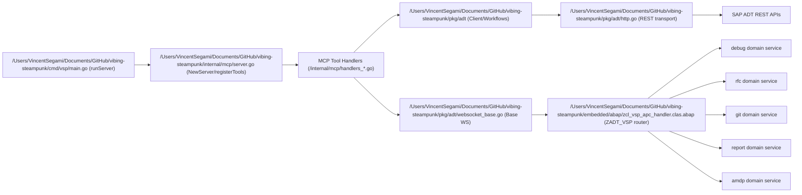

# VSP (Vibing Steampunk) — Deep Dive & Strategic Review

**Date:** 2026-02-07  
**Report ID:** 001  
**Scope:** Full codebase review (read-only analysis), architecture and strategy

## Executive Summary
As of February 7, 2026, this repo is powerful but structurally overextended: it has strong ADT breadth and real innovation (unified source tools, WebSocket domains, Lua automation), but reliability and maintainability are being limited by tool-surface drift, duplicated architecture paths, and weak operational guardrails. The biggest current risk is inconsistent runtime behavior across duplicated protocol/tool paths (especially debugger and WebSocket code). The biggest opportunity is to consolidate onto one canonical tool/transport architecture and add a proper CI/security/observability baseline.

## Architecture Map

### Entry points
1. `/Users/VincentSegami/Documents/GitHub/vibing-steampunk/cmd/vsp/main.go:26` root command, `/Users/VincentSegami/Documents/GitHub/vibing-steampunk/cmd/vsp/main.go:142` MCP startup (`ServeStdio` at `:224`).
2. `/Users/VincentSegami/Documents/GitHub/vibing-steampunk/cmd/vsp/cli.go:21` CLI ops, `/Users/VincentSegami/Documents/GitHub/vibing-steampunk/cmd/vsp/debug.go:18` debug REPL, `/Users/VincentSegami/Documents/GitHub/vibing-steampunk/cmd/vsp/lua.go:11` Lua REPL/script runner, `/Users/VincentSegami/Documents/GitHub/vibing-steampunk/cmd/vsp/workflow.go:15` workflow engine, `/Users/VincentSegami/Documents/GitHub/vibing-steampunk/cmd/vsp/config_cmd.go:14` config tooling.

### Package dependency graph (direct, internal)
1. `cmd/vsp -> internal/mcp, pkg/adt, pkg/config, pkg/dsl, pkg/scripting`.
2. `internal/mcp -> pkg/adt, embedded/abap, embedded/deps`.
3. `pkg/dsl -> pkg/adt`.
4. `pkg/scripting -> pkg/adt`.
5. No circular imports found.

### Domain model and boundaries
1. ADT object model lives mostly in `/Users/VincentSegami/Documents/GitHub/vibing-steampunk/pkg/adt/crud.go:147`, `/Users/VincentSegami/Documents/GitHub/vibing-steampunk/pkg/adt/workflows.go:1921`, `/Users/VincentSegami/Documents/GitHub/vibing-steampunk/pkg/adt/workflows.go:2049`.
2. Debug domain entities and lifecycle types are in `/Users/VincentSegami/Documents/GitHub/vibing-steampunk/pkg/adt/debugger.go:540`.
3. Feature and safety governance: `/Users/VincentSegami/Documents/GitHub/vibing-steampunk/pkg/adt/features.go:53`, `/Users/VincentSegami/Documents/GitHub/vibing-steampunk/pkg/adt/safety.go:8`; server wiring at `/Users/VincentSegami/Documents/GitHub/vibing-steampunk/internal/mcp/server.go:113`.
4. Boundary is not clean: protocol logic and business workflows are mixed inside `pkg/adt` (`/Users/VincentSegami/Documents/GitHub/vibing-steampunk/pkg/adt/http.go:21` + `/Users/VincentSegami/Documents/GitHub/vibing-steampunk/pkg/adt/workflows.go:2084`).

### State model (dual protocol)
1. REST state: CSRF/session cache in `/Users/VincentSegami/Documents/GitHub/vibing-steampunk/pkg/adt/http.go:23`.
2. WS state: session, pending request map, per-domain active context in `/Users/VincentSegami/Documents/GitHub/vibing-steampunk/pkg/adt/websocket_base.go:26`, `/Users/VincentSegami/Documents/GitHub/vibing-steampunk/pkg/adt/websocket.go:17`, `/Users/VincentSegami/Documents/GitHub/vibing-steampunk/pkg/adt/amdp_websocket.go:16`.
3. MCP server holds singleton WS clients and async task map in `/Users/VincentSegami/Documents/GitHub/vibing-steampunk/internal/mcp/server.go:31`.

### Critical path traces
1. `GetSource(method)` path: `/Users/VincentSegami/Documents/GitHub/vibing-steampunk/internal/mcp/handlers_codeintel.go:418 -> /Users/VincentSegami/Documents/GitHub/vibing-steampunk/pkg/adt/workflows.go:1921 -> /Users/VincentSegami/Documents/GitHub/vibing-steampunk/pkg/adt/client.go:158`.
2. `EditSource` surgical CRLF path: normalization and replacement at `/Users/VincentSegami/Documents/GitHub/vibing-steampunk/pkg/adt/workflows.go:1183` and `/Users/VincentSegami/Documents/GitHub/vibing-steampunk/pkg/adt/workflows.go:1215`; method-scoped edit at `/Users/VincentSegami/Documents/GitHub/vibing-steampunk/pkg/adt/workflows.go:1376`; regression tests at `/Users/VincentSegami/Documents/GitHub/vibing-steampunk/pkg/adt/workflows_test.go:493`.
3. Debug lifecycle in MCP is split: session tools are legacy REST (`/Users/VincentSegami/Documents/GitHub/vibing-steampunk/internal/mcp/handlers_debugger_legacy.go:17`), breakpoints are WebSocket (`/Users/VincentSegami/Documents/GitHub/vibing-steampunk/internal/mcp/handlers_debugger.go:36`), while WS session methods exist but are not used by MCP (`/Users/VincentSegami/Documents/GitHub/vibing-steampunk/pkg/adt/websocket_debug.go:131`).
4. RAP `WriteSource`: unified path in `/Users/VincentSegami/Documents/GitHub/vibing-steampunk/pkg/adt/workflows.go:2084`, with type-specific branches including `DDLS/BDEF/SRVD/SRVB` at `/Users/VincentSegami/Documents/GitHub/vibing-steampunk/pkg/adt/workflows.go:2338` and `/Users/VincentSegami/Documents/GitHub/vibing-steampunk/pkg/adt/workflows.go:2480`; batch RAP ordering helper in `/Users/VincentSegami/Documents/GitHub/vibing-steampunk/pkg/dsl/import.go:142`.
5. WS routing in ABAP is domain-table based and centralized at `/Users/VincentSegami/Documents/GitHub/vibing-steampunk/embedded/abap/zcl_vsp_apc_handler.clas.abap:54` and `/Users/VincentSegami/Documents/GitHub/vibing-steampunk/embedded/abap/zcl_vsp_apc_handler.clas.abap:205`.
6. Lua bindings map 50 globals to ADT/debug/history functions from `/Users/VincentSegami/Documents/GitHub/vibing-steampunk/pkg/scripting/bindings.go:15`.

### Fork divergence (vs upstream `oisee`)
1. Ahead/behind is `16 ahead / 2 behind`.
2. Missing upstream commits: `a94248c` and `34eb727` include substantial ABAP sync/refactor files (APC/debug/rfc/report/amdp).
3. Local has 3 ABAP trees (`embedded/abap`, `src`, `abap/src/zadt_vsp`) with drift, while sync script exports only a subset (`/Users/VincentSegami/Documents/GitHub/vibing-steampunk/scripts/sync-embedded.lua:4` vs deploy list in `/Users/VincentSegami/Documents/GitHub/vibing-steampunk/embedded/abap/embed.go:45`).

## Findings (Phase 2)

### 2.1 Architecture
- 🔴 `internal/mcp` debugger architecture is inconsistent: `DebuggerListen/Attach/Step/...` use REST (`/Users/VincentSegami/Documents/GitHub/vibing-steampunk/internal/mcp/handlers_debugger_legacy.go:17`), while breakpoint ops use WS (`/Users/VincentSegami/Documents/GitHub/vibing-steampunk/internal/mcp/handlers_debugger.go:36`).
- 🔴 Concurrency risk in AMDP WS hierarchy: `AMDPWebSocketClient` defines its own `mu` (`/Users/VincentSegami/Documents/GitHub/vibing-steampunk/pkg/adt/amdp_websocket.go:17`) while git/report send paths lock `c.mu` and write shared base `c.conn` (`/Users/VincentSegami/Documents/GitHub/vibing-steampunk/pkg/adt/git.go:108`, `/Users/VincentSegami/Documents/GitHub/vibing-steampunk/pkg/adt/reports.go:236`).
- 🟡 `/Users/VincentSegami/Documents/GitHub/vibing-steampunk/internal/mcp/server.go:224` is a god file (2489 LOC) with registry, mode policy, schema, and wiring mixed.
- 🟡 Tool architecture has no single source of truth: `registerTools` map/comment drift (`/Users/VincentSegami/Documents/GitHub/vibing-steampunk/internal/mcp/server.go:283`) vs config hardcoded lists (`/Users/VincentSegami/Documents/GitHub/vibing-steampunk/cmd/vsp/config_cmd.go:753`).
- 🟡 `pkg/adt` is over-broad: low-level REST/WS, object CRUD, orchestration, and execution workflows are in one package (`/Users/VincentSegami/Documents/GitHub/vibing-steampunk/pkg/adt/http.go:21`, `/Users/VincentSegami/Documents/GitHub/vibing-steampunk/pkg/adt/workflows.go:2084`).
- 🟡 Feature probing is informational, not real tool gating: created in `/Users/VincentSegami/Documents/GitHub/vibing-steampunk/internal/mcp/server.go:164`, consumed mainly by system handlers (`/Users/VincentSegami/Documents/GitHub/vibing-steampunk/internal/mcp/handlers_system.go:56`).
- 🟢 DSL is useful for CLI batch/workflow use (`/Users/VincentSegami/Documents/GitHub/vibing-steampunk/cmd/vsp/workflow.go:106`) but not central to MCP runtime.

### 2.2 MCP Tool Design
- 🟡 Tool mode boundaries are incoherent and stale: focused tool whitelist comment says “41” but includes many more and even experimental/install domains (`/Users/VincentSegami/Documents/GitHub/vibing-steampunk/internal/mcp/server.go:283`).
- 🟡 Schema and parameter naming are inconsistent (`objType` vs `object_type`, `outputPath` vs `output_dir`) in `/Users/VincentSegami/Documents/GitHub/vibing-steampunk/internal/mcp/handlers_fileio.go:46`.
- 🟡 Response contracts are inconsistent for AI consumption: some handlers emit JSON strings, others freeform prose (`/Users/VincentSegami/Documents/GitHub/vibing-steampunk/internal/mcp/handlers_system.go:23` vs `/Users/VincentSegami/Documents/GitHub/vibing-steampunk/internal/mcp/handlers_debugger_legacy.go:46`).
- 🟡 Legacy and unified tools both exist (`GetProgram` and `GetSource`, `GrepObject` and `GrepObjects`) in `/Users/VincentSegami/Documents/GitHub/vibing-steampunk/internal/mcp/server.go:445` and `/Users/VincentSegami/Documents/GitHub/vibing-steampunk/internal/mcp/handlers_codeintel.go:357`.
- 🟢 Error messages are mostly actionable for missing params and invalid enums, but not consistently machine-readable.

### 2.3 ABAP Side (ZADT_VSP)
- 🔴 Potential security gap: dynamic RFC execution (`CALL FUNCTION lv_function`) without local authorization checks in `/Users/VincentSegami/Documents/GitHub/vibing-steampunk/embedded/abap/zcl_vsp_rfc_service.clas.abap:245`.
- 🟡 APC JSON parsing is regex/manual brace matching (`/Users/VincentSegami/Documents/GitHub/vibing-steampunk/embedded/abap/zcl_vsp_apc_handler.clas.abap:115`), brittle for escaped/edge JSON.
- 🟡 Connection drop behavior is cleanup-only, no resumability: debug and AMDP sessions are ended on disconnect (`/Users/VincentSegami/Documents/GitHub/vibing-steampunk/embedded/abap/zcl_vsp_debug_service.clas.abap:173`, `/Users/VincentSegami/Documents/GitHub/vibing-steampunk/embedded/abap/zcl_vsp_amdp_service.clas.abap:122`).
- 🟢 Domain router extensibility is good: service registration + domain dispatch (`/Users/VincentSegami/Documents/GitHub/vibing-steampunk/embedded/abap/zcl_vsp_apc_handler.clas.abap:54`, `/Users/VincentSegami/Documents/GitHub/vibing-steampunk/embedded/abap/zcl_vsp_apc_handler.clas.abap:205`).

### 2.4 Testing Strategy
- 🔴 Coverage concentration is skewed: 210 tests in `pkg/adt` vs 3 in `internal/mcp`; critical MCP orchestration is under-tested.
- 🔴 WS clients are effectively untested in unit tests despite being reliability-critical (`/Users/VincentSegami/Documents/GitHub/vibing-steampunk/pkg/adt/websocket_base.go`, `/Users/VincentSegami/Documents/GitHub/vibing-steampunk/pkg/adt/websocket_debug.go`, `/Users/VincentSegami/Documents/GitHub/vibing-steampunk/pkg/adt/amdp_websocket.go`).
- 🟡 Integration tests are real-system dependent with build tag and env gates (`/Users/VincentSegami/Documents/GitHub/vibing-steampunk/pkg/adt/integration_test.go:1`, `/Users/VincentSegami/Documents/GitHub/vibing-steampunk/pkg/adt/integration_test.go:14`), no offline stub suite.
- 🟢 CRLF regression coverage exists and is strong (`/Users/VincentSegami/Documents/GitHub/vibing-steampunk/pkg/adt/workflows_test.go:493`).
- 🟡 Method-level source operations lack explicit dedicated tests around `GetClassMethodSource`/method replace bounds (`/Users/VincentSegami/Documents/GitHub/vibing-steampunk/pkg/adt/client.go:158`, `/Users/VincentSegami/Documents/GitHub/vibing-steampunk/pkg/adt/workflows.go:1376`).

### 2.5 Dependencies & Supply Chain
- 🟡 `mcp-go` is behind current upstream: pinned `v0.17.0` (`/Users/VincentSegami/Documents/GitHub/vibing-steampunk/go.mod:10`) while upstream has newer releases.
- 🟡 `go-sqlite3` appears unnecessary right now because `pkg/cache` appears unused by runtime (`/Users/VincentSegami/Documents/GitHub/vibing-steampunk/pkg/cache/sqlite.go:10`, references mostly in cache tests).
- 🟡 No vulnerability scanning pipeline found in CI workflows; only sync workflow exists (`/Users/VincentSegami/Documents/GitHub/vibing-steampunk/.github/workflows/sync-upstream.yml:1`).
- 🟢 Core transport libs are reasonably modern (`gorilla/websocket v1.5.3`, `viper v1.21.0`, `cobra v1.10.1`) in `/Users/VincentSegami/Documents/GitHub/vibing-steampunk/go.mod`.

### 2.6 Developer Experience
- 🟡 Documentation is materially stale and contradictory:
  - `19/45 tools` in `/Users/VincentSegami/Documents/GitHub/vibing-steampunk/cmd/vsp/main.go:32`
  - `52/99` and `37 focused` conflicts in `/Users/VincentSegami/Documents/GitHub/vibing-steampunk/README.md:178` and `/Users/VincentSegami/Documents/GitHub/vibing-steampunk/README.md:186`
  - `54/99` and `20/47` conflicts in `/Users/VincentSegami/Documents/GitHub/vibing-steampunk/CLAUDE.md:7` and `/Users/VincentSegami/Documents/GitHub/vibing-steampunk/CLAUDE.md:49`.
- 🟡 No `CONTRIBUTING.md`; onboarding relies on large docs/reports sprawl (118 report files).
- 🟢 CLI/system-profile UX is practical (`/Users/VincentSegami/Documents/GitHub/vibing-steampunk/cmd/vsp/cli.go:21`, `/Users/VincentSegami/Documents/GitHub/vibing-steampunk/cmd/vsp/config_cmd.go:27`).

### 2.7 What’s Missing
- 🔴 No built-in operational observability: no metrics, tracing, health endpoints found in Go runtime packages.
- 🟡 Retry/backoff strategy is minimal (single retry on CSRF/session timeout) in `/Users/VincentSegami/Documents/GitHub/vibing-steampunk/pkg/adt/http.go:135`; no generalized transient-error policy.
- 🟡 No rate limiting/throttle controls to protect SAP systems from aggressive agent loops.
- 🟡 No tool usage telemetry layer to learn which tools agents actually use and fail on.
- 🟡 No Basis-focused deployment/hardening runbook; install instructions exist but are mixed/stale (`/Users/VincentSegami/Documents/GitHub/vibing-steampunk/embedded/abap/embed.go:149` vs actual version in `/Users/VincentSegami/Documents/GitHub/vibing-steampunk/embedded/abap/zcl_vsp_apc_handler.clas.abap:76`).

### 2.8 What Should Be Deleted
- 🔴 Remove committed sensitive artifacts now:
  - `/Users/VincentSegami/Documents/GitHub/vibing-steampunk/reports/2025-12-21-007-phase5-live-experiment.md:26` contains a concrete password string.
  - `/Users/VincentSegami/Documents/GitHub/vibing-steampunk/amdp-breakpoint-test-results-20251206-084536.log:5` exposes system/user metadata.
- 🟡 Remove duplicate ABAP source trees and define one source-of-truth (`embedded/abap`, `src`, `abap/src/zadt_vsp`).
- 🟡 Delete or archive stale speculative reports that no longer match code reality; retain ADR-style docs instead.

## Strategic Recommendations (Phase 3)

### 3.1 Vision alignment
1. The codebase is partially aligned with Vision/Roadmap goals, but core docs are stale (`VISION.md` says `v2.13`; `ROADMAP.md` says `v2.15` and outdated counts).
2. Structural blockers for phases 6-9 are real: tool-contract drift, mixed protocol paths, and insufficient WS/integration testing.
3. This should be positioned as an independent project, not an upstream-following fork, with upstream treated as selective code intake.
4. Lua is a valid embedded automation bet for single-binary goals, but it should be a layer over a cleaner typed core.

### 3.2 Market and ecosystem positioning
1. Compared with SAP Joule ABAP capabilities, VSP is lower-level and more autonomous for engineering workflows (debug/protocol/tool composition), but lacks enterprise governance polish.
2. Compared with `abap-adt-api` TypeScript, VSP’s advantage is MCP-native single-binary operations plus WS domains; disadvantage is ecosystem/library maturity and typed API stability.
3. Compared with `mcp-abap-adt` style servers, VSP is broader and deeper technically, but currently harder to operationalize safely at enterprise scale.

### 3.3 Highest-leverage 3 changes
1. Unify tool registry + contracts (risk reduction + velocity gain): generate one canonical tool catalog used by registration, focused/expert sets, docs, and config tooling.
2. Unify debugger protocol path to WS-first with fallback abstraction (correctness + capability unlock): eliminate mixed REST/WS lifecycle behavior and add reconnect/resume policy.
3. Add CI/security/observability baseline (adoption enablement): required for team/enterprise trust.

## Prioritized Roadmap
1. **Phase A:** Delete sensitive artifacts, rotate leaked credentials, add `.gitignore` for logs, add secret scanning. **Effort:** S. **Impact:** High.
2. **Phase A:** Create single tool catalog file and generate `registerTools` + `config` lists + docs from it. **Effort:** M. **Impact:** High.
3. **Phase A:** Fix docs/version/tool-count drift (`README`, `CLAUDE`, `ROADMAP`, `VISION`) and set one release/status page. **Effort:** S. **Impact:** High.
4. **Phase A:** Add baseline PR CI workflow: `go test`, lint, staticcheck, govulncheck, secret scan. **Effort:** S. **Impact:** High.
5. **Phase B:** Decompose `/internal/mcp/server.go` into registry + category modules (`read/write/debug/system/install/...`). **Effort:** M. **Impact:** High.
6. **Phase B:** Refactor `pkg/adt` into `rest`, `ws`, `workflow` packages and remove lock-shadowing in AMDP WS paths. **Effort:** M. **Impact:** High.
7. **Phase B:** Replace manual ABAP JSON parsing with robust parser strategy in APC handler and add auth checks around RFC dispatch. **Effort:** M. **Impact:** High.
8. **Phase B:** Add WS-focused tests and offline integration harness (mock WS server + canned ADT payloads). **Effort:** M. **Impact:** High.
9. **Phase B:** Rationalize focused/expert sets to stable-only focused mode and move install/experimental to expert. **Effort:** S. **Impact:** Med.
10. **Phase C:** Introduce observability package (structured logs, correlation IDs, metrics, health endpoints). **Effort:** L. **Impact:** High.
11. **Phase C:** Add adaptive throttling/retry/backoff and SAP-protective limits per tool/domain. **Effort:** M. **Impact:** High.
12. **Phase C:** Publish enterprise deployment docs for Basis/security + package to MCP registry/community channels. **Effort:** M. **Impact:** High.

## Kill List
1. Remove `/Users/VincentSegami/Documents/GitHub/vibing-steampunk/amdp-breakpoint-test-results-20251206-084536.log`: committed runtime log with system/user info.
2. Remove credential-bearing examples from `/Users/VincentSegami/Documents/GitHub/vibing-steampunk/reports/2025-12-21-007-phase5-live-experiment.md:26` and rotate credentials immediately.
3. Delete one of the duplicate ABAP source trees and enforce one sync direction; current triple-tree model is a maintenance trap.
4. Deprecate duplicate legacy MCP tools once unified tools are stable; keep compatibility shims temporarily, then delete.
5. Remove or archive unfinished cache layer (`pkg/cache`) unless it is moved to active runtime use.

## Unknowns Requiring Live SAP Validation
- Whether SAP role model fully mitigates missing local RFC auth checks in ABAP services.
- WS disconnect behavior under real load and long-running debug sessions (no reconnect/resume currently).
- Real-world RAP multi-object ordering edge cases for `SRVB` in mixed deployment pipelines.
- Practical token reduction percentages in production workflows; claims are documented but not benchmarked in code.

## External Sources Used
- [mcp-go releases](https://github.com/mark3labs/mcp-go/releases)
- [abap-adt-api npm package](https://www.npmjs.com/package/abap-adt-api)
- [mcp-abap-adt repository](https://github.com/mario-andreschak/mcp-abap-adt)
- [SAP ABAP AI capabilities (SAP Community)](https://community.sap.com/t5/technology-blog-posts-by-sap/abap-ai-capabilities-in-sap-btp-abap-environment/ba-p/14138263)
