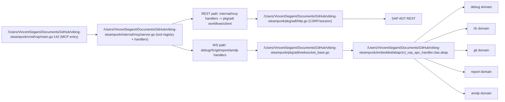

# VSP Strategic Deep Dive — CBA Alignment, Assumption Challenge, & Codebase Review

**Date:** 2026-02-07  
**Report ID:** 002  
**Scope:** Full repository/code review + full `/reports` inventory review + strategic stress-test against CBA context  
**Method:** Read-only analysis; no code changes

## Executive Summary
VSP is technically strong as an ADT execution bridge, but currently over-claims enterprise readiness relative to its operational controls. The biggest strength is real, working ADT automation depth (REST + WebSocket + method-level source ops). The biggest risk is governance/operability: fragmented tool contracts, weak CI/security baseline, and no enterprise integration substrate (Jira/Cloud ALM/audit evidence). The biggest opportunity is to narrow positioning to "best SAP ADT MCP execution layer" and harden reliability/governance. The biggest delusion is treating "99 tools" and "Phase 1.5 operational today" as equivalent to enterprise-ready autonomous delivery.

## Architecture Map

### Entry points
1. MCP server startup: `/Users/VincentSegami/Documents/GitHub/vibing-steampunk/cmd/vsp/main.go:142`, serve stdio: `/Users/VincentSegami/Documents/GitHub/vibing-steampunk/cmd/vsp/main.go:224`.
2. CLI command surface: `/Users/VincentSegami/Documents/GitHub/vibing-steampunk/cmd/vsp/cli.go`, `/Users/VincentSegami/Documents/GitHub/vibing-steampunk/cmd/vsp/debug.go:18`, `/Users/VincentSegami/Documents/GitHub/vibing-steampunk/cmd/vsp/lua.go:11`, `/Users/VincentSegami/Documents/GitHub/vibing-steampunk/cmd/vsp/workflow.go:15`.

### Package dependency graph (compiled)
1. `cmd/vsp -> internal/mcp, pkg/adt, pkg/config, pkg/dsl, pkg/scripting`.
2. `internal/mcp -> embedded/abap, embedded/deps, pkg/adt`.
3. `pkg/dsl -> pkg/adt`.
4. `pkg/scripting -> pkg/adt`.
5. Circular imports: none found (`go list ./...` succeeds).

### Coupling and god-file assessment
1. `/Users/VincentSegami/Documents/GitHub/vibing-steampunk/internal/mcp/server.go` is a god file (2489 LOC) mixing registry, policy, schemas, and mode logic.
2. `/Users/VincentSegami/Documents/GitHub/vibing-steampunk/pkg/adt/workflows.go` is another god module (3559 LOC) mixing workflow orchestration and protocol details.
3. Coupling concern: business behavior and transport/protocol mechanics are interleaved in `pkg/adt` instead of split by responsibility.

## Reports Directory Assessment

### Meta assessment
1. Total reports reviewed: 121 markdown files under `/Users/VincentSegami/Documents/GitHub/vibing-steampunk/reports`.
2. Currency profile: 74 historical, 27 active, 9 current, 11 undated.
3. Relevance profile (to this CBA review): 17 high, 57 medium, 47 low.
4. Net assessment: reports are a strength for institutional memory but a liability when claims drift faster than code.

### Contradictions and staleness patterns (high-value)
1. Tool-count drift appears repeatedly across docs and reports; code reality is 125 registered tools vs 123 in config list (`/Users/VincentSegami/Documents/GitHub/vibing-steampunk/cmd/vsp/config_cmd.go:753`, `/Users/VincentSegami/Documents/GitHub/vibing-steampunk/internal/mcp/server.go:553`, `/Users/VincentSegami/Documents/GitHub/vibing-steampunk/internal/mcp/server.go:676`).
2. Strategic reports describe Jira/Cloud ALM/agent pipelines as near-term, but repo code has no direct Jira/Cloud ALM connectors under `cmd/`, `internal/`, `pkg/`, `embedded/`.
3. "Production-ready"/"operational today" narrative is directionally true for ADT operations, but overstated for enterprise execution without CI/security/audit operating model.
4. ABAPilot feature-race recommendations are overextended relative to current maintainer bandwidth and current platform moat (execution safety/reliability).

### Lessons from report history
1. The project repeatedly over-expands scope before stabilizing core contracts.
2. Design documents are ambitious; implementation tends to land partially and then move to next frontier.
3. Governance and operationalization are consistently deferred behind feature growth.

### Full per-report table (every report)
| Report | Key Finding/Decision | Currency | Relevance | Contradiction/Staleness Flag |
|---|---|---|---|---|
| `2025-12-02-001-auto-pilot-cross-wbcrossgt-analysis.md` | ZRAY_10_AUTO_PILOT: Deep Dive into CROSS and WBCROSSGT Usage | historical | low | none |
| `2025-12-02-002-cross-wbcrossgt-reference-guide.md` | CROSS and WBCROSSGT: Complete Reference Guide | historical | low | none |
| `2025-12-02-003-graph-and-api-surface-design-overview.md` | Graph Traversal & API Surface Analysis: Design Overview | historical | medium | none |
| `2025-12-02-004-graph-architecture-improvements-vs-punk.md` | Graph Architecture Improvements & Standard API Surface Scanner | historical | medium | none |
| `2025-12-02-005-improved-graph-architecture-design.md` | Improved Graph Architecture Design for ZRAY | historical | medium | none |
| `2025-12-02-006-standard-api-surface-scraper.md` | Standard API Surface Scraper | historical | medium | none |
| `2025-12-02-007-graph-traversal-implementation-plan.md` | Graph Traversal & Analysis Implementation Plan | historical | medium | none |
| `2025-12-02-008-test-intelligence-plan.md` | Test Intelligence System for vsp | historical | low | none |
| `2025-12-02-009-library-architecture-and-caching-strategy.md` | Library Architecture & Caching Strategy for Graph/API Tools | historical | medium | none |
| `2025-12-02-010-cache-implementation-complete.md` | Cache Implementation Complete - Phase 1 | historical | low | none |
| `2025-12-02-011-safety-protection-implementation.md` | Safety & Protection Implementation Complete | historical | low | none |
| `2025-12-02-012-package-creation-and-unittest-fix.md` | Package Creation and RunUnitTests Parser Fix | historical | low | none |
| `2025-12-02-013-abap-debugging-and-trace-research.md` | ABAP Debugging and Trace Research: Building Ultimate Test Intelligence Tools | historical | medium | none |
| `2025-12-02-014-debugging-tools-summary-and-verification.md` | Debugging Tools Summary and Verification | historical | medium | none |
| `2025-12-02-015-cds-dependency-and-zray-local-implementation.md` | CDS Dependency Analyzer & $ZRAY Local Implementation | historical | low | none |
| `2025-12-02-016-cds-and-zray-endpoint-investigation.md` | CDS Dependency & $ZRAY Endpoint Investigation | historical | low | none |
| `2025-12-02-017-file-based-deployment-design.md` | File-Based Deployment Architecture | historical | medium | none |
| `2025-12-03-milestone-grep-and-search-tools.md` | Milestone Report: Grep/Search Tools + Enhanced EditSource | historical | medium | none |
| `2025-12-04-012-library-and-dsl-brainstorming.md` | Library API & DSL Options Brainstorming | historical | medium | none |
| `2025-12-04-cds-tool-and-object-type-analysis.md` | CDS Dependency Analyzer Tool & Object Type Unification Analysis | historical | low | none |
| `2025-12-04-dependency-analysis-forward-vs-reverse.md` | Dependency Analysis: Forward vs Reverse Dependencies | historical | low | none |
| `2025-12-05-001-code-injection-and-bootstrap-strategies.md` | Code Injection & Bootstrap Strategies via ADT | historical | medium | none |
| `2025-12-05-002-self-replicating-deploy-agent-design.md` | Self-Replicating Deploy Agent Design | historical | low | none |
| `2025-12-05-003-adt-assisted-universal-deployment.md` | ADT-Assisted Universal Deployment Strategy | historical | low | none |
| `2025-12-05-004-execute-abap-implementation.md` | ExecuteABAP Implementation Report | historical | low | none |
| `2025-12-05-005-native-adt-features-deep-dive.md` | Native ADT Features Deep Dive | historical | low | none |
| `2025-12-05-012-adt-debugger-api-deep-dive.md` | ADT External Debugger REST API - Deep Dive Analysis | historical | medium | none |
| `2025-12-05-013-ai-powered-rca-workflows.md` | AI-Powered Root Cause Analysis Workflows for ABAP | historical | medium | none |
| `2025-12-05-014-debugger-scripting-vision.md` | External Debugger Scripting Vision | historical | high | none |
| `2025-12-05-015-debugger-experiment-findings.md` | Debugger Experiment Findings | historical | medium | none |
| `2025-12-05-016-debugger-session-timeout-analysis.md` | Debugger Session Timeout Analysis & Solutions | historical | medium | none |
| `2025-12-05-017-amdp-debug-ui5-bsp-capabilities.md` | AMDP Debugging & UI5/BSP Management Capabilities | historical | medium | none |
| `2025-12-05-018-amdp-debugger-testing.md` | AMDP Debugger Testing Report | historical | medium | none |
| `2025-12-05-019-amdp-session-architecture.md` | AMDP Debugging: Session Architecture & Solutions | historical | medium | maturity claim risk |
| `2025-12-05-020-transport-management-plan.md` | Transport Management Implementation Plan | historical | medium | none |
| `2025-12-05-021-project-status-v2.11.md` | VSP Project Status Report v2.11.0 | historical | low | none |
| `2025-12-05-022-future-vision.md` | VSP Future Vision: AI-Native ABAP Development | historical | high | none |
| `2025-12-05-023-vsp-for-abap-developers.md` | VSP: AI Meets ABAP - A New Era for SAP Development | historical | low | none |
| `2025-12-05-024-amdp-goroutine-channel-architecture.md` | AMDP Debug Session Manager: Goroutine + Channel Architecture | historical | medium | none |
| `2025-12-05-session-debugger-experiment.md` | Debugger Experiment Design | historical | medium | none |
| `2025-12-05-session-rap-odata-test.md` | RAP OData Creation Test Session | historical | medium | none |
| `2025-12-06-001-amdp-breakpoint-investigation.md` | AMDP Breakpoint Investigation Report | historical | medium | none |
| `2025-12-06-002-amdp-debugging-status.md` | AMDP Debugging Status & Progress Report | historical | medium | none |
| `2025-12-07-001-v2.12-release-notes.md` | VSP v2.12.0 Release Notes | historical | low | none |
| `2025-12-08-001-abapgit-integration-design.md` | abapGit Integration Design for vsp | historical | medium | none |
| `2025-12-08-002-abapgit-integration-progress.md` | abapGit Integration - Progress Report (PARKED) | historical | medium | none |
| `2025-12-08-003-rap-odata-service-lessons.md` | RAP OData Service Implementation - Lessons Learned | historical | medium | none |
| `2025-12-10-001-editsource-class-includes.md` | EditSource Class Include Support | historical | low | none |
| `2025-12-11-001-package-reassignment-odata-execute.md` | Package Reassignment & OData Execute Endpoint | historical | low | none |
| `2025-12-11-002-adt-abap-debugger-deep-dive.md` | ADT ABAP Debugger Deep Dive | historical | medium | none |
| `2025-12-11-003-debugger-breakpoint-fix-session.md` | Debugger Breakpoint Fix Session | historical | medium | none |
| `2025-12-14-001-eclipse-adt-debugger-traffic-analysis.md` | Eclipse ADT Debugger Traffic Analysis | historical | medium | none |
| `2025-12-14-002-external-debugger-breakpoint-storage-investigation.md` | External Debugger Breakpoint Storage Investigation | historical | medium | none |
| `2025-12-18-001-ai-assisted-rca-anst-integration.md` | AI-Assisted Root Cause Analysis & ANST Integration Vision | historical | high | none |
| `2025-12-18-002-websocket-rfc-handler.md` | WebSocket RFC Handler (ZADT_VSP) | historical | low | none |
| `2025-12-19-001-websocket-debugging-deep-dive.md` | WebSocket Debugging Deep Dive | historical | medium | none |
| `2025-12-21-001-tas-scripting-time-travel-vision.md` | TAS-Style Debugging, Scripting, and Time Travel for ABAP | historical | medium | none |
| `2025-12-21-002-test-extraction-isolated-replay.md` | Test Case Extraction & Isolated Replay for Rapid Patch Testing | historical | medium | none |
| `2025-12-21-003-force-replay-state-injection.md` | Force Replay: Live State Injection for Debugging | historical | medium | none |
| `2025-12-21-004-test-extraction-implications.md` | Test Extraction & AI-Powered RCA: Implications for ABAP Development | historical | low | none |
| `2025-12-21-005-phase5-testing-methodology.md` | Phase 5 Testing Methodology: Ensuring TAS-Style Debugging Works | historical | medium | none |
| `2025-12-21-006-phase5-data-extraction-examples.md` | Phase 5 Data Extraction Examples | historical | low | none |
| `2025-12-21-007-phase5-live-experiment.md` | Phase 5 Live Experiment: TAS-Style Debugging | historical | medium | none |
| `2025-12-22-001-amdp-debugging-investigation.md` | AMDP Debugging Investigation | historical | medium | none |
| `2025-12-22-002-vsp-possibilities-unlocked.md` | VSP v2.15: The Possibilities Are Now Endless | historical | low | none |
| `2025-12-22-003-websocket-abapgit-integration.md` | WebSocket-based abapGit Integration | historical | medium | none |
| `2025-12-22-observations-since-v2.12.5.md` | Observations & Changes Since v2.12.5 | historical | low | none |
| `2025-12-23-001-heavyweight-operations-architecture.md` | Heavyweight Operations Architecture for VSP | historical | medium | none |
| `2025-12-23-002-abapgit-websocket-integration-complete.md` | abapGit WebSocket Integration - Implementation Report | historical | medium | none |
| `2025-12-23-002-install-tool-failure-analysis.md` | InstallZADTVSP Tool Failure Analysis | historical | medium | none |
| `2025-12-23-003-two-weeks-of-progress.md` | Two Weeks of Breakneck Progress: v2.12.5 → v2.16.0 | historical | low | none |
| `2025-12-23-004-zadt-vsp-self-deployment-design.md` | ZADT_VSP Self-Deployment Design | historical | low | none |
| `2025-12-24-001-abap-debug-test-plan.md` | ABAP Debugging Test Plan | historical | medium | none |
| `2025-12-28-001-cl-abap-debugger-analysis.md` | CL_ABAP_DEBUGGER Analysis Report | historical | medium | none |
| `2026-01-02-001-zllm-tool-fm-fixes.md` | ZCL_LLM_00_TOOL_FM Fixes | active | low | none |
| `2026-01-02-002-run-report-text-elements-design.md` | RunReport & SetTextElements Tools Design | active | medium | none |
| `2026-01-02-003-achievements-and-execution-tools-plan.md` | VSP Achievements & Execution Tools Plan | active | medium | none |
| `2026-01-02-004-dap-abap-debugging-vision.md` | DAP Integration Vision for ABAP Debugging | active | high | none |
| `2026-01-02-005-roadmap-quick-mid-far-wins.md` | VSP Roadmap: Quick/Mid/Far Wins | active | high | none |
| `2026-01-03-001-dap-implementation-plan.md` | DAP Implementation Plan: ABAP Debug Adapter | active | medium | none |
| `2026-01-04-001-tool-introspection-analysis.md` | VSP Tool Introspection & Analysis Report | active | low | none |
| `2026-01-04-002-tool-universalization-strategy.md` | VSP Tool Universalization Strategy | active | low | none |
| `2026-01-04-003-abap-agent-implementation-guide.md` | ABAP Agent Implementation Guide | active | low | none |
| `2026-01-04-004-investigation-tools-brainstorm.md` | VSP Investigation Tools Brainstorm | active | medium | none |
| `2026-01-05-001-v2.19.0-release-notes.md` | VSP v2.19.0 Release Notes | active | low | none |
| `2026-01-06-001-github-issues-analysis.md` | GitHub Issues Analysis & Reflection | active | low | none |
| `2026-01-06-001-method-level-source-operations.md` | Method-Level Source Operations | active | low | none |
| `2026-01-06-002-amc-async-architecture-analysis.md` | AMC & Async Architecture Analysis | active | medium | none |
| `2026-01-18-001-claude-md-improvements-analysis.md` | CLAUDE.md Improvements Analysis | active | low | tool-count drift |
| `2026-01-18-002-sap-future-engineering-strategic-analysis.md` | Strategic Analysis: Future of SAP Engineering & vsp Positioning
 | active | high | tool-count drift; maturity claim risk; ALM terminology stale |
| `2026-01-18-003-implementation-roadmap-summary.md` | Implementation Roadmap: vsp → Enterprise AI-Augmented SAP Development
 | active | high | maturity claim risk; ALM terminology stale |
| `2026-01-18-004-agent-skills-opportunity-analysis.md` | Agent SKILLS Opportunity Analysis
 | active | low | maturity claim risk |
| `2026-01-18-005-additional-gaps-opportunities.md` | Additional Gaps & Opportunities Analysis
 | active | low | maturity claim risk; ALM terminology stale |
| `2026-01-18-006-abapilot-competitive-analysis-vsp-enhancements.md` | ABAPilot Competitive Analysis & vsp Enhancement Strategy
 | active | high | maturity claim risk |
| `2026-01-18-007-cba-mcp-skills-pattern.md` | CBA MCP Servers as Just-In-Time SKILLS Pattern
 | active | high | none |
| `2026-01-18-008-cba-architecture-clarifications.md` | CBA Architecture Clarifications & Design Decisions
 | active | high | none |
| `2026-01-18-CHATGPT-REVIEW-PROMPT.md` | Strategic Review Prompt for ChatGPT/GPT-o1
 | active | high | tool-count drift; maturity claim risk; ALM terminology stale |
| `2026-01-18-MASTER-RESEARCH-SUMMARY.md` | MASTER RESEARCH SUMMARY - vsp Strategic Positioning Update
 | active | high | ALM terminology stale |
| `2026-01-19-OPUS-REVIEW-PROMPT.md` | Opus Strategic Review & Implementation Prompt
 | active | high | maturity claim risk; ALM terminology stale |
| `2026-01-19-OPUS-STRATEGIC-RECOMMENDATIONS.md` | Opus Independent Strategic Analysis | active | high | maturity claim risk; ALM terminology stale |
| `2026-01-19-SESSION-SUMMARY-strategic-docs-update.md` | Session Summary: Strategic Documents Update & Repository Maintenance
 | active | high | maturity claim risk; ALM terminology stale |
| `2026-02-01-001-one-tool-mode-future.md` | One Tool Mode: Future Development Options | current | low | none |
| `2026-02-01-002-abap-help-tool-design.md` | ABAP Help Tool Design | current | low | none |
| `2026-02-03-001-abapgit-dependencies-submodules.md` | abapGit Dependencies & Submodules Analysis | current | medium | none |
| `2026-02-03-001-tool-search-integration-analysis.md` | Claude Tool Search Tool Integration Analysis | current | low | none |
| `2026-02-03-002-test-checklist.md` | Test Checklist: Transportable Edits Safety Feature | current | medium | none |
| `2026-02-03-002-transportable-edits-safety-feature.md` | Transportable Edits Safety Feature | current | medium | none |
| `2026-02-03-003-transport-tools-release-plan.md` | Transport Tools & Safety Feature Release Plan | current | medium | none |
| `2026-02-03-SESSION-CONTEXT.md` | Session Context: Transportable Edits Safety Feature | current | medium | none |
| `2026-02-07-001-vsp-deep-dive-strategic-review.md` | VSP (Vibing Steampunk) — Deep Dive & Strategic Review | current | high | none |
| `abap-adt-discovery-guide.md` | ABAP ADT Discovery Guide | undated | low | none |
| `abap-adt-tools-overview.md` | ABAP ADT Tools Overview | undated | medium | none |
| `adt-abap-internals-documentation.md` | SAP ADT ABAP Internals Documentation | undated | low | none |
| `adt-capability-matrix.md` | ADT Capability Matrix | undated | low | none |
| `adt-toolset-analysis.md` | ADT Toolset Analysis Report | undated | medium | none |
| `adt-tracing-and-z-implementations.md` | ADT Tracing & Custom Implementation Guide | undated | low | none |
| `cookie-auth-implementation-guide.md` | Cookie Authentication Implementation Guide | undated | low | none |
| `focused-mode-proposal.md` | Focused Mode Proposal for MCP ABAP ADT Server | undated | high | none |
| `golang-port-assessment.md` | Go Port Assessment: abap-adt-api Library | undated | low | none |
| `mcp-adt-go-status.md` | vsp Implementation Status | undated | low | none |
| `project-rename-analysis.md` | Project Rename Analysis: vibing-steampunk → vibing-steampunk | undated | low | none |

## CBA Integration Readiness Matrix

| Architecture Component | Code Evidence | Honest Status | Gap |
|---|---|---|---|
| SAP MCP core ADT CRUD | `/Users/VincentSegami/Documents/GitHub/vibing-steampunk/pkg/adt/workflows.go:1944`, `/Users/VincentSegami/Documents/GitHub/vibing-steampunk/pkg/adt/workflows.go:2084` | ✅ Implemented | Needs contract stabilization and stronger tests |
| SAP Test Sub-Agent MCP | No dedicated sub-agent package/tooling in runtime code | ❌ Missing | No autonomous test sub-agent orchestration |
| CBA test artefacts integration | No CBA artefact connectors in runtime code | ❌ Missing | Must integrate external systems, not build in-core |
| MCP documentation servers integration | No external MCP client fan-in in runtime server | ❌ Missing | CBA SKILLS architecture exists in reports only |
| abapGit -> GitHub sync | `GitExport` implemented (`/Users/VincentSegami/Documents/GitHub/vibing-steampunk/internal/mcp/handlers_git.go:47`) | ⚠️ Partial | Export exists; PR/GitHub integration absent |
| SAP Cloud ALM integration | No Cloud ALM API integration in code | ❌ Missing | Keep as integration boundary, not core feature |
| FTR evidence publication | No evidence publisher to ALM/FTR APIs | ❌ Missing | Need audit/evidence schema + integration |
| Jira work item ingestion | No Jira client/webhook code | ❌ Missing | Must integrate externally |
| GitHub Actions CI integration | Only upstream sync workflow (`/Users/VincentSegami/Documents/GitHub/vibing-steampunk/.github/workflows/sync-upstream.yml:1`) | ⚠️ Partial | Missing PR CI, security scan, release checks |
| CTS/Transport orchestration | Transport tools + safety exist (`/Users/VincentSegami/Documents/GitHub/vibing-steampunk/pkg/adt/safety.go:48`, `/Users/VincentSegami/Documents/GitHub/vibing-steampunk/pkg/adt/transport.go:67`) | ✅ Implemented core | Enterprise policy/process integration missing |
| cloudalmlink feature linkage | No cloudalmlink adapter | ❌ Missing | Should integrate, not replicate |
| Multi-agent coordination | Lua/DSL orchestration exists (`/Users/VincentSegami/Documents/GitHub/vibing-steampunk/pkg/scripting/bindings.go:15`, `/Users/VincentSegami/Documents/GitHub/vibing-steampunk/pkg/dsl/workflow.go:53`) | ⚠️ Partial | No scheduler, arbitration, lock-aware planner |
| `/CBA/` namespace enforcement | Not implemented as config/policy | ❌ Missing | CBA blocker for safe object creation conventions |
| Audit logging | Plain text/error strings; no structured audit trail | ❌ Missing | Cannot reconstruct regulator-grade change lineage |

## Critical Path Verification (Code-Verified)

1. Autonomous bug-fix workflow (Jira -> grep -> edit -> test -> PR): only the `grep/edit/test` middle is present. Jira ingestion and PR/evidence publishing are not implemented in runtime code.
2. Method-level `GetSource`: implemented (`/Users/VincentSegami/Documents/GitHub/vibing-steampunk/pkg/adt/workflows.go:1964`, `/Users/VincentSegami/Documents/GitHub/vibing-steampunk/pkg/adt/client.go:158`). The 95% token reduction claim is plausible but not benchmarked in code.
3. `EditSource` CRLF normalization: implemented (`/Users/VincentSegami/Documents/GitHub/vibing-steampunk/pkg/adt/workflows.go:1183`, `/Users/VincentSegami/Documents/GitHub/vibing-steampunk/pkg/adt/workflows.go:1215`) and regression tested (`/Users/VincentSegami/Documents/GitHub/vibing-steampunk/pkg/adt/workflows_test.go:493`).
4. Debug session lifecycle: split-brain architecture. Breakpoints are WS (`/Users/VincentSegami/Documents/GitHub/vibing-steampunk/internal/mcp/handlers_debugger.go:36`) while listen/attach/step/get-vars are legacy REST (`/Users/VincentSegami/Documents/GitHub/vibing-steampunk/internal/mcp/handlers_debugger_legacy.go:17`).
5. RAP creation ordering: single-object writes handle DDLS/BDEF/SRVD/SRVB in `WriteSource` branches (`/Users/VincentSegami/Documents/GitHub/vibing-steampunk/pkg/adt/workflows.go:2338`, `/Users/VincentSegami/Documents/GitHub/vibing-steampunk/pkg/adt/workflows.go:2480`); explicit multi-object RAP ordering helper exists in DSL (`/Users/VincentSegami/Documents/GitHub/vibing-steampunk/pkg/dsl/import.go:142`) but excludes SRVB.
6. abapGit export flow: implemented via WS git domain (`/Users/VincentSegami/Documents/GitHub/vibing-steampunk/pkg/adt/git.go:58`, `/Users/VincentSegami/Documents/GitHub/vibing-steampunk/internal/mcp/handlers_git.go:47`).
7. Transport safety controls: implemented and fairly robust (`/Users/VincentSegami/Documents/GitHub/vibing-steampunk/pkg/adt/safety.go:250`, `/Users/VincentSegami/Documents/GitHub/vibing-steampunk/pkg/adt/workflows.go:1303`).

## Assumption Challenge Results

### 2.1 Challenge Michael's vision assumptions
1. **"VS Code + SAP ADT solves IDE problem" -> PARTIAL**. SAP states ABAP tools for VS Code GA is planned for **Q2 2026**, but initial scope is not evidence of full autonomous CLI/MCP execution parity. Evidence: [SAP Community](https://community.sap.com/t5/technology-blog-posts-by-sap/the-next-era-of-abap-development-project-quot-juic-e-quot/ba-p/14195430), [ABAP help portal](https://help.sap.com/docs/abap-cloud/abap-development-tools-user-guide/working-with-sap-fiori-elements-apps).
2. **"AI coding assistants as peer programmers is right for Phase 1" -> MOSTLY HOLDS for a bank**. For APRA/SOX environments, human-reviewed augmentation is more realistic than early autonomy.
3. **"Enterprise context MCPs will exist and be usable" -> PARTIAL**. Architecture is sound, but depends on data governance and maintained knowledge bases that are often incomplete.
4. **"abapGit -> GitHub -> Actions is right CI path" -> PARTIAL**. Technically valid, but round-trip governance and SAP-side feedback loops are not solved in this repo.
5. **"Multi-agent specialization is realistic near-term" -> WEAK**. Current code has no lock-aware multi-agent coordinator; SAP object locks/activation dependencies likely make this costly.
6. **"Confidence-based routing thresholds are actionable" -> FAILS as governance model**. No empirical confidence framework tied to regulated deployment criteria exists here.
7. **"Cultural shift is prerequisite" -> HOLDS, underestimated**. This is primarily change management, not a tooling issue.
8. **"High-quality current landscape docs prerequisite" -> WEAK in practice**. This is typically the scarcest prerequisite in legacy SAP estates.

### 2.2 Challenge vsp positioning assumptions
1. **"Production-ready" -> PARTIAL at tool level, not enterprise level**. Core operations work; enterprise controls/audit/CI posture are insufficient.
2. **"99 tools as advantage" -> WEAK signal**. Tool quality, contracts, and reliability matter more than count.
3. **"Execution layer for everything" -> TOO BROAD**. Better to own ADT execution and integrate surrounding systems.
4. **Lua scripting as core bet -> PARTIAL**. Useful for advanced operators; not clearly a CBA adoption driver.
5. **Fork governance acceptable for bank -> RISKY**. `16 ahead / 2 behind` and ABAP sync drift increase third-party risk burden.
6. **ZADT_VSP deployment is straightforward -> OVERSTATED**. Basis/security scrutiny is a major adoption gate.

### 2.3 Challenge prior strategic analysis assumptions
1. **"Absorb ABAPilot features" -> NOT the right near-term move**. Competing on NL/AI generation breadth dilutes core moat.
2. **"3 CBA SKILLS" -> GOOD boundary, but ownership must be CBA**. vsp should consume, not own enterprise knowledge lifecycle.
3. **"Deep Cloud ALM integration in vsp" -> integrate rather than embed**. Keep vsp lean; publish structured outputs/APIs.
4. **"Phase 1.5 operational today" -> overstated end-to-end**. Execution core is operational; full autonomous delivery stack is not.
5. **FTE estimates in prior docs -> incomplete**. Underestimate non-coding work (security, Basis approvals, change management).

## Technical Findings (Severity + CBA Relevance)

### 🔴 Critical
1. **Mixed debugger architecture causes inconsistent behavior** `[CBA: High]`  
   Evidence: `/Users/VincentSegami/Documents/GitHub/vibing-steampunk/internal/mcp/server.go:981`, `/Users/VincentSegami/Documents/GitHub/vibing-steampunk/internal/mcp/handlers_debugger.go:36`, `/Users/VincentSegami/Documents/GitHub/vibing-steampunk/internal/mcp/handlers_debugger_legacy.go:17`.
2. **Tool catalog drift breaks governance and trust** `[CBA: High]`  
   Evidence: `/Users/VincentSegami/Documents/GitHub/vibing-steampunk/cmd/vsp/config_cmd.go:753` (123 tools) vs runtime-registered 125; missing `GetAbapHelp` + `RunQuery` in config list.
3. **ABAP RFC domain performs dynamic `CALL FUNCTION` without local auth checks** `[CBA: High]`  
   Evidence: `/Users/VincentSegami/Documents/GitHub/vibing-steampunk/embedded/abap/zcl_vsp_rfc_service.clas.abap:245`; no `AUTHORITY-CHECK` in embedded ABAP services.
4. **No PR CI/security pipeline (only sync workflow)** `[CBA: High]`  
   Evidence: `/Users/VincentSegami/Documents/GitHub/vibing-steampunk/.github/workflows/sync-upstream.yml:1`.
5. **Sensitive artifacts committed** `[CBA: High]`  
   Evidence: `/Users/VincentSegami/Documents/GitHub/vibing-steampunk/amdp-breakpoint-test-results-20251206-084536.log`, `/Users/VincentSegami/Documents/GitHub/vibing-steampunk/reports/2025-12-21-007-phase5-live-experiment.md:26`.

### 🟡 Strategic
1. **`internal/mcp/server.go` god-file and registration sprawl** `[CBA: High]`  
   Evidence: `/Users/VincentSegami/Documents/GitHub/vibing-steampunk/internal/mcp/server.go:224`.
2. **`pkg/adt` over-aggregates protocol + orchestration concerns** `[CBA: Medium]`  
   Evidence: `/Users/VincentSegami/Documents/GitHub/vibing-steampunk/pkg/adt/http.go:21`, `/Users/VincentSegami/Documents/GitHub/vibing-steampunk/pkg/adt/workflows.go:2084`.
3. **WS ABAP parser is brittle (regex + manual brace counting)** `[CBA: Medium]`  
   Evidence: `/Users/VincentSegami/Documents/GitHub/vibing-steampunk/embedded/abap/zcl_vsp_apc_handler.clas.abap:115`.
4. **Embedded ABAP source-of-truth drift risk across 3 trees** `[CBA: High]`  
   Evidence: `/Users/VincentSegami/Documents/GitHub/vibing-steampunk/scripts/sync-embedded.lua:4`, `/Users/VincentSegami/Documents/GitHub/vibing-steampunk/embedded/abap/embed.go:45`.
5. **Install dependency path is placeholder, not production** `[CBA: Medium]`  
   Evidence: `/Users/VincentSegami/Documents/GitHub/vibing-steampunk/embedded/deps/embed.go:44`, `/Users/VincentSegami/Documents/GitHub/vibing-steampunk/internal/mcp/handlers_install.go:542`.
6. **No `/CBA/` namespace enforcement in runtime policy** `[CBA: High]`.
7. **No structured audit telemetry** `[CBA: High]`.
8. **Docs/claims drift materially from code** `[CBA: Medium]`  
   Evidence: `/Users/VincentSegami/Documents/GitHub/vibing-steampunk/cmd/vsp/main.go:32`, `/Users/VincentSegami/Documents/GitHub/vibing-steampunk/README.md:178`, `/Users/VincentSegami/Documents/GitHub/vibing-steampunk/CLAUDE.md:49`.

### 🟢 Opportunistic
1. **Retire alias dead code or enable with generated metadata** `[CBA: Low]`  
   Evidence: `/Users/VincentSegami/Documents/GitHub/vibing-steampunk/internal/mcp/server.go:2429`.
2. **Normalize response payloads to typed JSON envelopes for all handlers** `[CBA: Medium]`.
3. **Add unit tests for env parsing (`splitCommaSeparated`) and config precedence** `[CBA: Medium]`  
   Evidence: `/Users/VincentSegami/Documents/GitHub/vibing-steampunk/cmd/vsp/main.go:458`.

## Positioning Recommendation (Honest)

VSP should claim to be: **the most complete open-source SAP ADT MCP execution bridge for engineer-in-the-loop automation**, not the full enterprise orchestration platform.  
That is defensible, true today, and directly valuable.

Not recommended claims (current overreach):
1. "Execution layer for everything".
2. "Production-ready autonomous delivery".
3. "99 tools" as primary value argument.

## Build / Integrate / Ignore Matrix

| Item | Recommendation | Rationale |
|---|---|---|
| Canonical tool registry + generated docs/config | **Build in vsp** | Core correctness + maintainability |
| WS-first debugger lifecycle unification | **Build in vsp** | Core reliability + behavior consistency |
| Structured audit logs, metrics, health | **Build in vsp** | Enterprise trust requirement |
| `/CBA/` namespace policy enforcement | **Build in vsp** | CBA adoption blocker |
| Jira ingestion and workflow triggers | **Integrate** | Not core ADT execution concern |
| Cloud ALM feature/evidence publication | **Integrate** | Use ALM-native capabilities |
| Tricentis/SAP Test Automation orchestration | **Integrate** | Buy/connect, do not rebuild |
| CBA SKILLS content management | **Integrate** | Enterprise data ownership sits with CBA |
| ABAPilot-style NL generation race | **Ignore (for now)** | Dilutes moat and execution focus |
| Multi-agent swarm orchestration | **Ignore/deprioritize** | High complexity, low near-term proof |

## What Blocks CBA Adoption (Ranked)

### Stops pilot
1. Security model ambiguity for ZADT_VSP deployment and dynamic RFC behavior.
2. No clear operating model (support/SLA/ownership) for a bank environment.
3. No minimal audit evidence format compatible with compliance review.

### Stops daily use
1. Tool contract drift and stale docs reduce trust.
2. Inconsistent debugger behavior due mixed REST/WS path.
3. Weak observability for diagnosing failures quickly.

### Stops production deployment
1. No PR CI/security gate baseline.
2. No structured audit/event trail and policy enforcement (`/CBA/`, approvals, evidence lineage).
3. Fork governance and solo-maintainer risk without formal support wrapper.

## Prioritised Roadmap (Honest Effort, including non-coding)

### Phase A (Quick wins, <1 week each)
1. **Security cleanup + baseline controls** (S, High)  
   Delete sensitive artifacts, add secret scanning, update `.gitignore`, rotate exposed credentials.
2. **Single source of truth for tool catalog** (M, High)  
   Generate runtime registration + config list + docs from one schema.
3. **Docs reality pass** (S, High)  
   Align README/CLAUDE/ROADMAP/VISION with actual runtime counts and supported workflows.
4. **CI baseline for PRs** (M, High)  
   Add test/lint/static/security checks and reproducible build verification.

**Kill criteria Phase A:** if these are not complete in 3 weeks, stop all new feature work.

### Phase B (Medium, 1-4 weeks each)
1. **Debugger architecture unification (WS-first)** (M, High)  
   Remove split lifecycle, add explicit fallback behavior.
2. **Package decomposition** (L, High)  
   Break `internal/mcp/server.go` and split `pkg/adt` by `rest/ws/workflow` concerns.
3. **ABAP WS hardening** (M, High)  
   Replace brittle parsing, add explicit auth/allowlist patterns for RFC domain.
4. **Contract-first response model** (M, Medium)  
   Standardize tool response envelopes for AI self-correction.

**Kill criteria Phase B:** if failure rate and MTTR do not materially improve in test/pilot telemetry, pause strategic features.

### Phase C (Strategic, 1-3 months)
1. **Enterprise integration adapters** (L, High)  
   Jira/Cloud ALM/evidence/approval integrations as optional adapters.
2. **Observability and governance pack** (L, High)  
   Structured audit log schema, metrics export, health endpoints, change traceability.
3. **Commercial/operating wrapper** (M, High)  
   Define support model, release cadence, security patch policy, and CBA onboarding package.

**Kill criteria Phase C:** if CBA cannot identify an internal sponsor + Basis/security path by end of phase, deprioritize CBA-specific roadmap.

### CBA dependencies (external)
1. Named business and technical sponsor.
2. Approved Basis/security pathway for ZADT_VSP deployment.
3. Defined allowed object namespace policy (`/CBA/`).
4. Clear ownership for CBA documentation/incident knowledge sources.
5. Agreement on audit evidence format and approval workflow.

## Kill List (Explicit)

1. **Stop "99 tools" as primary positioning.**  
   Replace with reliability/safety-oriented capability narrative.
2. **Stop broad "execution layer for everything" messaging.**  
   Narrow to ADT execution + governance-ready integration points.
3. **Delete committed runtime artifacts and credential-bearing report content.**
4. **Deprioritize deep Lua expansion until core contracts are stable.**
5. **Archive stale strategy reports that are contradicted by current code.**
6. **Remove placeholder install/dependency claims until actually deployable.**

## Risk Register

| Risk | Likelihood | Impact | Mitigation |
|---|---|---|---|
| SAP ships strong VS Code ABAP + AI in 2026 | Medium | High | Differentiate on execution safety/on-prem ops; integrate with SAP tooling instead of competing head-on |
| CBA security blocks ZADT_VSP | High | High | Provide REST-only profile + hardening package + least-privilege design |
| Upstream fork relationship degrades | Medium | Medium | Reposition as independent project with selective upstream intake |
| SAP Joule improves for on-prem workflows | Medium | Medium | Position as execution backend/complementary bridge |
| CBA Mac SOE blocks MCP pathways | High | High | Offer server-side deployment pattern and non-Mac dependent workflows |
| Michael vision not funded | Medium | High | Target smaller pilot with measurable outcomes and minimal integration scope |
| "Production-ready" claim fails audit | High | High | Replace with evidence-based maturity model and gated rollout |
| No CBA champion emerges | Medium | High | Build reusable enterprise onboarding kit and broaden sponsor search |

## Uncomfortable Questions (Direct Answers)

1. **If SAP ships native VS Code + ABAP + AI in 2026, does vsp still matter?**  
   Yes, if vsp becomes the hardened execution/governance bridge for on-prem and mixed landscapes. No, if vsp stays a feature-count project without enterprise controls.
2. **Is a solo-maintainer fork credible for a bank transformation?**  
   Not by itself. It needs an operating wrapper: support model, security process, release governance, and ownership continuity.
3. **Is "execution layer" operational or aspirational today?**  
   Core ADT execution is operational. End-to-end autonomous enterprise delivery is aspirational. Estimated truly end-to-end out-of-box coverage: roughly 35-45%.
4. **Is Phase-2 multi-agent near-term realistic?**  
   Mostly research. For SAP lock/transport realities, single-agent sequential orchestration with strong checkpoints is the practical near-term pattern.
5. **What would Michael's team hit on day 1 at CBA?**  
   Basis/security approval friction for ZADT_VSP, namespace/policy gaps, no Jira/Cloud ALM adapter, weak audit trail, tool-contract/docs drift, and unclear production support model.

## Operational Readiness Verdict

1. **Current readiness for CBA pilot:** conditional, with significant gating.
2. **Current readiness for enterprise daily use:** no.
3. **Current readiness for regulated production rollout:** no.

## Unknowns Requiring Live SAP/CBA Validation

1. RFC/TPDAPI authorization behavior under CBA role design.
2. WS failure/reconnect behavior under sustained concurrent load.
3. RAP object-order edge cases across realistic CBA package landscapes.
4. Evidence package acceptability for CBA audit/compliance workflows.

## External Verification Sources (checked 2026-02-07)

1. SAP ABAP tools for VS Code GA target (Q2 2026): [SAP Community](https://community.sap.com/t5/technology-blog-posts-by-sap/the-next-era-of-abap-development-project-quot-juic-e-quot/ba-p/14195430)
2. SAP ABAP tools scope docs: [SAP Help](https://help.sap.com/docs/abap-cloud/abap-development-tools-user-guide/working-with-sap-fiori-elements-apps)
3. ABAP tools for Eclipse + Joule context: [SAP News](https://news.sap.com/africa/2024/08/sap-enhances-abap-with-generative-ai-and-introduces-new-digital-learning-hub/)
4. `abap-adt-api` package status: [npm](https://www.npmjs.com/package/abap-adt-api)
5. `mcp-abap-adt` repository: [GitHub](https://github.com/mario-andreschak/mcp-abap-adt)
6. `mcp-abap-abap-adt-api` repository: [GitHub](https://github.com/mario-andreschak/mcp-abap-abap-adt-api)
7. MCP registry availability: [Model Context Protocol](https://modelcontextprotocol.io/docs/tools/inspector)

## Test and Analysis Limits

1. Full `go test ./...` cannot complete in this sandbox due local listener restrictions (`bind: operation not permitted` in debugger tests).
2. Online dependency vulnerability/update checks are limited in this environment (`govulncheck` unavailable, module update checks blocked).
3. No live SAP system was connected for runtime verification.
