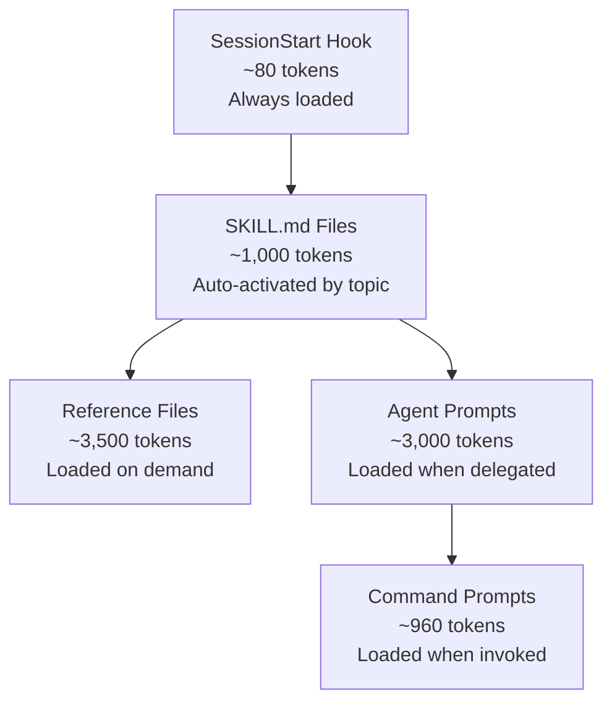
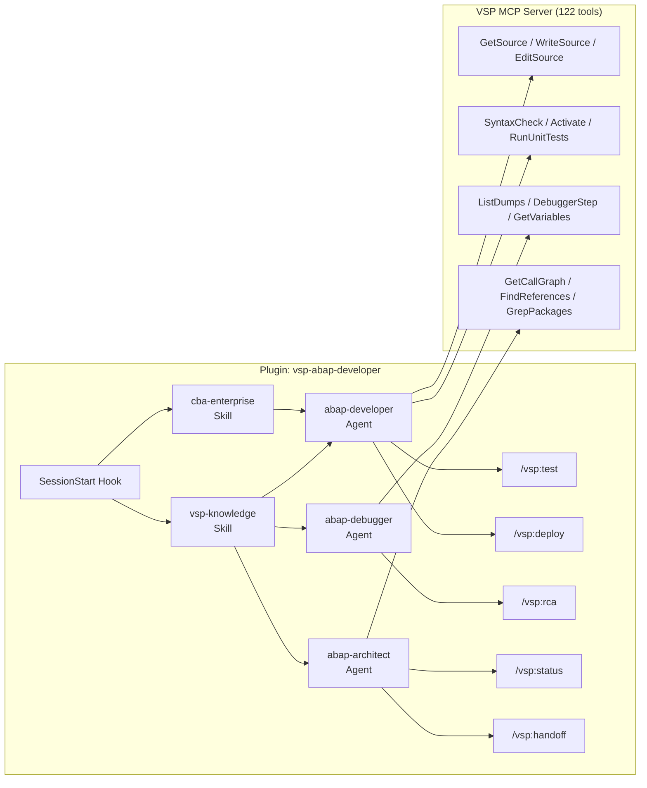

# VSP Claude Code Plugin — Architecture & Design Report

**Date:** 2026-03-29
**Report ID:** 001
**Subject:** Architecture and design documentation for the vsp-abap-developer Claude Code plugin
**Related Documents:**
- `reports/2026-01-18-007-cba-mcp-skills-pattern.md`
- `reports/2026-01-18-008-cba-architecture-clarifications.md`
- `reports/2026-02-07-002-vsp-strategic-deep-dive-cba-alignment.md`
- Anthropic: [Harness Design for Long-Running Apps](https://www.anthropic.com/engineering/harness-design-long-running-apps)

---

## Executive Summary

The `vsp-abap-developer` plugin is a Claude Code plugin that packages domain expertise, workflow patterns, and enterprise context for SAP ABAP development using VSP's 122 MCP tools. Unlike CLI-wrapper plugins (e.g., sapcli-claude-plugin), it provides **knowledge and behavioral guidance** — VSP already gives Claude hands to touch SAP; this plugin gives Claude the brain of an experienced SAP developer.

**Key metrics:** 20 files, 7,501 words total content, 3 agents, 2 skills (with 7 reference docs), 5 commands, 1 hook.

---

## Design Decisions

### Single Plugin vs Marketplace

**Decision: Single plugin.** VSP is one tool with interconnected knowledge — debugging requires safety awareness, deployment requires transport knowledge, architecture requires understanding of all object types. A marketplace of separate plugins would fragment this interconnected knowledge.

### In-Repo vs Standalone

**Decision: In-repo at `plugin/`.** The plugin versions alongside VSP. When tools change, the plugin knowledge updates in the same commit. No sync drift.

### Knowledge Plugin vs Tool Wrapper

**Decision: Knowledge plugin.** VSP is already an MCP server — Claude can already call all 122 tools. The plugin provides workflow orchestration (what sequence of tools to use), domain gotchas (ABAP SQL differences, object type coverage gaps), and enterprise context (CBA namespace, governance). It's a "driver's manual," not a "steering wheel."

### Harness Patterns (Anthropic Article)

Three patterns from Anthropic's harness design research were integrated:

1. **Generator/Evaluator Separation** → Baked into `abap-developer` as a "Verification Protocol." The agent must re-read its own code via GetSource after writing, run SyntaxCheck/RunUnitTests, and report actual tool output — never self-assess.

2. **Sprint Contracts** → Triggered for multi-object changes (>2 objects). The `abap-architect` defines success criteria before implementation; the `abap-developer` implements and verifies against the contract.

3. **Context Resets with Structured Handoffs** → The `abap-architect` produces handoff documents that survive context boundaries. The `/vsp:handoff` command produces explicit context snapshots for session transfer.

---

## Architecture

### Token Efficiency Model (Progressive Disclosure)

| Layer | Content | Tokens | When Loaded |
|-------|---------|--------|-------------|
| Hook | SessionStart context reminder | ~80 | Every session |
| Skills | 2x SKILL.md (vsp-knowledge + cba-enterprise) | ~1,000 | When topic matches |
| References | 7 reference files | ~3,500 | When specific subtopic needed |
| Agents | 3 agent prompts | ~3,000 | When delegated by Claude |
| Commands | 5 command definitions | ~960 | When user invokes `/vsp:*` |

**Typical session:** ~1,100 tokens (hook + 1 skill). **Maximum session:** ~8,500 tokens (everything loaded). This mirrors the CBA "just-in-time SKILLS pattern" — query context on demand, not upfront.

### Component Relationships

---

## Component Reference

### Agents

| Agent | Role | Key Tools | Trigger |
|-------|------|-----------|---------|
| **abap-developer** | Build, edit, test, deploy | GetSource, WriteSource, EditSource, SyntaxCheck, Activate, RunUnitTests | "create a class," "edit this method," "fix this code" |
| **abap-debugger** | RCA, dumps, traces, debugging | ListDumps, GetDump, SetExternalBreakpoint, DebuggerStep, GetVariables | "debug this," "why is this failing," "investigate this dump" |
| **abap-architect** | Dependencies, impact, design | GetCallGraph, GetCallersOf, FindReferences, GrepPackages, RunATCCheck | "analyze impact," "review architecture," "plan refactoring" |

All agents use `model: sonnet` for cost efficiency and embed tool names directly in their prompts (no runtime README reads).

**Harness patterns in agents:**
- Developer: Verification Protocol (re-read rule, failure gate, sprint contracts)
- Debugger: Evidence-based conclusions (re-read after fix, tool output as proof)
- Architect: Handoff Protocol (structured session snapshots), Sprint Contract templates

### Skills

| Skill | SKILL.md | References | Trigger |
|-------|----------|------------|---------|
| **vsp-knowledge** | 554 words | 4 files (sql-gotchas, object-types, safety-patterns, prerequisites) | General ABAP development, VSP tool usage |
| **cba-enterprise** | 422 words | 3 files (namespace-rules, governance, skills-pattern) | CBA environments, `/CBA/` namespace, governance |

The `references/` subdirectory pattern implements progressive disclosure — lean SKILL.md loads always (~500 tokens), heavy reference files load only when the subtopic arises.

### Commands

| Command | Workflow | Key Insight |
|---------|----------|-------------|
| `/vsp:test` | SearchObject → RunUnitTests → RunATCCheck | Reports actual counts, not "tests passed" |
| `/vsp:deploy` | SyntaxCheck → Activate → RunUnitTests → Transport | Mandatory quality gates, no shortcuts |
| `/vsp:status` | GetSystemInfo → GetFeatures → ListDependencies | Shows what's available, what's missing |
| `/vsp:rca` | ListDumps → GetDump → GetSource → (optional WebSocket debugging) | 4-phase RCA, falls back gracefully without ZADT_VSP |
| `/vsp:handoff` | Review context → Verify state → Produce structured handoff | Enables clean context resets |

### Hook

The SessionStart hook injects a ~80-token context reminder covering: method-level operations, re-read rule, SyntaxCheck requirement, sprint contract trigger, and CBA namespace awareness.

---

## CBA Enterprise Layer

The `cba-enterprise` skill provides a dedicated layer for Commonwealth Bank of Australia deployment context:

- **Namespace enforcement:** `/CBA/` prefix required (not Z*)
- **Safety defaults:** Package-restricted, no deletes, no free SQL
- **Governance:** Confidence-based deployment gates (>95% auto, 80-95% review, <80% human takeover)
- **Evaluator calibration:** Three scored ABAP code examples (5/5, 3/5, 1/5) in `governance.md` providing few-shot compliance benchmarks
- **SKILLS pattern:** Just-in-time context retrieval reducing token usage by 99.2%

---

## Reference Implementations

| Project | What We Took | What We Didn't |
|---------|-------------|----------------|
| **sapcli-claude-plugin** | Minimal structure (manifest + agents + skills), auto-activation via description | CLI wrapping via Bash (VSP is already MCP) |
| **secondsky/sap-skills** | SKILL.md + references/ pattern, agent frontmatter format, command namespacing | Marketplace distribution, MCP server configs, LSP integrations |
| **marianfoo/mcp-sap-docs** | Documentation-as-tools pattern, searchable knowledge base concept | Full FTS5 search infrastructure (overkill for a plugin) |
| **Anthropic harness article** | Verification protocol, sprint contracts, handoff protocol, evaluator calibration | Separate evaluator agent (baked into existing agents instead) |

---

## Future Directions

1. **MCP server integration** — Add `.mcp.json` pointing to mcp-sap-docs for real-time SAP documentation search
2. **Marketplace distribution** — Publish as standalone marketplace for non-fork users
3. **Additional agents** — Performance optimizer (SQL trace analysis), transport manager (CTS workflow)
4. **Workflow templates** — YAML workflow files that the DSL engine can execute
5. **Evaluator calibration expansion** — More few-shot examples covering performance, security, and naming conventions
